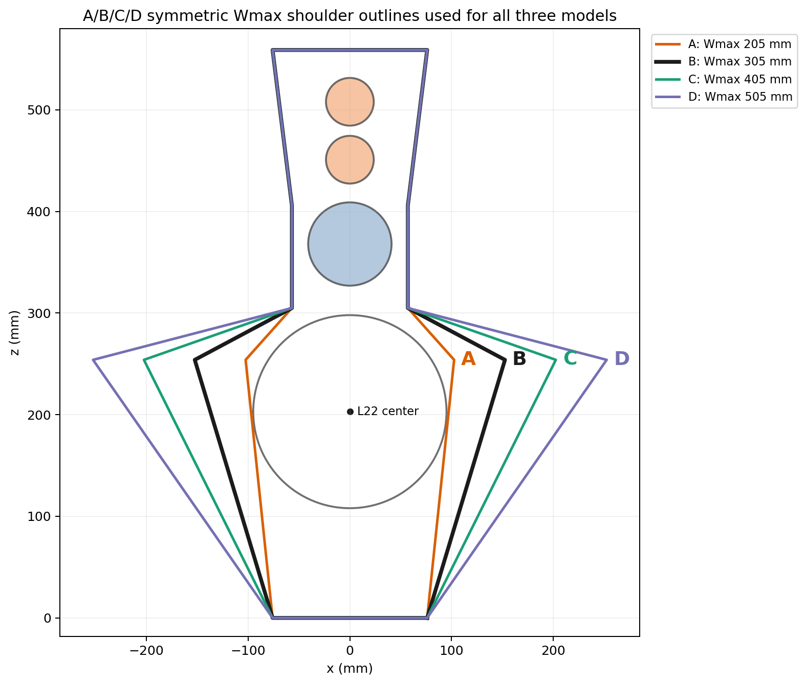
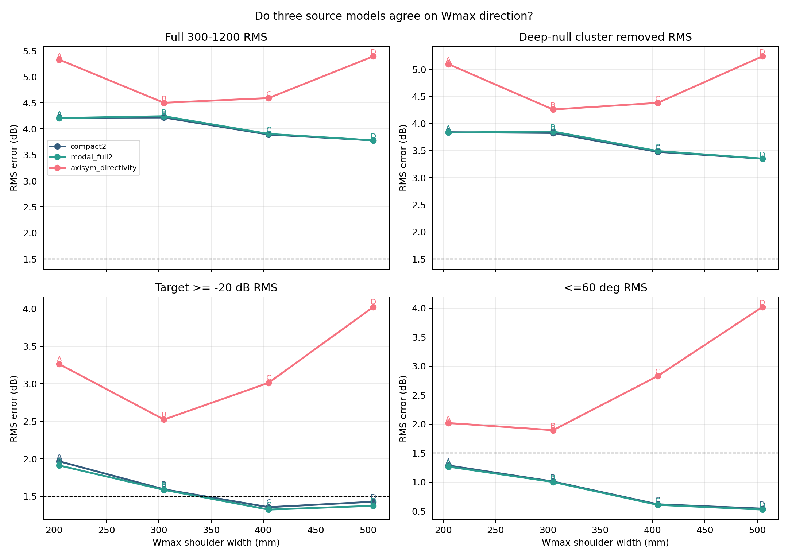
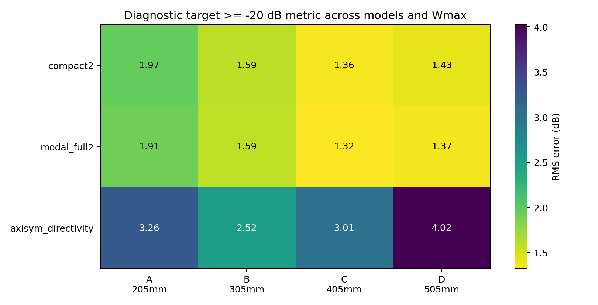
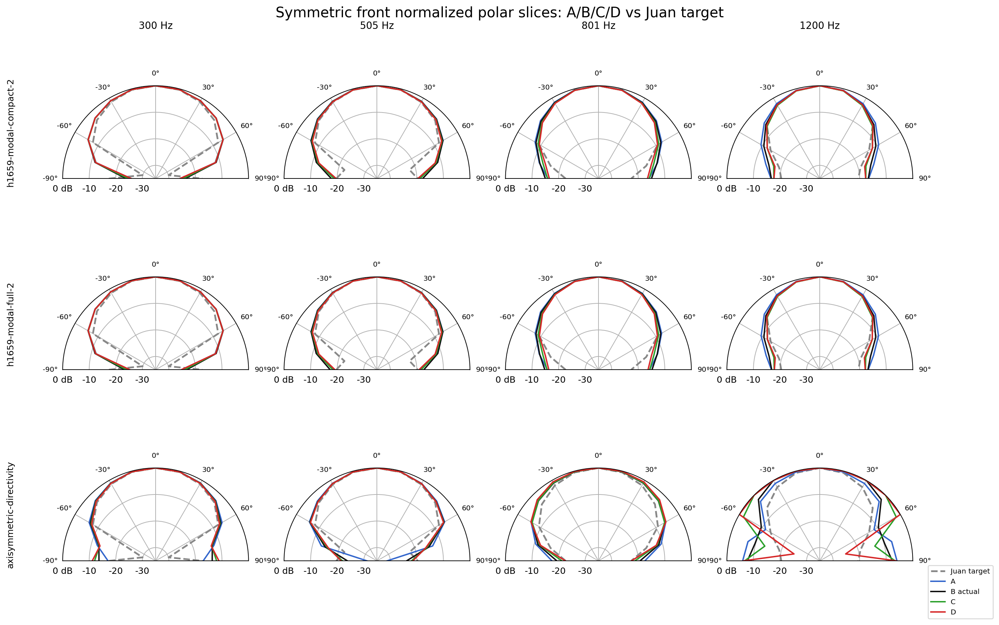
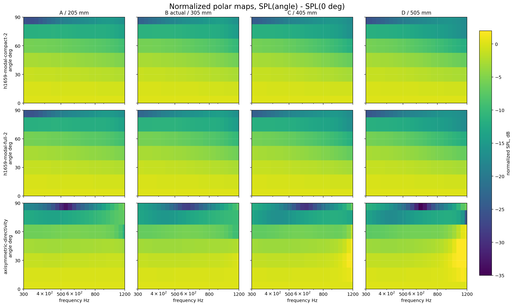
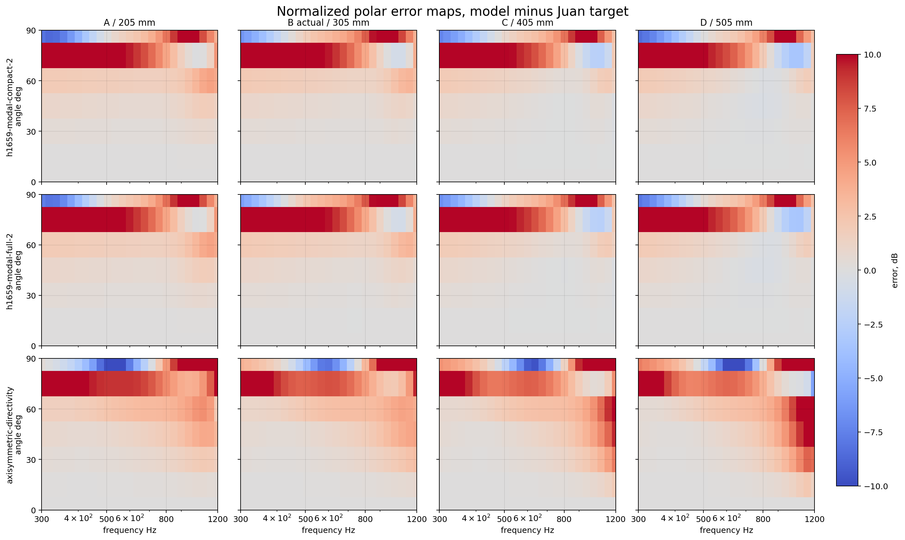
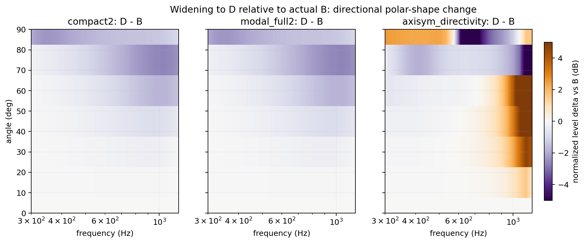
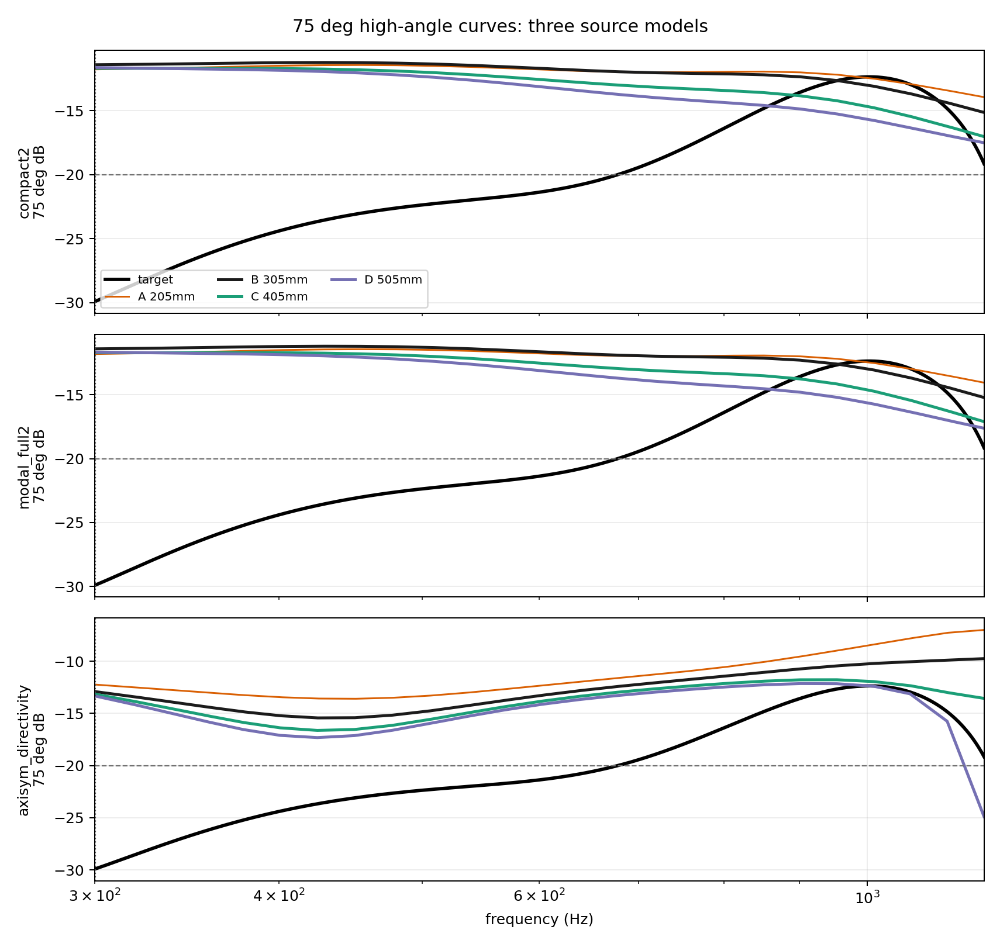

# Wmax Directional Agreement Across Three Models

This report checks whether three source models agree directionally on the Wmax shoulder extension sweep. The sweep keeps the LX521 layout and populated-silent passive treatment fixed, changes only the symmetric Wmax shoulder outline, and evaluates the same Juan top raw measurement target from 300 Hz to 1200 Hz.

## Variants

B is the actual LX521 baffle width used as the baseline. A is narrower; C and D progressively extend the shoulder farther outward from the L22 driver opening.

| Variant | Wmax shoulder width |
| --- | ---: |
| A | 205 mm |
| B | 305 mm, actual LX521 |
| C | 405 mm |
| D | 505 mm |

## Models Run

All three runs used BEM with the same measurement target, frequency grid, passive aperture policy, and mesh settings. The models differ only in how the L22 source is represented.

| Model key | Source model |
| --- | --- |
| `compact2` | `h1659-modal-compact-2`, split-profile-ring finite source |
| `modal_full2` | `h1659-modal-full-2`, split-profile-ring finite source |
| `axisym_directivity` | `axisymmetric-directivity`, no-inversion diagnostic source |

## Directional Result

The models do not unanimously agree directionally.

The two H1659 modal finite-source models agree strongly: widening the Wmax shoulder from B toward C/D improves the fitted polar-error metrics. The axisymmetric-directivity diagnostic disagrees: it prefers the actual B outline and predicts widening toward D gets worse.

| Model | Full-band best | Full-band B to D delta | Target > -20 dB best | Target > -20 dB B to D delta | Through 60 deg B to D delta | Direction |
| --- | ---: | ---: | ---: | ---: | ---: | --- |
| `compact2` | D, 3.780 dB | -0.439 dB | C, 1.356 dB | -0.166 dB | -0.468 dB | Improves with width |
| `modal_full2` | D, 3.780 dB | -0.464 dB | C, 1.323 dB | -0.213 dB | -0.477 dB | Improves with width |
| `axisym_directivity` | B, 4.503 dB | +0.893 dB | B, 2.523 dB | +1.501 dB | +2.127 dB | Worsens with width |

Negative deltas mean D is better than B. Positive deltas mean D is worse than B.

## Polar Plots

These plots show the actual normalized polar behavior behind the directional metrics. The slice plot overlays A/B/C/D against the Juan target at representative frequencies; the map plots show the full 300-1200 Hz normalized-polar field and the model-minus-target polar error field.

## What The Plots Say

The trend plot shows the modal models tracking each other closely. Their full-band, through-60-degree, and through-80-degree errors fall as the shoulder is widened, with the broadest D outline giving the best full-band RMS. On the target-above-minus-20 diagnostic, both modal models prefer C slightly over D, so the widening benefit is not strictly monotonic after C for that narrower metric.

The axisymmetric diagnostic is the outlier model directionally. Its metrics degrade as the shoulder is widened, especially on the target-above-minus-20 and through-60-degree views.

The D-minus-B maps show where the broadest extension helps or hurts relative to the actual baffle. The modal models show net improvement, but the diagnostic model produces the opposite overall direction.

The 75-degree curve remains important because all three models still have their worst residual at the 300.293 Hz / 75-degree target-null point. The sweep should therefore be treated as directional evidence, not a formal acceptance pass.

## Conclusion

The answer depends on which source model is trusted. If weighting the accepted H1659 modal finite-source models more heavily, the evidence favors increasing the Wmax shoulder beyond the actual B outline, with C/D better than B and D best on full-band RMS. If requiring all three independent source models to agree, the result is not robust: the axisymmetric-directivity diagnostic says the opposite.

Supporting data:

- [three_model_wmax_metrics.csv](three_model_wmax_metrics.csv)
- [directional_agreement.csv](directional_agreement.csv)

Per-model sweep artifacts:

- [compact2 run](../l22mg-bem-juan-top-populated-silent-compact2-wmax-abcd/)
- [modal_full2 run](../l22mg-bem-juan-top-populated-silent-modal-full2-wmax-abcd/)
- [axisym_directivity run](../l22mg-bem-juan-top-populated-silent-axisym-directivity-wmax-abcd/)
