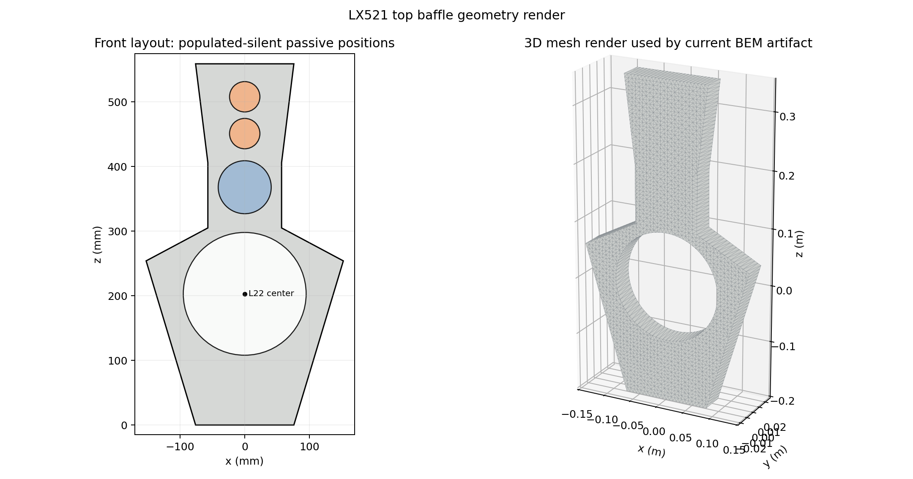
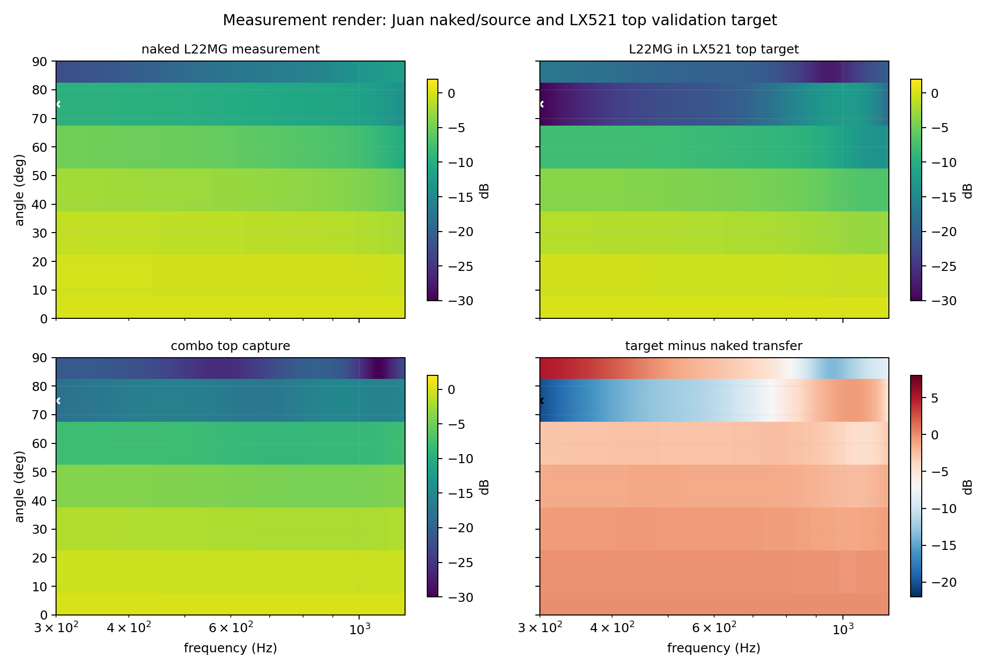
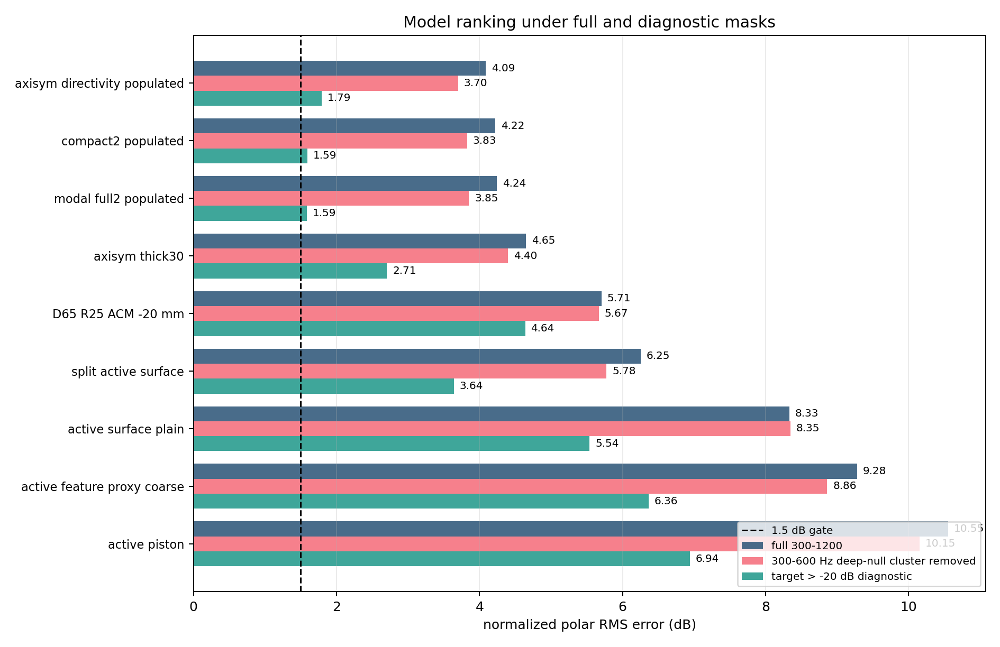
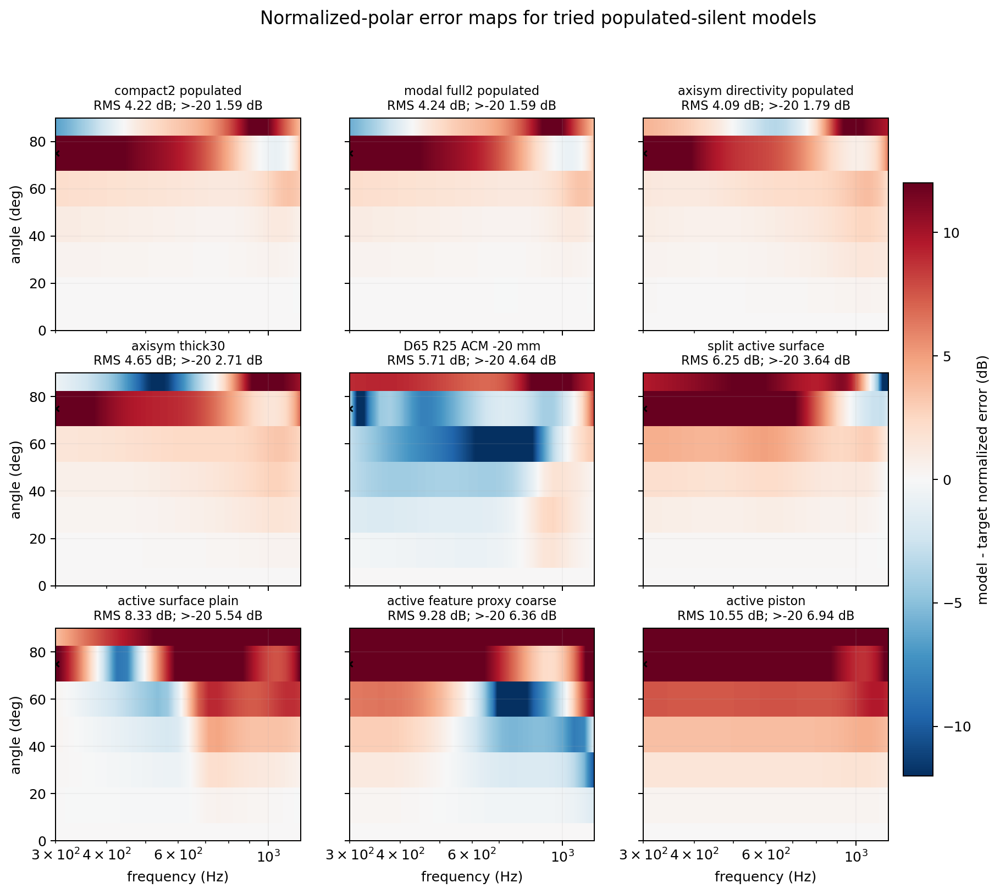
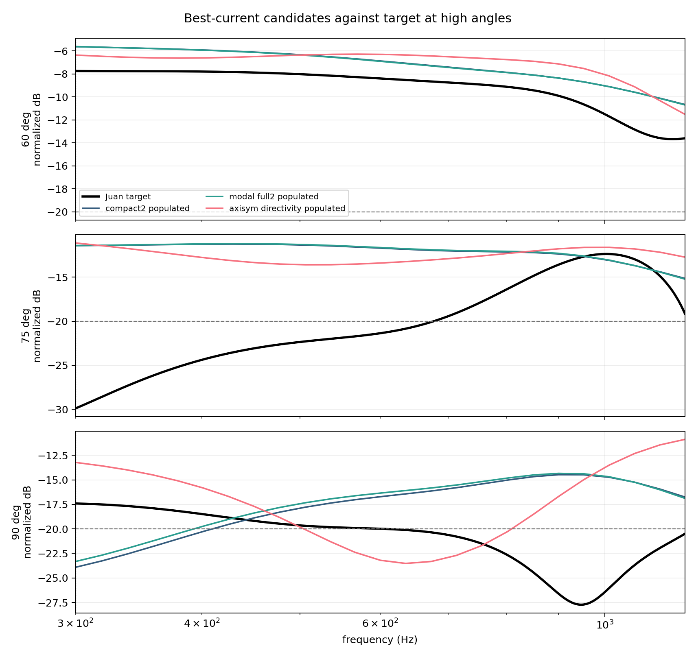
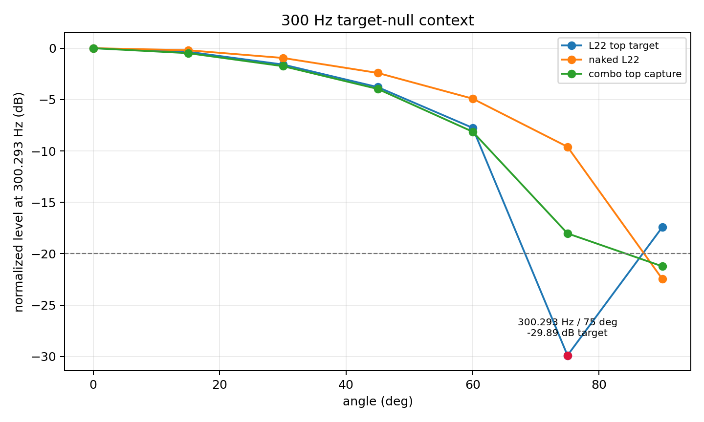

# L22MG Juan Top-Baffle Populated-Silent Modeling Report

Generated: 2026-05-24

## Summary

No current populated-silent model passes the acceptance gate. The full 300-1200 Hz normalized-polar RMS target is `<= 1.5 dB`; the best full-band result is `4.088 dB`.

The dominant blocker is the measured Juan top-baffle target null at `300.293 Hz / 75 deg`. At that point the L22-alone target is `-29.894 dB` normalized, while the naked L22 measurement is `-9.594 dB`; the implied top-minus-nude transfer is `-20.300 dB`. The separate top-baffle combo capture is `-18.024 dB` at the same point, or `+11.870 dB` above the L22-alone target. This is a target-quality/repeatability warning, not an approved data exclusion.

Under the repo's existing diagnostic `target > -20 dB` mask, the best current model is `modal full2 populated` at `1.587 dB`, narrowly ahead of `compact2 populated` at `1.594 dB`. That diagnostic is close to the `1.5 dB` target, but it is not the acceptance calculation.

## Policy Alignment

- Validation source: `output/data/polar_data_juan_baffleless.h5`, driver `L22MG (nude)`.
- Validation target: `output/data/polar_data_juan_lx521_top_raw.h5`, driver `L22MG (LX521 top raw)`.
- Target angles: HDF5 target angles `[0, 15, 30, 45, 60, 75, 90]`; no angular interpolation.
- IR peak policy: `direct_ir_peak_policy=first-strong`, mirrored from the published target artifact.
- Passive treatment: `populated-silent`; passive UM/tweeter driver positions are modeled as populated/solid silent obstructions, not open holes.
- Validation alignment: one global scalar gain plus one global delay only; no angle, band, rear, or source dB fitting.

## Baffle and Measurement Renders

The modeled baffle is the LX521 top baffle with the L22 cutout and populated-silent passive positions. The 3D panel is the OBJ mesh emitted by the current compact2 artifact.

The measurement render shows the naked L22 source measurement, the L22-only top-baffle target, the top-baffle combo capture, and the target-minus-naked transfer. The white/black `x` marks the `300.293 Hz / 75 deg` target null.

## Models Tried

| model | intent | full RMS | exact 300/75 removed | deep-null cluster removed | target > -20 dB | <=60 deg | <=80 deg | worst residual |
| --- | --- | ---: | ---: | ---: | ---: | ---: | ---: | --- |
| axisym directivity populated | diagnostic axisymmetric directivity table | 4.088 | 4.086 | 3.702 | 1.792 | 1.383 | 3.302 | +18.779 dB @ 300 Hz / 75 deg |
| compact2 populated | canonical split axisymmetric H1659 compact2 source | 4.219 | 4.217 | 3.826 | 1.594 | 1.009 | 3.497 | +18.476 dB @ 300 Hz / 75 deg |
| modal full2 populated | fuller H1659 modal source | 4.244 | 4.242 | 3.852 | 1.587 | 1.001 | 3.507 | +18.487 dB @ 300 Hz / 75 deg |
| axisym thick30 | thickness sensitivity on axisymmetric source | 4.652 | 4.650 | 4.400 | 2.706 | 1.464 | 3.367 | +16.495 dB @ 300 Hz / 75 deg |
| D65 R25 ACM -20 mm | split discrete monopole cloud/acoustic-center probe | 5.707 | 5.707 | 5.668 | 4.639 | 4.409 | 4.471 | -16.075 dB @ 756 Hz / 60 deg |
| split active surface | split active surface Neumann source | 6.252 | 6.249 | 5.776 | 3.639 | 1.801 | 5.279 | +24.209 dB @ 300 Hz / 75 deg |
| active surface plain | active surface Neumann source | 8.334 | 8.334 | 8.347 | 5.538 | 3.300 | 5.575 | +23.619 dB @ 933 Hz / 90 deg |
| active feature proxy coarse | rear-basket/feature active proxy | 9.279 | 9.277 | 8.861 | 6.362 | 4.625 | 7.104 | +27.834 dB @ 300 Hz / 75 deg |
| active piston | piston-like active source diagnostic | 10.550 | 10.548 | 10.153 | 6.942 | 4.055 | 8.050 | +29.599 dB @ 300 Hz / 75 deg |

The stale width-sweep rerank contained a W405 row at `3.891 dB`, but that row predates the IR-policy metadata alignment and is not promoted here.

## Ranking Plot

The full-band rank favors the axisymmetric directivity diagnostic. The diagnostic `target > -20 dB` mask favors `modal full2 populated`, with `compact2 populated` effectively tied. All bars remain to the right of the `1.5 dB` acceptance gate except the non-acceptance diagnostic values that are still slightly above it.

## Error Maps

All credible current candidates share the same main residual: they do not reproduce the very deep 300 Hz high-angle target null. The active-surface and piston variants introduce larger residual structures elsewhere, so they are not viable improvements.

## High-Angle Curves

The 60 deg curves are already near the target. The failure starts at 75 deg and remains visible at 90 deg. The top three current candidates are close to each other at 75 deg and miss the 300 Hz null by roughly the same order.

## 300 Hz Target-Null Context

The L22-alone target, naked L22, and top-baffle combo captures disagree most strongly at `75 deg`. This is why removing only the single exact 300 Hz point barely changes the full RMS: the broader high-angle low-frequency region still carries the same target-quality signature.

## Interpretation

The best full-band model after the latest iteration is `axisym directivity populated`, but it is diagnostic: the source CV/mesh evidence is not sufficient to treat it as accepted.

The best current candidate under the repo's published diagnostic null mask is `modal full2 populated` at `1.587 dB`. It is the closest to the `1.5 dB` shape gate when deep target nulls are de-emphasized, and it also keeps the through-60 deg RMS at `1.001 dB`. `compact2 populated` is practically tied at `1.594 dB` and remains a conservative baseline.

The active piston, active surface, split active surface, D65 discrete cloud, feature proxy, and thickness variants do not improve the core failure. They either leave the 300 Hz / 75 deg miss in place or add worse residuals elsewhere.

## Conclusion

Do not claim acceptance from this iteration. The honest result is:

- Best literal/full-band rank: `axisym directivity populated`, `4.088 dB` RMS, diagnostic only.
- Best current diagnostic masked rank: `modal full2 populated`, `1.587 dB` RMS with `target > -20 dB`, still above the `1.5 dB` target and not an acceptance mask.
- Best conservative baseline: `compact2 populated`, `1.594 dB` under the same diagnostic mask and `4.219 dB` full-band.

The next iteration should focus on explaining or replacing the Juan L22-only top-baffle high-angle low-frequency target before more source complexity is added. The existing modeling changes are not what limits the pass/fail outcome.

