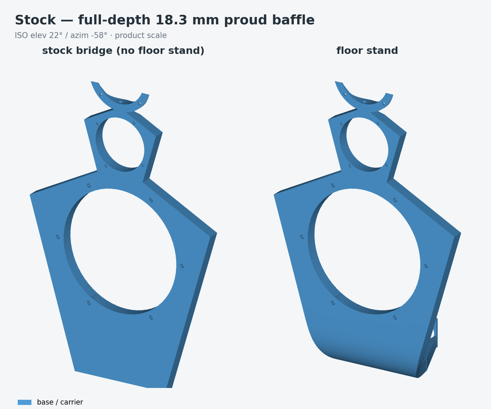
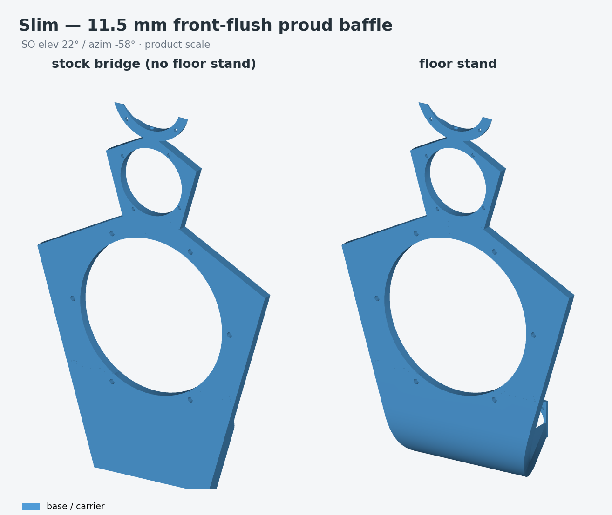
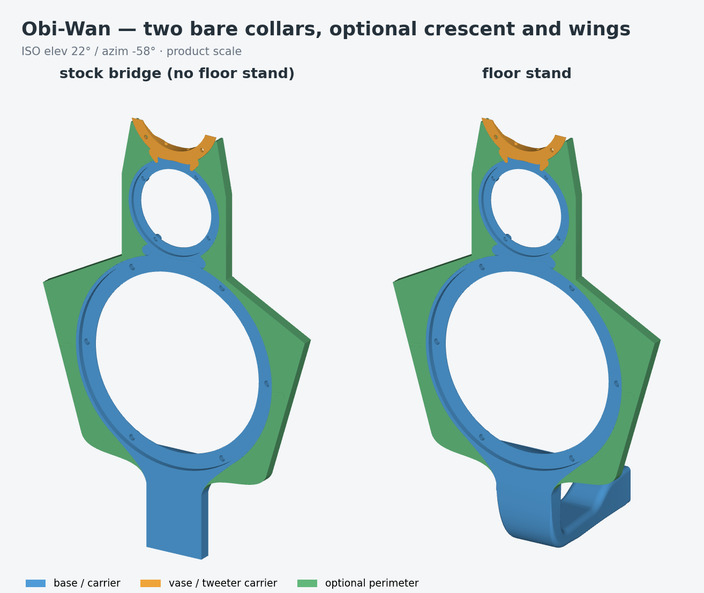
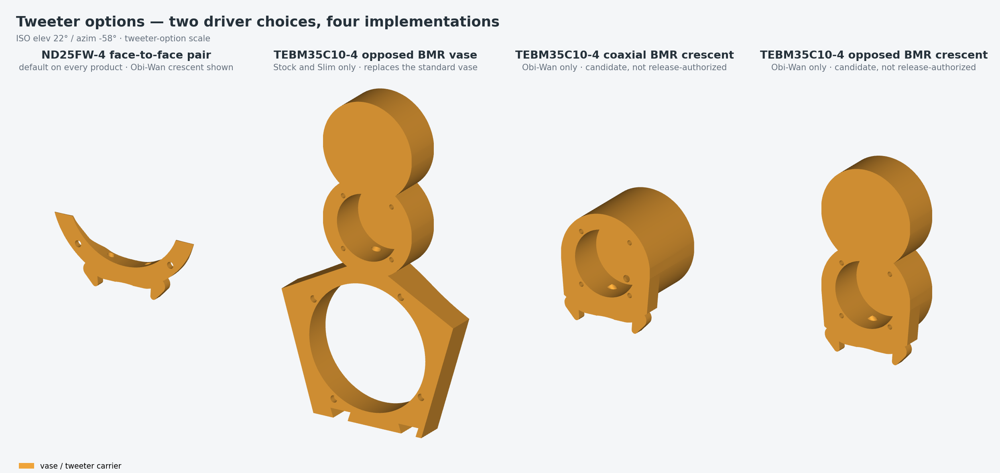
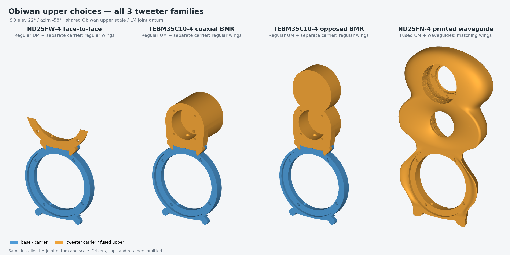
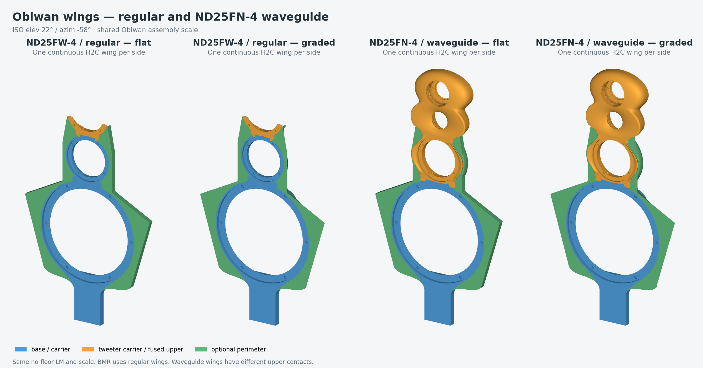

# Open-baffle experiments — Stock, Slim and Obiwan

Inspired by **Siegfried Linkwitz’s ideas and openness in sharing his work**,
this project explores a compromise in his design: the roughly **7.5 kHz
crossover between the upper midrange and tweeters**. A high crossover helped
preserve the intended dipole radiation pattern through that transition,
leaving the small upper-midrange driver covering roughly **1–7.5 kHz**.
See Linkwitz’s [design rationale](https://www.linkwitzlab.com/LX521/Description.htm)
and [frequency-range discussion](https://www.linkwitzlab.com/LX521/FAQ.htm).

The goal is to explore alternative tweeters, waveguides and baffle shapes
that support **a lower crossover while preserving dipole behavior**. By
handing more of the high-frequency work to the tweeters, we aim to reduce
upper-midrange distortion and improve the performance of the whole system.
Measurements of directivity and distortion, together with listening
comparisons, will determine whether that goal is achieved.

**Stock and Slim** closely follow Linkwitz’s baffle design. **Obiwan** is a
new modular design built as an experimentation platform: interchangeable
tweeter arrangements and quickly removable wings make it easier to compare
drivers, waveguides and acoustic boundaries without rebuilding the entire
baffle.

## Build and print

**The current manufacturing target is the Bambu H2C with two 0.6 mm High
Flow nozzles.** Start with the [H2C file guide](to_print/h2c/README.md) for
STLs, editable projects, audited slices, materials and per-speaker quantities.
`make` now builds the H2C shelf; `make PRINTER=P2S all` selects the earlier
pipeline. The pre-migration source checkpoint and rewritten commit references
are recorded in the [generated-file history guide](docs/GENERATED_HISTORY.md).

H2C uses one LM carrier for Obiwan and one full wing per side, including
Dayton ND25FN-4 waveguide wings. Stock/Slim use one complete LM without the stand, or two
LM pieces with the stand, plus their matching upper module. Driver spacing
and mounting seats remain unchanged. The Dayton ND25FN-4 waveguide has separate PETG-GF/PLA and
PETG Translucent/PLA Translucent projects.

Choose one mounting state and one complete configuration per speaker.

The earlier [P2S build guide](docs/BUILD_GUIDE.md) remains a hardware and
assembly reference. Its generated P2S
[file guide](to_print/FILE_GUIDE.md) lists all 42 choices and actual sliced
job estimates. There are 68 sliced projects and 8 projects requiring GUI
slicing across alternate nozzle/material lanes.

The [complete parts and magnet catalog (PNG)](images/generated/catalog/ALL_ITEMS_MAGNET_CATALOG.png)
shows the 78 pre-H2C part variants, their buried magnet locations and types,
shared parts, alternate tweeters and separate test fixtures. The accompanying
[file map](images/generated/catalog/README.md) identifies every source.

For H2C material mapping and process exceptions, use the generated
[H2C file guide](to_print/h2c/README.md). The shared [print and hardware
policies](docs/PRINT_POLICIES.md) retain the earlier printer details: structural LM/UM infill is 100%, wings
are 10%, and the Dayton ND25FN-4 waveguide uses M3 fasteners. The [current update
report](review/print_policy_update_20260912/SUMMARY.md) links the regenerated
print files, support exceptions and D6 magnet test pair.

Stock is the canonical CAD baseline. Slim is experimental. Obi-Wan and BMR
options are qualification candidates; printed fit, long-term loaded behavior
and acoustic performance are not established by CAD renders or passing code
checks. See the [current test procedure](docs/PETG_GF_QUALIFICATION.md).

## Product comparison

One row per product, each showing both stand states, then one row for the
tweeter options. Every render uses one camera and one declared frame per scale
group, so the panels within a row and the three product rows against each
other are directly comparable. Regenerate the product rows with
`make iso_matrix`; `make h2c_review` also refreshes the upper and wing comparisons.



Stock is the canonical product: the complete 18.3 mm outline, with two core
pieces on H2C without the stand or three with the stand. The earlier P2S
split uses four — [`docs/stock.md`](docs/stock.md).



Slim is the same outline with the acoustic field thinned to 11.5 mm, sharing
one front plane end to end — [`docs/slim.md`](docs/slim.md).



These two Obiwan panels show the regular UM, ND25FW-4 crescent and flat
wings. The integrated ND25FN-4 upper is a second body choice on the same LM,
shown alongside the regular uppers below — [`docs/obiwan.md`](docs/obiwan.md).



Left to right: ND25FW-4 crescent; BMR Stock/Slim vase; BMR Obiwan coaxial
crescent; BMR Obiwan opposed crescent; **ND25FN-4 integrated UM/waveguide**.
These are the actual printed carriers at one scale. Drivers and removable
service caps are omitted so their construction can be compared.



The complete Obiwan uppers share the same LM joint datum in this row:
ND25FW-4, coaxial BMR, opposed BMR and ND25FN-4 waveguide. The first three
retain the regular UM; the fourth includes its UM in the curved body.



Choose flat or graded wings to match the selected upper. The two regular
wing styles fit ND25FW-4 and BMR. ND25FN-4 uses its own curved upper contacts
and matching wings, shown on the same no-floor-stand LM here.

## Tweeter options

The project offers **three tweeter families**. BMR has multiple mount layouts;
those layouts are alternatives within one driver family.

| Tweeter family | Construction | Stock / Slim | Obiwan |
|---|---|---|---|
| **Dayton ND25FW-4 face-to-face** | Two domes with factory waveguide faceplates | Standard upper module with integral crescent | Separate crescent on the regular UM |
| **Tectonic TEBM35C10-4 BMR** | Two balanced-mode radiators; opposed or coaxial layout | Replace the whole upper module with the opposed-BMR version | Choose the coaxial or opposed BMR crescent on the regular UM |
| **Dayton ND25FN-4 waveguide** | Two faceplate-free domes in printed front/rear waveguides | No compatible upper module currently provided | Replace the whole UM and crescent with one fused body; use the matching waveguide wings |

The **ND25FN-4 waveguide** is the former retained-package design, now named
for its driver and construction. Its organic MU10 surround and tweeter
waveguides form one piece, with an enclosed cable gallery, two service caps
and two M3 retainers. The same body fits both Obiwan stand configurations;
it retains the LM joint and meets the LM front flush without covering it.
H2C provides one continuous matching wing per side, in flat or graded form.
Regular Obiwan wings have different upper contacts and cannot substitute.
Stock/Slim BMR uppers also have different magnet stations: their matching
perimeter is not supplied, so use the standard shoulders or B1 wings only
with ND25FW-4.

Start with the [three-family selection guide](docs/TWEETER_OPTIONS.md) and
[Dayton ND25FN-4 waveguide assembly guide](docs/DAYTON_ND25FN4_WAVEGUIDE.md).
The [H2C file catalog](to_print/h2c/README.md) includes all three families,
with separate PETG-GF/PLA and PETG Translucent/PLA Translucent jobs for the
ND25FN-4 body, accessories and wings. BMR and ND25FN-4 remain qualification
candidates: inclusion and successful slice checks do not establish physical
fit, retention or acoustic performance. The earlier P2S catalog and CAD-only
BMR-slim variants are documented separately in [Variants](docs/VARIANTS.md).

The separate Purifi PTT1.3 experiment remains in
`build/ptt_crescent_PTT1.3T04-HAG-01/`; it is not one of the three supported
selection families in the current H2C print catalog.

## Products

The current print catalog is [H2C](to_print/h2c/README.md). The earlier
product-grouped CAD facade is:
[`artifacts/`](artifacts/README.md).

| Product | Geometry | Optional perimeter | Tweeter options | Status | Doc |
|---|---|---|---|---|---|
| [Stock](artifacts/stock/) | B2, 304.802 x 453.457 x 18.3 mm | A-comp shoulders **or** B1 wings | ND25FW-4 crescent (integral) or TEBM35C10-4 BMR vase | Canonical CAD | [`docs/stock.md`](docs/stock.md) |
| [Slim](artifacts/slim/) | V1L + V1; 11.5 mm front-flush acoustic field, full-depth bottom strip | matching V1 shoulders **or** V1 wings | ND25FW-4 crescent (integral) or TEBM35C10-4 BMR vase | Experimental | [`docs/slim.md`](docs/slim.md) |
| [Obiwan](artifacts/obiwan/) | LM + regular UM or integrated UM/waveguide; floor and stock-bridge states | flat or graded wings matched to the upper | ND25FW-4 crescent, coaxial/opposed BMR crescent, or fused ND25FN-4 waveguide + UM | Candidate; not release-authorized | [`docs/obiwan.md`](docs/obiwan.md) |

The original state-oriented build outputs remain in `build/floor_stand/`,
`build/no_floor_stand/`, and `build/wings/` because the validation pipeline depends on
them. `artifacts/` adds stable names, hashes, and product grouping through
relative links without duplicating large CAD files. See
[`docs/PROJECT_SCOPE.md`](docs/PROJECT_SCOPE.md) for the intent, assumptions,
and release boundary; [`docs/REPOSITORY_STRUCTURE.md`](docs/REPOSITORY_STRUCTURE.md)
documents the implemented source/package and generated-state boundary.

## Use the delivered files

Open the [H2C file guide](to_print/h2c/README.md), choose a compatible
configuration and material lane, and use its editable `.3mf` or audited
`.gcode.3mf`. Those projects retain the supports, infill modifiers and
measured magnet insertion pauses. An STL contains geometry only.

```sh
make h2c_prepare        # prepare H2C projects from current geometry
make h2c_validate       # slice and audit; reuse current verified results
make h2c_review         # upright assembly views
make h2c_docs           # refresh the file and tweeter-family guides
```

The [earlier P2S file guide](to_print/FILE_GUIDE.md) remains available for
that printer. Its material mapping and split wings are specific to P2S.
No ZIP is required for either workflow.

## Develop and regenerate

Use Python with the dependencies in `cad-remote-requirements.lock`. The
vendored driver references are self-contained under `vendor/SEAS/`; no
sibling checkout is needed for those inputs. VTK renders CAD with an actual
depth buffer, and Matplotlib/Pillow compose the comparison panels.

```sh
make PYTHON=<venv>/bin/python             # current H2C pipeline
make PRINTER=P2S artifacts          # relink and rehash the CAD facade
make PRINTER=P2S iso_matrix # regenerate the CAD comparison images
make PRINTER=P2S delivery_refresh # bind already-published files and regenerate the file guide
```

The current H2C pipeline runs locally. The earlier P2S CAD pipeline defaults
to the original maintainer's remote host `osado.lan`; select
`LX_CAD_EXECUTION=local` when running that pipeline on another workstation. Remote execution,
resource limits and promotion are documented in [REMOTE_BUILD.md](docs/REMOTE_BUILD.md).
A source change requires current CAD/slice provenance before republishing;
validation does not silently regenerate or re-certify old geometry.

## Generated artifact layout

Current H2C manufacturing outputs live in `build/h2c/`; the current print
catalog lives in `to_print/h2c/`. Both stand states are included. The earlier
P2S pipeline and the shared source authorities use the following layout:

    build/floor_stand/      LX_STAND_FOOT=1: Stock/Slim fused foot + NL8 panel;
      stl/  *.step  *.png     Obi-Wan integral LM-owned W64 floor stem/foot + NL8 panel
    build/no_floor_stand/   LX_STAND_FOOT=0: Stock/Slim flat piece_bottom + bridge;
      stl/  *.step  *.png     Obi-Wan solid bridge web fused into the LM core
    build/wings/{flat,graded}/    Obi-Wan acoustic wing families
    build/vase_TEBM35C10-4/{stock,slim}/   opposed-BMR vase, full Ø63 lands
    build/bmr_slim_TEBM35C10-4/proud/{stock,slim}/  Ø56-core/lobed vase alternatives
    build/bmr_crescent_TEBM35C10-4/       candidate BMR crescents, both variants
    build/bmr_slim_TEBM35C10-4/           lobed Obi-Wan CAD-only candidates
    build/common/           flag-independent shared outputs
    images/generated/iso/   the product-comparison cells and rows/ images

Each folder contains all proud-family variants and the matching Obi-Wan
core/add-on set. In Stock and Slim, `piece_bottom` is the only functionally
different base piece; the other base STLs can differ by <0.05 mm as
the foot-entry knots move. In Obi-Wan, the UM core is state-independent. The
floor LM owns the integral stand and only the shared upper shoulder; the
no-floor LM owns the complete fused bridge web. Their lower magnet axes are
coincident on that shoulder, but floor mode has no shallow skirt or rail below
it.
`build/common/attachments.step` is flag-independent and is
promoted as one shared file. The `LX_STAND_FOOT` environment flag defaults to 1.

Per-product printable-piece tables live in the product docs. The two
product-independent STL groups are:

| STL in `build/<state>/stl/` | Footprint (mm) | Used by |
|---|---|---|
| `lx521_coupon_*` | small blocks/gauges | calibration, routing, and clocking checks ([`docs/PRINTING.md`](docs/PRINTING.md)) |
| lx521_polar_base_1..2of2 | Ø216 / 169×185 | polar-measurement turntable under the stand foot (floor_stand only) |

## Shared source and evidence map

Geometry modules are listed in each product's doc. These are the shared
entry points:

| File | What |
|---|---|
| `scripts/export_piece_stls.py` | Exports the print-ready proud-family or Obi-Wan core/add-on STLs (`--variant`, `--outdir`) and one exact adjacent, hash-bound `.print.json` authority for every STL |
| `scripts/export_steps.py` | Exports a module's `gen_step()` to STEP via build123d's native exporter (`<module.py> --output <path>`) — no CAD-skill dependency |
| `scripts/gen_product_iso_matrix.py` | Renders the standardized product-comparison ISO set into `images/generated/iso/` from the promoted STEP files; one shared camera, one declared frame per scale group |
| `Makefile` | Generates STEPs/STLs/PNGs for both stand states into `build/floor_stand/` and `build/no_floor_stand/` (see "Generated artifact layout"). Local OCC jobs are serial; the remote executor uses bounded parallel slots, and every CAD subprocess runs through `scripts/run_memory_guarded.py`. |
| `scripts/remote_cad.py` / `cad-remote-requirements.lock` | Content-addressed SSH executor, resumable job control, verified artifact return, and exact remote Python environment |
| `review/captive_magnet_slice_audit/CAPTIVE_MAGNET_PAUSE_MANIFEST.md` | Authoritative per-STL front-face-down orientation, actual sliced open/closing layers, Bambu Custom park/pause/restore events, grouped magnet counts, and local-axis polarity |
| `review/CAPTIVE_MAGNET_ARTIFACT_INVENTORY.md` | Clickable inventory of all 58 magnet-bearing STL records, their 56 locally generated/directly loadable G-code-bearing Bambu 3MF projects, descriptive piece names, and exact magnet counts; also reconciles the 86 transverse and eight exact split-proxy stations |
| `build/<state>/stl/*.stl` and `build/wings/{flat,graded}/stl/*.stl` | The enforced acoustic-print inventory is 39 nonpolar front-face-down STL/sidecar pairs in each stand state plus ten flat and ten graded pairs: 98 exact pairs total. Every acoustic piece is source-X180 with only an optional in-bed Z rotation and its front datum at STL Z=0. A missing, orphaned, stale-hash, tilted, or translation-inconsistent `<stem>.print.json` fails release validation. The two floor polar-index jigs are the sole orientation-sidecar exclusions because they are fixtures with no acoustic front-face datum. |

The generated directories are **candidate packages**, not physical-release
authorization: even `make release` performs CAD, artifact and manifold checks
only, and the Obi-Wan state manifests record `release_authorized: false`.

## Documentation

Products:

- [`docs/stock.md`](docs/stock.md) — Stock: key dimensions, print split,
  proud cable routing, magnet attachment, assembly.
- [`docs/slim.md`](docs/slim.md) — Slim: V1 vase, V1L LM section, the
  keyed 283° UM outlet.
- [`docs/obiwan.md`](docs/obiwan.md) — Obi-Wan: two-collar geometry,
  buried routes, floor/no-floor structure, structural screens, assembly.

Cross-cutting authorities:

- [`docs/PROJECT_SCOPE.md`](docs/PROJECT_SCOPE.md) — intent, three-product
  inventory, CAD brief, assumptions, release boundary.
- [`docs/REPOSITORY_STRUCTURE.md`](docs/REPOSITORY_STRUCTURE.md) — layout and
  the source/generated-state boundary.
- [`docs/VARIANTS.md`](docs/VARIANTS.md) — variant/add-on catalog, envelope
  compatibility matrix, hardware, and retired C7/V0 design history.
- [`docs/PRINTING.md`](docs/PRINTING.md) — filament, slicer profile, coupons,
  fastener torques, insert installation, magnet pauses, print constraints.
- [`docs/REMOTE_BUILD.md`](docs/REMOTE_BUILD.md) — remote executor, cache
  seeding, promotion transaction, memory profiles.
- [`docs/CAPTIVE_MAGNET_SLICING.md`](docs/CAPTIVE_MAGNET_SLICING.md) — pause
  and embed workflow.
- [`docs/obiwan_acoustic_wings_spec.md`](docs/obiwan_acoustic_wings_spec.md) —
  flat/graded wing design authority.
- [`docs/obiwan_physical_qualification.md`](docs/obiwan_physical_qualification.md)
  — fail-closed physical qualification record.
- [`docs/README.md`](docs/README.md) — the complete documentation index.
