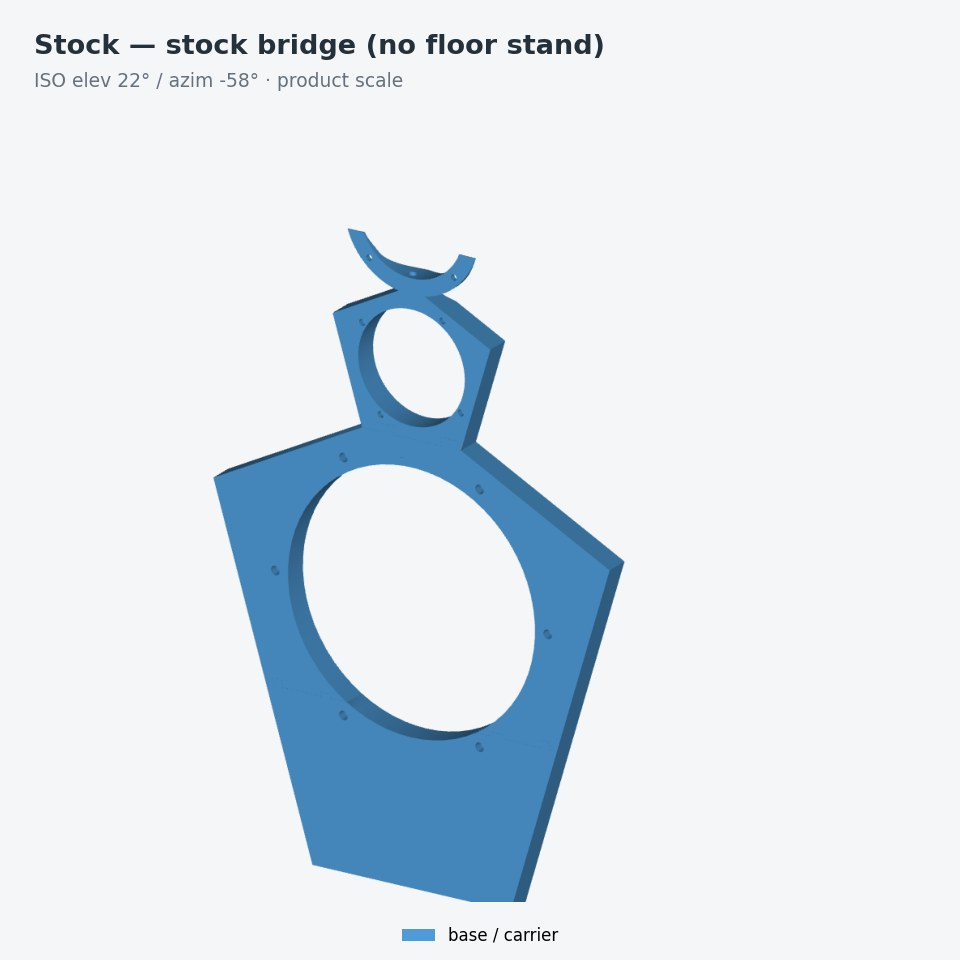
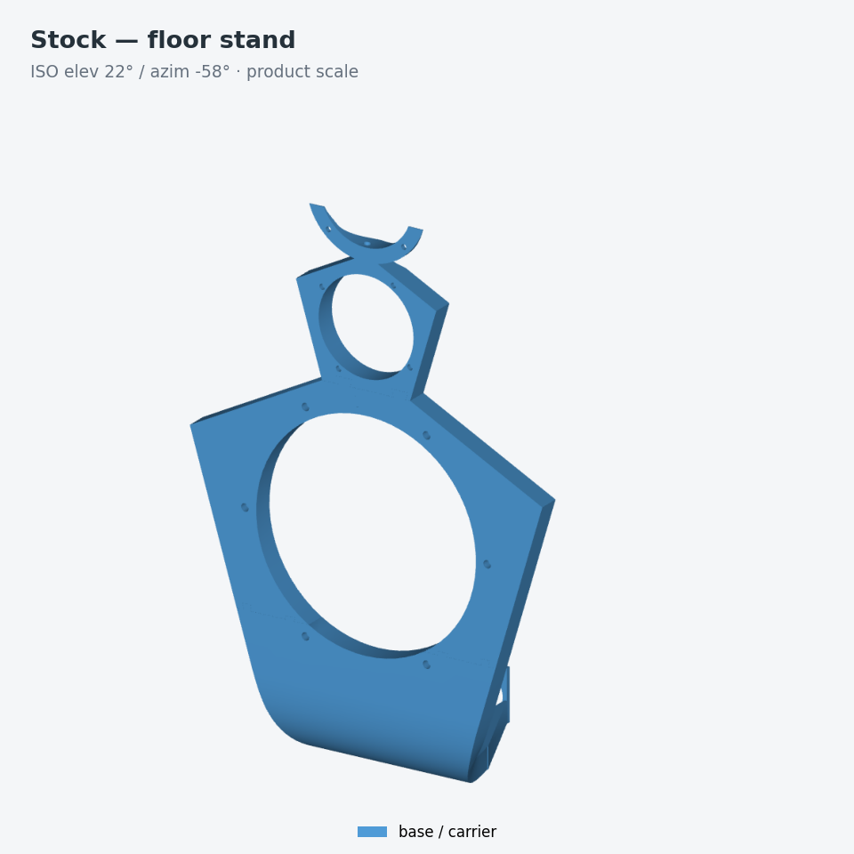
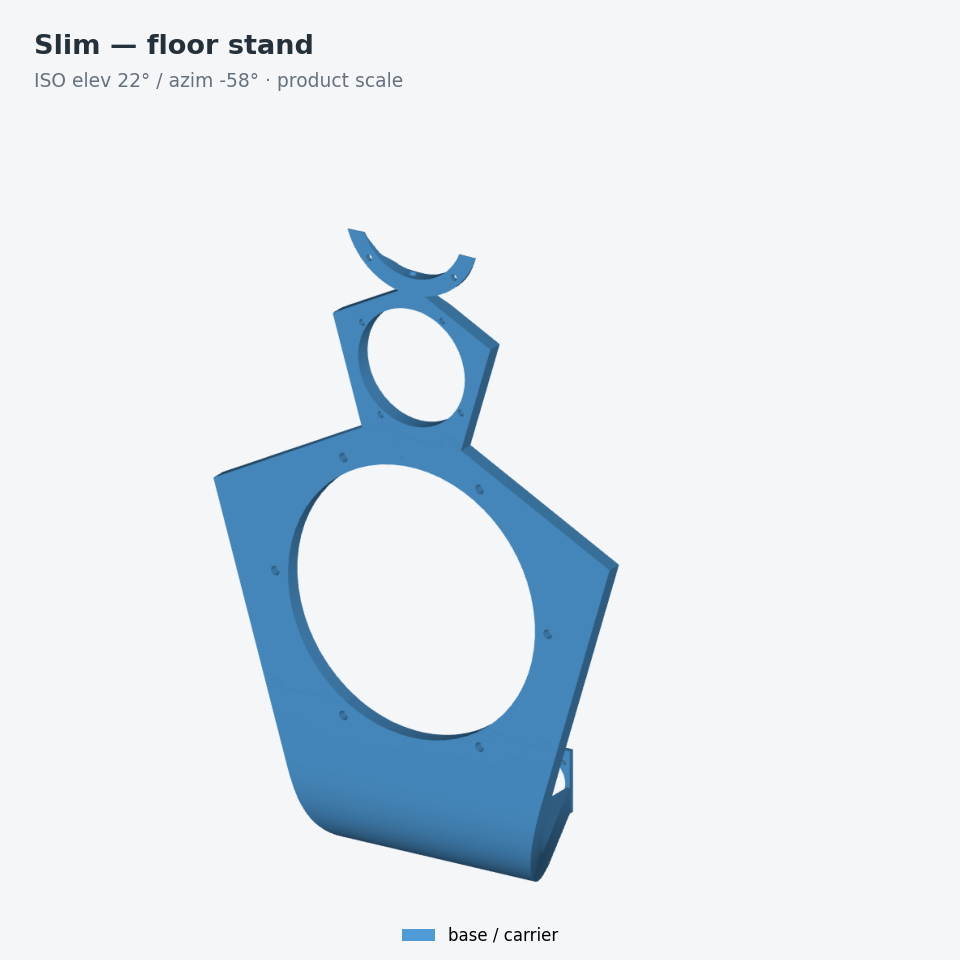
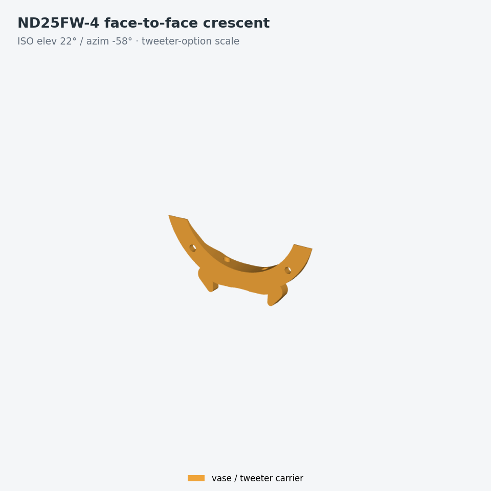
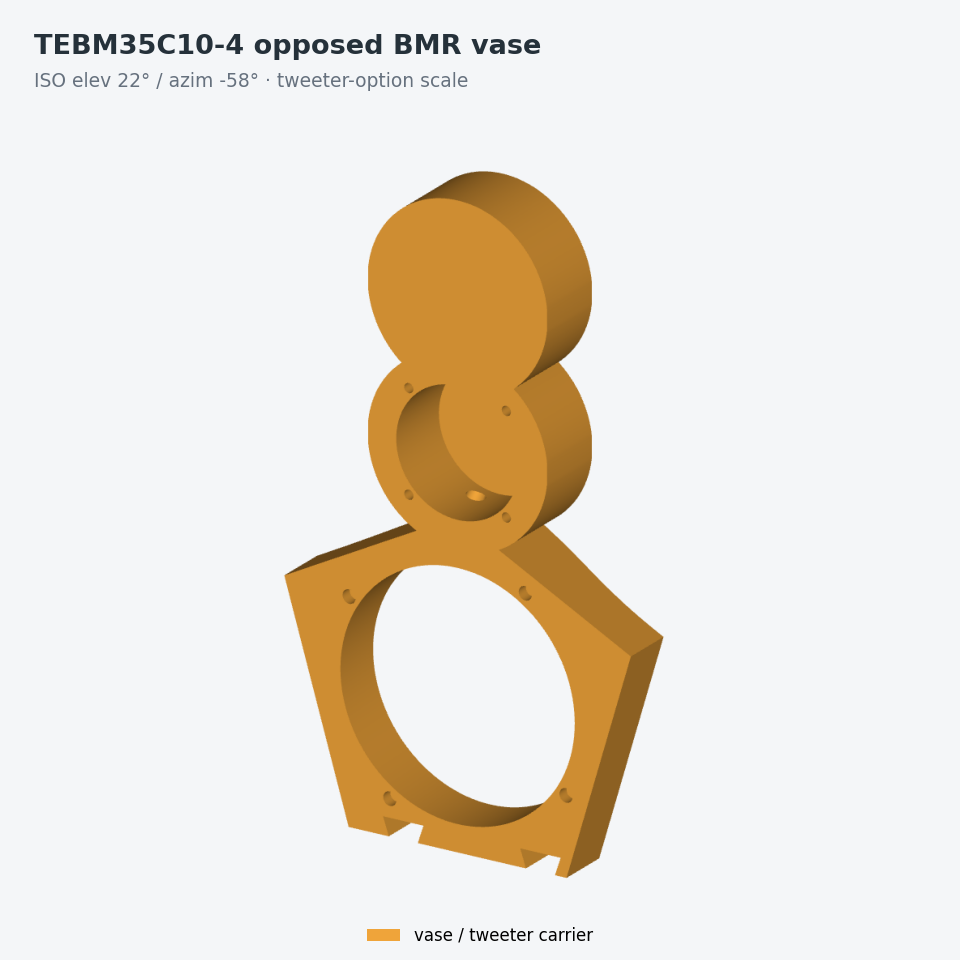

# LX521.4 top baffle — ND25FW-4 face-to-face mod (V2)

3D-printable version of the modified top baffle from
`plano top baffle con anidados V2.pdf` (exact 1:1 vector geometry extracted
from the PDF, not redrawn). Overall 304.8 × 468.31 × 18.3 mm — the exact
design depth is **18.3 mm**, not 18.6 mm. That envelope describes the R6P
proud family; the R6F Obi-Wan experiment deliberately removes the full
outline and retains only two collars. This file is the picker: choose a
product below, then follow its own doc.

## Product comparison

Every render below uses one camera and one declared frame per scale group, so
the cells are directly comparable. Regenerate them with `make iso_matrix`
after any CAD change.

| | Stock R6P | Slim R6P | Obi-Wan R6F |
|---|---|---|---|
| **Stock bridge (no floor stand)** |  |  |  |
| **Floor stand** |  |  |  |

The Obi-Wan cells include its optional tweeter crescent and flat wings, because
its mandatory geometry alone is two bare collars.

| Tweeter option | Render |
|---|---|
| **ND25FW-4 face-to-face** (default, all products) — two Dayton ND25FW-4 domes with waveguide, faceplates clamping the crescent; integral to the Stock/Slim vase, an optional add-on carrier on Obi-Wan |  |
| **TEBM35C10-4 opposed BMR vase** (Stock & Slim only) — two Tectonic TEBM35C10-4 BMRs, lower facing front and upper facing rear, replacing the crescent; built by `make vase_tebm35c10_4_cad` |  |

The tweeter row is drawn at its own larger scale; it is not comparable in size
to the product row.

## Products

The project has one human-facing artifact catalog:
[`artifacts/`](artifacts/README.md).

| Product | Geometry | Optional perimeter | Tweeter options | Status | Doc |
|---|---|---|---|---|---|
| [Stock R6P](artifacts/stock/) | B2, 304.802 x 453.457 x 18.3 mm | A-comp shoulders **or** B1 wings | ND25FW-4 crescent (integral) or TEBM35C10-4 BMR vase | Canonical CAD | [`docs/stock.md`](docs/stock.md) |
| [Slim R6P](artifacts/slim/) | V1L + V1; 11.5 mm front-flush acoustic field, full-depth bottom strip | matching V1 shoulders **or** V1 wings | ND25FW-4 crescent (integral) or TEBM35C10-4 BMR vase | Experimental | [`docs/slim.md`](docs/slim.md) |
| [Obi-Wan R6F](artifacts/obiwan/) | separate LM/UM collars; floor and stock-bridge states | flat constant-depth or graded weighted-depth wings | ND25FW-4 crescent add-on only | Candidate; not release-authorized | [`docs/obiwan.md`](docs/obiwan.md) |

The original state-oriented build outputs remain in `build/floor_stand/`,
`build/no_floor_stand/`, and `build/wings/` because the validation pipeline depends on
them. `artifacts/` adds stable names, hashes, and product grouping through
relative links without duplicating large CAD files. See
[`docs/PROJECT_SCOPE.md`](docs/PROJECT_SCOPE.md) for the intent, assumptions,
and release boundary; [`docs/REPOSITORY_STRUCTURE.md`](docs/REPOSITORY_STRUCTURE.md)
documents the implemented source/package and generated-state boundary.

## Quickstart

CAD is remote-first by default: `make` snapshots the working tree, runs on
`osado.lan`, and promotes only hash-verified artifacts back. The public remote
targets are:

    make
    make floor_stand
    make floor_obiwan  # focused integral-floor Obi-Wan release and strict QA
    make obiwan_release  # both Obi-Wan states + flat/graded, concurrent on osado
    make obiwan_wings  # flat + graded STEP/STL families, built concurrently
    make vase_tebm35c10_4_cad  # both Stock and Slim BMR-vase CAD children
    make check  # proud regression + final Obi-Wan R6F suites
    make candidate  # checks + regenerated candidate artifacts + QA

Running OCC on the current machine requires an explicit opt-in:

    LX_CAD_EXECUTION=local make PYTHON=<venv>/bin/python

Job control, cache seeding, promotion transactions, and the memory profiles
are documented in [`docs/REMOTE_BUILD.md`](docs/REMOTE_BUILD.md).

For direct Bambu Lab P2S use, build the small
[`to_print/`](to_print/README.md) shelf with `make to_print`. It exposes only
the 51 printable Stock, Slim, and Obi-Wan entries under friendly names,
including the no-floor-stand Obi-Wan 01+02+03+04 combo plate, with
matching ready-to-print `.gcode.3mf` projects and a local hash manifest. That
alternative is independently addressable through
`make obiwan_combo_plate_source`, `make obiwan_combo_plate`, and
`make obiwan_combo_plate_to_print`; none of these targets dispatches to osado.

These goals never dispatch to osado and run only on the workstation:

    make to_print                 P2S shelf: audit + 51 friendly STL/project pairs
    make to_print_validate        validate an existing shelf without slicing
    make artifacts                artifacts/ product facade: relink + rehash
    make iso_matrix               the standardized ISO render set above
    make check_bambu_3mf_audit    synthetic 3MF transform/mesh regressions
    make bambu_slice_release      authoritative ready-project slice/audit
    make vase_tebm35c10_4_3mf     ready BMR-vase projects, both profiles

Direct pip dependencies are `build123d`, `shapely`, `matplotlib`, `numpy`, and
`Pillow` — no external CAD tooling.

## Generated artifact layout

The default remote `make` builds BOTH stand-foot states. Use
`LX_CAD_EXECUTION=local make -j1` only for an intentional local build:

    build/floor_stand/      LX_STAND_FOOT=1: R6P fused foot + NL8 panel;
      stl/  *.step  *.png     R6F integral LM-owned W64 floor stem/foot + NL8 panel
    build/no_floor_stand/   LX_STAND_FOOT=0: R6P flat piece_bottom + bridge;
      stl/  *.step  *.png     R6F solid bridge web fused into the LM core
    build/wings/{flat,graded}/    Obi-Wan acoustic wing families
    build/vase_TEBM35C10-4/{stock,slim}/   opposed-BMR vase children
    build/common/           flag-independent shared outputs
    images/generated/iso/   the product-comparison render set

Each folder contains all proud-family variants and the matching Obi-Wan
core/add-on set. In R6P, `piece_bottom` is the only functionally
different base piece; the other base STLs can differ by <0.05 mm as
the foot-entry knots move. In R6F, the UM core is state-independent. The
floor LM owns the integral stand and only the shared upper shoulder; the
no-floor LM owns the complete fused bridge web. Their lower magnet axes are
coincident on that shoulder, but floor mode has no shallow skirt or rail below
it.
`build/common/attachments.step` is flag-independent and is
promoted as one shared file. The `LX_STAND_FOOT` environment flag defaults to 1.

Per-product printable-piece tables live in the product docs. The two
product-independent STL groups are:

| STL in `build/<state>/stl/` | Footprint (mm) | Used by |
|---|---|---|
| `lx521_coupon_*` | small blocks/gauges | calibration, routing, and clocking checks ([`docs/PRINTING.md`](docs/PRINTING.md)) |
| lx521_polar_base_1..2of2 | Ø216 / 169×185 | polar-measurement turntable under the stand foot (floor_stand only) |

## Shared source and evidence map

Geometry modules are listed in each product's doc. These are the shared
entry points:

| File | What |
|---|---|
| `scripts/export_piece_stls.py` | Exports the print-ready proud-family or Obi-Wan core/add-on STLs (`--variant`, `--outdir`) and one exact adjacent, hash-bound `.print.json` authority for every STL |
| `scripts/export_steps.py` | Exports a module's `gen_step()` to STEP via build123d's native exporter (`<module.py> --output <path>`) — no CAD-skill dependency |
| `scripts/gen_product_iso_matrix.py` | Renders the standardized product-comparison ISO set into `images/generated/iso/` from the promoted STEP files; one shared camera, one declared frame per scale group |
| `Makefile` | Generates STEPs/STLs/PNGs for both stand states into `build/floor_stand/` and `build/no_floor_stand/` (see "Generated artifact layout"). Local OCC jobs are serial; the remote executor uses bounded parallel slots, and every CAD subprocess runs through `scripts/run_memory_guarded.py`. |
| `scripts/remote_cad.py` / `cad-remote-requirements.lock` | Content-addressed SSH executor, resumable job control, verified artifact return, and exact remote Python environment |
| `review/captive_magnet_slice_audit/CAPTIVE_MAGNET_PAUSE_MANIFEST.md` | Authoritative per-STL front-face-down orientation, actual sliced open/closing layers, Bambu Custom park/pause/restore events, grouped magnet counts, and local-axis polarity |
| `review/CAPTIVE_MAGNET_ARTIFACT_INVENTORY.md` | Clickable inventory of all 58 magnet-bearing STL records, their 56 locally generated/directly loadable G-code-bearing Bambu 3MF projects, descriptive piece names, and exact magnet counts; also reconciles the 86 transverse and eight exact split-proxy stations |
| `build/<state>/stl/*.stl` and `build/wings/{flat,graded}/stl/*.stl` | The enforced acoustic-print inventory is 39 nonpolar front-face-down STL/sidecar pairs in each stand state plus ten flat and ten graded pairs: 98 exact pairs total. Every acoustic piece is source-X180 with only an optional in-bed Z rotation and its front datum at STL Z=0. A missing, orphaned, stale-hash, tilted, or translation-inconsistent `<stem>.print.json` fails release validation. The two floor polar-index jigs are the sole orientation-sidecar exclusions because they are fixtures with no acoustic front-face datum. |

The generated directories are **candidate packages**, not physical-release
authorization: even `make release` performs CAD, artifact and manifold checks
only, and the Obi-Wan state manifests record `release_authorized: false`.

## Documentation

Products:

- [`docs/stock.md`](docs/stock.md) — Stock R6P: key dimensions, print split,
  R6P cable routing, magnet attachment, assembly.
- [`docs/slim.md`](docs/slim.md) — Slim R6P: V1 vase, V1L LM section, the
  keyed 283° UM outlet.
- [`docs/obiwan.md`](docs/obiwan.md) — Obi-Wan R6F: two-collar geometry,
  buried routes, floor/no-floor structure, structural screens, assembly.

Cross-cutting authorities:

- [`docs/PROJECT_SCOPE.md`](docs/PROJECT_SCOPE.md) — intent, three-product
  inventory, CAD brief, assumptions, release boundary.
- [`docs/REPOSITORY_STRUCTURE.md`](docs/REPOSITORY_STRUCTURE.md) — layout and
  the source/generated-state boundary.
- [`docs/VARIANTS.md`](docs/VARIANTS.md) — variant/add-on catalog, envelope
  compatibility matrix, hardware, and retired C7/V0 design history.
- [`docs/PRINTING.md`](docs/PRINTING.md) — filament, slicer profile, coupons,
  fastener torques, insert installation, magnet pauses, print constraints.
- [`docs/REMOTE_BUILD.md`](docs/REMOTE_BUILD.md) — remote executor, cache
  seeding, promotion transaction, memory profiles.
- [`docs/CAPTIVE_MAGNET_SLICING.md`](docs/CAPTIVE_MAGNET_SLICING.md) — pause
  and embed workflow.
- [`docs/obiwan_acoustic_wings_spec.md`](docs/obiwan_acoustic_wings_spec.md) —
  flat/graded wing design authority.
- [`docs/obiwan_physical_qualification.md`](docs/obiwan_physical_qualification.md)
  — fail-closed physical qualification record.
- [`docs/README.md`](docs/README.md) — the complete documentation index.
