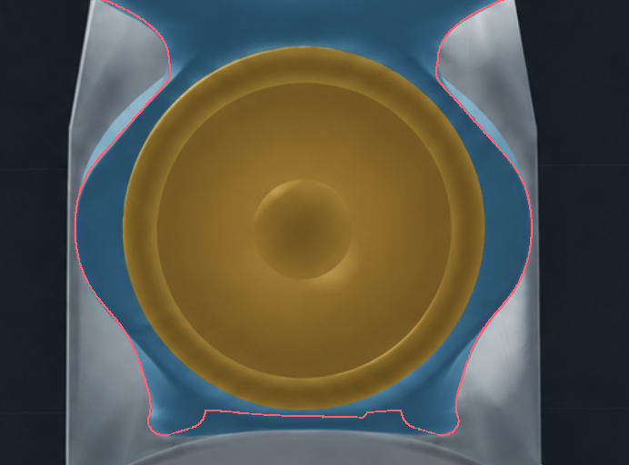

# Dayton ND25FN-4 waveguide — design sources and geometry evidence

The **Dayton ND25FN-4 waveguide** is the third tweeter family in this project.
It fuses the Obiwan MU10 upper-mid carrier and the printed front/rear tweeter
waveguides into one body. The same body fits both LM stand states.

**For printing, use the [current H2C file catalog](../../to_print/h2c/README.md).**
The [assembly and hardware guide](../../docs/DAYTON_ND25FN4_WAVEGUIDE.md)
explains the matching body, caps, M3 retainers and continuous H2C wings,
with separate PETG-GF/PLA and PETG Translucent/PLA Translucent jobs.
The [three-family guide](../../docs/TWEETER_OPTIONS.md) compares this option
with ND25FW-4 and BMR. It is an Obiwan upper replacement, not a crescent-only swap.

This directory retains the approved design sources and earlier P2S evidence.
“V4” is the original package's revision label. Original archive, source and
P2S filenames retain it for hash/provenance continuity; it is no longer the
product or current H2C filename. No deliverable ZIP is produced.

## Surface and interface evidence

The UM follows the supplied outline with a rounded middle, tighter lower
waist and flowing upper shoulders. The front is wider than the rear, with a
continuous inclined side and a broad shallow bowl. Its lower edge follows
the actual LM contour and meets the LM at Z18.30 mm without covering it.
Four Ø6 × 3 mm magnets are buried at the shoulders, with axes following the
sloping surface. The enclosed cable gallery passes beneath the driver ledge.



[Reference validation](reference_validation.json) ·
[Front](views/UM_outline_front.png) · [Side](views/UM_depth_side.png) ·
[Oblique](views/UM_outline_oblique.png) ·
[Depth and magnet checks](depth_magnet_validation.json) ·
[Wing clearances](wing_validation.json).

The continuous radial loft removes the previous front nick and rear dent
at the UM/tweeter waist. [Surface sections](waist_validation.json) and
[before/after renders](views/waist_comparison.png) retain that evidence.
[Lower rear band](views/UM_lower_band_oblique.png) and
[band validation](lower_band_validation.json) cover the smooth solid backing.

The current H2C assembly has its own
[LM interface checks](../../build/h2c/obiwan_interface_validation.json).
The earlier [orthographic interface sheet](views/LM_interface_orthographic_3D.png)
and [GLB detail](views/LM_interface_detail.glb) show the retained joint.

## Earlier P2S files and source geometry

These folders are specific to the previous printer and split-wing arrangement:

- [Tinmorry PETG-GF + PLA](print/README.md).
- [PETG Translucent + PLA Translucent](print_translucent/README.md).
- [Engineering Plate translucent changeover calibration](print_translucent_changeover/README.md).

The old P2S projects use their own single-nozzle material mapping and magnet
pauses. Use the H2C catalog for current files; its continuous wings have
different print orientations and closure timing.

The [approved body source](STL/01_UM_Crescent_V4.stl),
[cap source](STL/02_Closed_Cap_PRINT_TWO.stl) and
[M3 retainer source](STL/03_Tweeter_Retainer_PRINT_TWO.stl) preserve the design.
The print-body authority adds internal magnet-loading relief while keeping
the approved exterior, seats and mounting faces. The
[original delivery manifest](delivery_manifest.json) indexes the body,
accessories and the four P2S upper-wing STLs. H2C instead provides a full
left/right wing pair for either flat or graded style.

Use Hanglife HLTI-M3-001 inserts (M3 thread, Ø5 × 4 mm) in the shared
Ø4.6 × 4 mm printed bores, with six M3 × 8 mm screws for the two retainers.
[Hardware validation](hardware_validation.json) ·
[Current hardware policies](../../docs/PRINT_POLICIES.md) ·
[Magnet selection](MAGNET_SELECTION.md).

## Preserved interfaces and routing

Installed axes: X lateral, Y upward, Z forward; dimensions in millimetres.

| Interface | Retained dimensions |
|---|---|
| LM rear-driven M3 axes | X=±32; Y=315.770102 |
| UM front half-lap | Native mating material Z=12.4–18.3; exterior flush with LM at Z18.3 |
| Blind insert receivers | Ø4.6; floor Z=16.4 |
| Receiver front floor / half-lap gap | At least the native 1.9 / 0.2 |
| LM-to-UM M2 tie | Original axis, bearing plane and screw length; rounded access mouth R0.5 |
| MU10 driver mount | Ø82 opening, Ø98.6 recess, Z14.3 seat and four original mounting pilots |
| UM driver centre | Y=366.081 |
| Opposed tweeter axes | Y=450.648 / 512.648; 62 mm pitch |

The tweeter pair remains 20.13 mm lower than the first retained-package placement. The forward tweeter's lower radial expansion is divided by 1.5, retaining its Ø37.2 throat and 8.8 mm flare depth. The upper flare and all tweeter retention interfaces are unchanged. The nominal 2.4 mm front ligament sets the selected UM/tweeter spacing.

The closed T cable handoff, solid annular material beneath the MU10 seat, rounded M2 screw access and independent UM lead corridor are retained. The independent lead opening behind the lower UM is a functional cable clearance. The curved rear band flows around the exact LM receiver lands, and a direct rear height loft joins the UM to the tweeter with matched slope and curvature. Its intersection with the inclined side is rounded.

The C2 T gallery follows an approximately R45.6 path through the UM, moving in depth to pass below both right-hand driver pilots. Its nominal Ø6 mm lumen eases down to Ø5.4 mm beside the upper pilot to retain wall thickness, then blends into the retained T taper at Y439. That join is approximately Ø5.4 mm, continuing into the original Ø4.8 mm branch. Both centreline and radius meet smoothly. The LM handoff stays at Y326. The full Ø82 driver insertion opening remains clear. Actual bend radius, screw clearance and closed cover are reported in [validation.json](validation.json), [lower-band validation](lower_band_validation.json), and the [no-floor](um_finish_no_floor_validation.json) / [floor](um_finish_floor_validation.json) finish checks.

The raised base apron has been removed. The exposed lower front is Z18.30 mm through installed Y322, then eases into the existing bowl by Y336 with matched slope and curvature. The exact LM contour governs the lower edge; the reference-outline comparison starts at Y322. The retained P2S upper wings are relieved around this foot while preserving their LM magnets and lower split joints. H2C continues these wings into one piece per side. Receiver screw axes, blind floors, half-lap faces and the M2 bearing remain fixed.

## Review and provenance

[Body and driver GLB](views/nd25fn4_color_review.glb) ·
[Original flat split-wing assembly](views/nd25fn4_flat_wings.glb) ·
[Original graded split-wing assembly](views/nd25fn4_graded_wings.glb) ·
[Top/front/side sheet](views/orthographic_top_front_side.png) ·
[Rear](views/rear_installed.png) · [Cable section](views/wire_connection_section.png).

Blue is printed material, orange is driver reference geometry and grey is
LM/wings. These GLBs are decimated review copies; print from the current
catalog. MU10 electrical terminals are omitted from its visual reference;
checks use the conservative physical envelope.

The `.print.json` sidecars contain installed-to-print transforms and hashes.
[build_manifest.json](build_manifest.json) records generator and input hashes.
Each rebuild verifies the 271 payload hashes in the immutable user-provided
retained package. This is an explicitly STL-focused adaptation, with no
faceted STEP substitute. The H2C catalog now includes this family while
retaining its separate physical and acoustic qualification status.

## Rebuild and verify

From `top_baffle_v2`, using the project Python environment:

```bash
../.venv/bin/python candidates/nd25fn4_crescent/rebuild.py
../.venv/bin/python candidates/nd25fn4_crescent/build_wings.py
LX_CAD_EXECUTION=local ../.venv/bin/python scripts/run_memory_guarded.py ../.venv/bin/python candidates/nd25fn4_crescent/validate.py --geometry-only
../.venv/bin/python candidates/nd25fn4_crescent/validate.py --wings-only
../.venv/bin/python candidates/nd25fn4_crescent/verify_m3_stock.py
../.venv/bin/python candidates/nd25fn4_crescent/validate_um_finish.py
../.venv/bin/python candidates/nd25fn4_crescent/validate_lower_band.py
../.venv/bin/python candidates/nd25fn4_crescent/validate_outline.py
../.venv/bin/python candidates/nd25fn4_crescent/validate_waist.py
../.venv/bin/python candidates/nd25fn4_crescent/validate_reference.py
../.venv/bin/python candidates/nd25fn4_crescent/validate_depth_magnets.py
../.venv/bin/python candidates/nd25fn4_crescent/review.py
../.venv/bin/python candidates/nd25fn4_crescent/waist_review.py
../.venv/bin/python candidates/nd25fn4_crescent/depth_review.py
../.venv/bin/python candidates/nd25fn4_crescent/lower_band_review.py
../.venv/bin/python candidates/nd25fn4_crescent/outline_review.py
../.venv/bin/python candidates/nd25fn4_crescent/orthographic_views.py
../.venv/bin/python candidates/nd25fn4_crescent/deliver_stls.py
```

Regenerate the body and wing snapshot jobs, inspect current views, and refresh `snapshot_validation.json` before indexing delivery. `validate_depth_magnets.py` samples complete cavity surfaces and the exterior around all four stations without any flat-pad exemption. The comparison views and depth sections come from the exported triangles. The final index rejects stale geometry, validation or image hashes.
