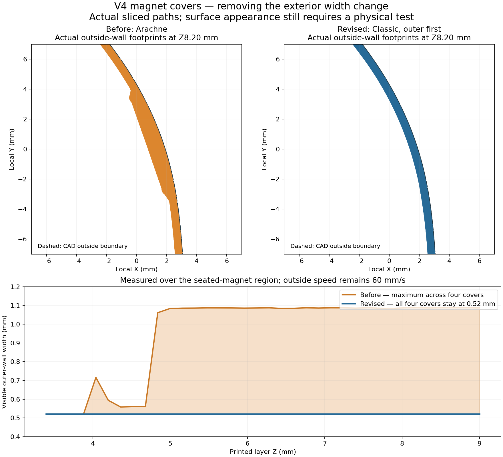
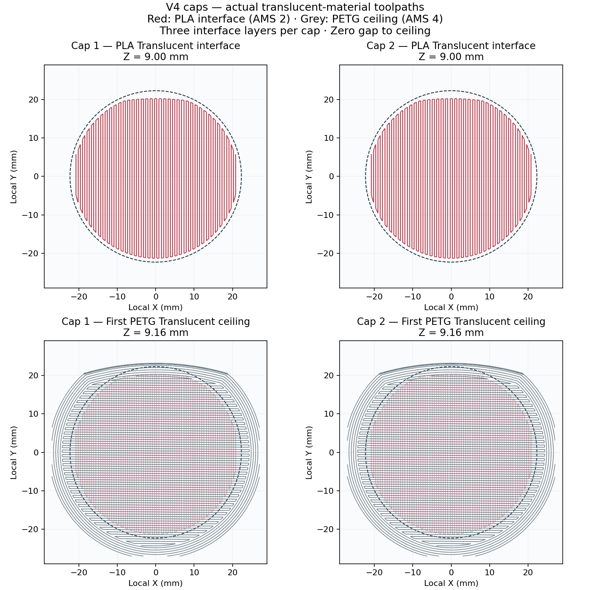

# waveguide — PETG Translucent + PLA Translucent

**Earlier P2S files.** For the current H2C printer, use the
[H2C catalog](../../../to_print/h2c/README.md) and
[Dayton ND25FN-4 waveguide guide](../../../docs/DAYTON_ND25FN4_WAVEGUIDE.md).
Original revision strings in these filenames are retained for provenance.


Separate **sliced Bambu Studio 3MF files for the P2S with a 0.6 mm High Flow nozzle**. The installed Bambu translucent filament recipes have been resolved in full and the toolpaths regenerated. This lane has its own material and changeover policy; later PETG-GF/PLA calibration changes do not alter these translucent print files.

## AMS assignment

Open a file as a **project**, use its prepared slice, and map these materials in Bambu Studio's Send dialog:

| Filament in project | Material | AMS slot | First / other layers | Flow | Volumetric limit |
|---|---|---:|---:|---:|---:|
| 1 | Bambu PETG Translucent | **4** | 250 / 245 °C | 0.95 | 16 mm³/s |
| 2 | Bambu PLA Translucent | **2** | 220 / 220 °C | 0.98 | 12 mm³/s |

The native files use one physical High Flow nozzle. Their internal nozzle-map values are not AMS slot numbers; **material 1 → slot 4, material 2 → slot 2** is the confirmed print-send assignment. PLA is used for removable support interfaces. Model parts and support bodies use PETG Translucent. Display colours follow the selected Bambu Studio presets.

**Textured PEI bed: 70 °C throughout.** This lane explicitly sets both materials' bed values to 70 °C. PLA's installed preset normally uses 55/60 °C; the first body slice showed a 55 °C command during a material change despite `by_first_filament`. The shared-bed override prevents that drop. PLA's nozzle, flow, cooling and retraction settings retain the installed translucent recipe.

## Files

For one speaker: print the body once, the accessories plate once, and one matching left/right upper-wing pair. Flat and graded wings are alternatives; retain the existing matching lower wings.

| File | Estimated time | PETG Translucent | PLA Translucent |
|---|---:|---:|---:|
| [01 — fused UM + ND25FN-4 waveguide body](01_UM_Crescent_V4_SMOOTH_WALLS_06HF_PETG_TRANSLUCENT_PLA_TRANSLUCENT.gcode.3mf) | 12 h 10 min | 322.8 g | 23.9 g |
| [02 — two caps + two M3 retainers](02_Caps_TWO_Retainers_TWO_06HF_PETG_TRANSLUCENT_PLA_TRANSLUCENT.gcode.3mf) | 2 h 09 min | 53.7 g | 2.6 g |
| [Flat left upper wing](V4_flat_left_UPPER_06HF_PETG_TRANSLUCENT_PLA_TRANSLUCENT.gcode.3mf) | 2 h 20 min | 60.9 g | 3.7 g |
| [Flat right upper wing](V4_flat_right_UPPER_06HF_PETG_TRANSLUCENT_PLA_TRANSLUCENT.gcode.3mf) | 2 h 25 min | 61.8 g | 4.1 g |
| [Graded left upper wing](V4_graded_left_UPPER_06HF_PETG_TRANSLUCENT_PLA_TRANSLUCENT.gcode.3mf) | 2 h 13 min | 54.9 g | 4.1 g |
| [Graded right upper wing](V4_graded_right_UPPER_06HF_PETG_TRANSLUCENT_PLA_TRANSLUCENT.gcode.3mf) | 2 h 13 min | 54.9 g | 4.1 g |

Estimates include the native slicer's support and purge consumption and exclude time spent inserting magnets.

## Retained geometry and print policy

- Same approved print meshes, placement, support blockers, driver seats and LM interfaces. One body fits both floor-stand states; the unchanged geometry retains the [LM assembly check](../print/LM_assembly_check.json).
- UM: **100% zig-zag**. Tweeter region: **15% gyroid**, using the existing modifier above installed Y421 mm. Upper wings: **10% gyroid**. Caps/retainers: **15% gyroid**.
- 0.16 mm layers; 0.20 mm first layer; six walls, ten top and five bottom layers. Existing widths, ironing, 5 mm outer brim and print orientations retained.
- PETG support bodies and **three dense PLA top-interface layers**, zero top Z gap, zero interface spacing. Existing bottom-contact exception remains 0.18 mm gap / 0.5 mm spacing.
- Purge: **298 mm³ PETG → PLA; 575 mm³ PLA → PETG**, matching the selected translucent colours and exceeding the shared material-separation minimum. Flushing into model, infill and supports is disabled.
- All 12 insert bores, cable routes and captive magnet cavities retain their nonprinting support blockers. Native geometry and actual support paths are independently checked.

The material overlay and its explicit exceptions live in [translucent_material_policy.json](../translucent_material_policy.json). Geometry roles, support rules and wall acceptance still come from the project-wide [print policy](../../../print_policy.json). Material temperature, flow, cooling, retraction and speed settings come from the complete frozen installed translucent presets, rather than the GF recipe.

Bambu's native `--allow-mix-temp` option is used for the intentional PETG/PLA support pair. The real PETG and PLA identities are preserved. If you reslice in the GUI, retain the mixed-material support permission and recheck support coverage and magnet timing.

## Body surface revision

Use the body file named **SMOOTH_WALLS**. The previous Arachne slice changed the visible outer-wall width from 0.52 mm to as much as 1.09 mm over the magnet pockets at a constant 60 mm/s. That changes the requested extrusion rate locally and is a plausible source of the reported pocket outline or texture change.

The revised body uses **Classic, thin-wall detection, outer walls first**, retaining **0.52 mm outer walls at 60 mm/s** across all four magnet covers. `Precise outer wall` is disabled because Bambu ignores that option for outer-first ordering. Both the complete retaining-wall boundary and the visible exterior contour are checked against actual extrusion footprints. Magnet positions, cover geometry, loading paths and LM interfaces are unchanged. Caps and wings retain their existing Arachne process.



The measured exterior width change is removed. Confirm the physical appearance with the [small body magnet surface test](qualification/README.md), which uses the actual curved body station and the revised material/process settings. Complete cosmetic invisibility has not been demonstrated by a physical print.

## Magnet pauses and material appearance

The body pauses before **Z9.80 mm** for its four Ø6×3 mm magnets. Each upper wing pauses before **Z5.96, 9.80 mm** for one Ø5×2 mm LM magnet and then two Ø6×3 mm UM magnets. These timings were rediscovered from the translucent-material slices.

Match polarity, fully seat each disc in its inclined pocket and keep it below the printing surface before resuming. The pause moves the bed down for access and restores the printing height. Changing pose or layer height requires reslicing and checking insertion timing again.

The buried cavities remain closed. Translucent plastic can reveal the infill and embedded magnets; this recipe preserves the structural infill rather than optimizing optical clarity. Physical adhesion, support removal and magnet retention with this material pair remain unmeasured.

## Cap supports and verification

Both caps have three PLA ceiling interfaces at Z8.68, Z8.84 and Z9.00 mm, followed by the first PETG ceiling at Z9.16 mm. Measured inner coverage is at least **99.35%**. Neither retainer has generated support.



All six jobs passed full oriented-triangle/placement comparison, native material recipe checks, actual T0 model/support and T1 interface extrusion checks, bed-temperature checks, support clearance, D6 wall continuity, insertion timing and static G-code validation. Native plate warnings are empty. Standard Bambu firmware commands remain intact; static checking does not simulate the printer.

[manifest.json](manifest.json) binds the six files to the preparation, frozen profiles, source meshes and passing reports. [views_manifest.json](views_manifest.json) binds the ceiling preview to the actual sliced G-code. Rebuild from the project root:

```bash
../.venv/bin/python candidates/nd25fn4_crescent/translucent_print.py prepare
# Inspect review/nd25fn4_translucent/dry_run.json before slicing.
../.venv/bin/python candidates/nd25fn4_crescent/translucent_print.py slice
../.venv/bin/python candidates/nd25fn4_crescent/translucent_print.py publish
../.venv/bin/python candidates/nd25fn4_crescent/translucent_surface_coupon.py prepare
# Inspect review/nd25fn4_translucent/surface_coupon/dry_run.json.
../.venv/bin/python candidates/nd25fn4_crescent/translucent_surface_coupon.py run
../.venv/bin/python candidates/nd25fn4_crescent/translucent_print_docs.py
```

Verify the current files without reslicing:

```bash
../.venv/bin/python candidates/nd25fn4_crescent/translucent_print.py verify
```
