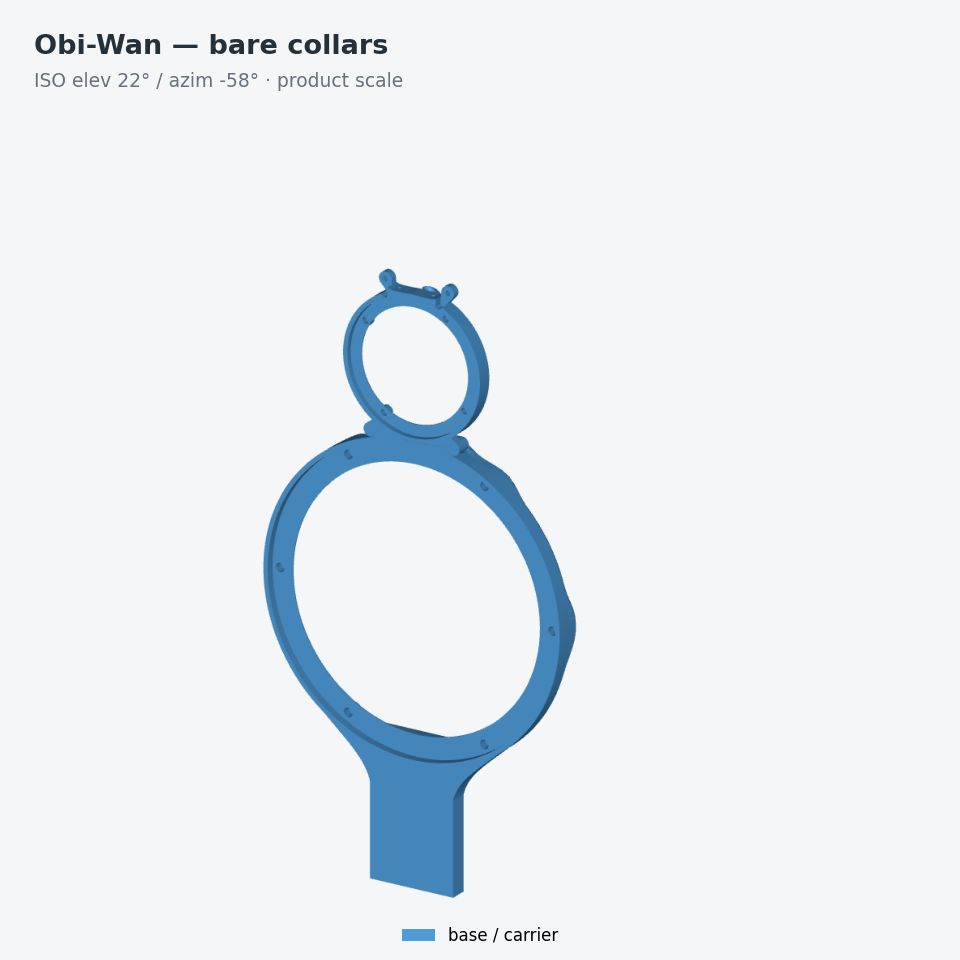
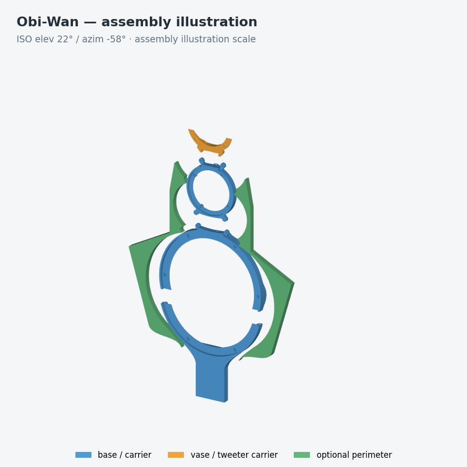

# Build your top baffle — earlier P2S arrangement

For the current H2C printer, start with the [H2C file guide](../to_print/h2c/README.md)
and [three-family tweeter selection](TWEETER_OPTIONS.md). The integrated
[Dayton ND25FN-4 waveguide](DAYTON_ND25FN4_WAVEGUIDE.md) is an Obiwan upper
option with its own matching wings. Quantities and splits below describe
the earlier P2S arrangement with regular uppers.

Choose the shape, mounting state and tweeter before opening a print file.
These are DIY CAD designs for an LX521.4 modification. Stock is the canonical
CAD baseline; Slim is experimental; Obi-Wan and the BMR options require
physical qualification. No measured acoustic advantage is claimed here.

| Choice | What you get | Parts for one speaker, default ND25 tweeters |
|---|---|---|
| Stock | Full-depth 18.3 mm baffle | 01 bottom in one stand state, 02 and 03 middle pieces, 04 vase |
| Slim | 11.5 mm acoustic field with a full-depth lower strip | The matching Slim 01, 02, 03 and 04 |
| Obi-Wan | Separate driver collars, with optional perimeter panels | 01 keyed LM bottom in one stand state, 02 keyed LM top, 03 UM carrier, 04 tweeter crescent; add the NL8 service lid for the floor state |

Stock and Slim can be bare, or use their matching four A shoulders,
or their matching pair of B1 wings. Choose one perimeter system. Obi-Wan can
be bare, or use four flat split2 pieces, or four graded split2 pieces. Its
wing combo replaces those four separate jobs. Split3 is retired from the shelf.

For Obi-Wan, the core combo replaces 01+02+03+04. The floor combo also
contains the NL8 service lid (five parts). Print a combo or its contents,
then repeat that selection for the second speaker. A complete winged
Obi-Wan has eight printed parts without a floor stand, nine with one.

## Pick the files

Use the generated [file guide](../to_print/FILE_GUIDE.md) for exact links,
lane, stand state, slicer time and filament estimates. Estimates are
per job; GUI jobs have no estimate until sliced. The catalog has 42 choices
and 76 projects across alternate lanes. This is not a shopping quantity.

| Folder | Material / nozzle | What to do |
|---|---|---|
| `3mf_04` | PLA Basic / 0.4 mm | Open the sliced `.gcode.3mf`; preserve its orientation and magnet pauses |
| `3mf_06hf` | PLA Basic / 0.6 mm high flow | Same workflow, with the matching installed nozzle |
| `3mf_06hf_petg-gf` | TINMORRY PETG-GF / 0.6 mm high flow | Sliced flat or graded wing combo; support is off |
| `3mf_06hf_petg-gf_pla` | TINMORRY PETG-GF / 0.6 mm high flow, PLA interface where support is enabled | Open `_GUI.3mf`, assign slots, slice and audit the exported result before printing |

GUI core combos, LM bottoms and UM carriers use six walls and 100% zig-zag infill,
normal/snug support, PETG-GF support bodies and PLA interfaces at zero top
Z gap. The standalone LM top uses 30% gyroid with support; the crescent and lid
use 30% gyroid with support off.
Saved settings and the delivery manifest are the exact authority.
Do not substitute a generic PETG profile or an installed same-name preset.

## Hardware to prepare

Counts below are **one speaker / stereo pair**, with the default ND25 pair.
The [insert catalog](INSERT_CATALOG.md) identifies each bore and insert size.
Confirm screw engagement with the actual driver flange and washer stack;
do not bottom a screw in a blind insert.

| Configuration | M5 inserts | M3 inserts | M2 inserts |
|---|---|---|---|
| Stock or Slim, bridge | 10 / 20 | 5 / 10 | 0 / 0 |
| Obi-Wan, bridge | 10 / 20 | 8 / 16 | 3 / 6 |
| Obi-Wan, floor | 8 / 16 | 12 / 24 | 3 / 6 |

For each Obi-Wan speaker, prepare six LM driver screws (M5), four UM driver
screws (M3), two LM–UM and two UM–crescent joint screws (M3), and three
M2 × 8 ties. The floor adds four NL8 screws (M3) and two floor-anchor
fasteners (M5); the bridge adds four bridge fasteners (M5). Stock/Slim
use the corresponding driver/bridge fasteners and one M3 vase-seam fastener.
Their integral-floor mounting hardware depends on the external stand and
must be counted from that stand's drawing.

The ND25 pair uses four M4 through-clamp screws and nuts per speaker (eight
for stereo), not heat-set inserts. Prepare one LM driver, one UM driver and
 two tweeters per speaker, the chosen connector, actual speaker leads and
compatible external stand/bridge. CAD driver references are fit proxies;
confirm the installed driver's terminals and flange.

A winged Obi-Wan uses twelve D5 × 2 magnets per speaker (24 stereo): six
in the core and six in the wings. Bare collars can retain their six buried
magnets for future wings. For Stock/Slim, count the selected jobs' sites in
the pause manifest; unused alternative files do not add hardware.
An opposed-BMR vase or either two-driver BMR crescent adds eight M2 driver
inserts and screws per speaker (16 stereo) and replaces the ND25 carrier
and pair. Stock/Slim BMR vases are separate CAD deliverables outside this
42-choice shelf. BMR-slim and PTT1.3 remain separate candidates.

Exploded offsets are illustrative, not assembly clearances.

## Print and assemble

1. Record the project hash, printer/nozzle, filament lot and drying history.
   Run the [PETG-GF qualification procedure](PETG_GF_QUALIFICATION.md)
   before committing to a structural build.
2. Preserve front-face-down orientation. For a GUI project, inspect both
   pin paths, blind insert bores, cable mouths, support removal access,
   material changes, prime-tower clearance and the pause in sliced preview.
3. Follow the selected job's pause count. Core combos pause at Z=5.96 mm
   for six magnets; standalone core parts have only their own sites.
   Mark a reference magnet, test every mating pair for attraction, and use
   the site's marked-pole direction in the pause manifest. Seat magnets
   below the next extrusion before resuming; do not infer polarity from
   left/right appearance. Photograph placements before burial.
4. Remove accessible support and fish the actual cables through every
   route before installing drivers. Reject a blocked route or trapped
   support. Install heat-set inserts in individual parts before assembly.
5. Dry-fit the keyed LM seam on a flat reference surface. Pins register
   the halves; the driver flange and its normal fasteners complete the load
   path. Fit LM–UM and UM–crescent joints and their ties without forcing.
6. Join wing dovetails coplanar on the same flat reference. Follow the wing
   adhesive-gallery procedure in [Obi-Wan](obiwan.md), then test magnetic
   attachment. Magnets receive no structural load credit.
7. Check screw engagement, cable clearance and front-plane alignment with
   the real drivers. Complete separate floor/bridge loaded tests and
   photograph the assembly before recording a physical pass.

## Evidence and sharing

The [qualification record](obiwan_physical_qualification.md) is pending.
The test worksheet records measured values and photo/measurement paths.
CAD renders illustrate configuration and assembly; they are not photographs
or acoustic test results. Publish response/polar comparisons only after
recording driver, crossover, microphone geometry and the baseline.

`make delivery_package` creates `dist/lx521-print-pack.zip` with actual STL
and 3MF bytes, this guide, estimates, qualification assets and SHA-256
checksums. Extracting it does not require the repository's symlinks.
The `artifacts/` facade is for browsing the source checkout; do not distribute
that symlink tree on its own.
