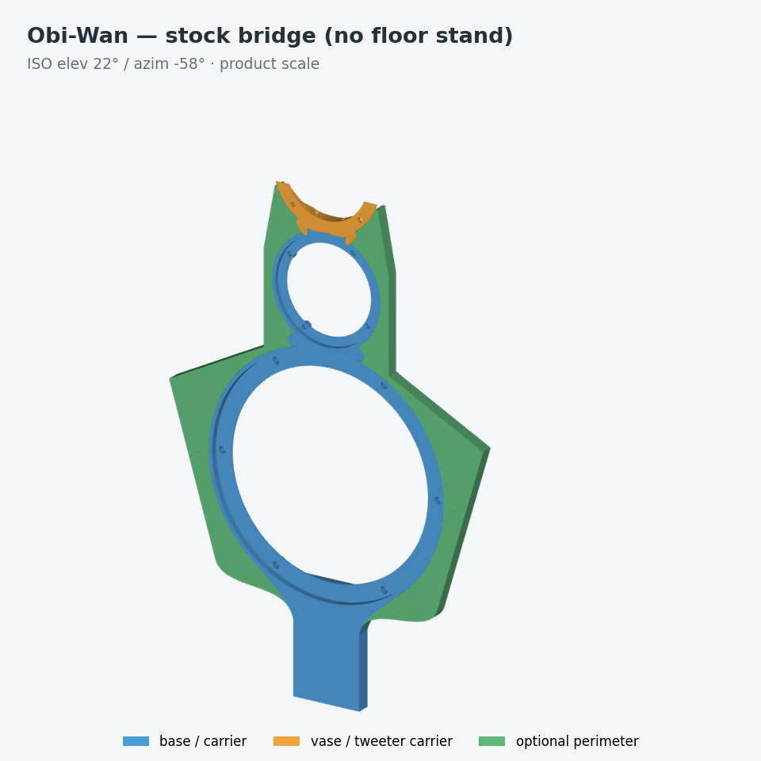
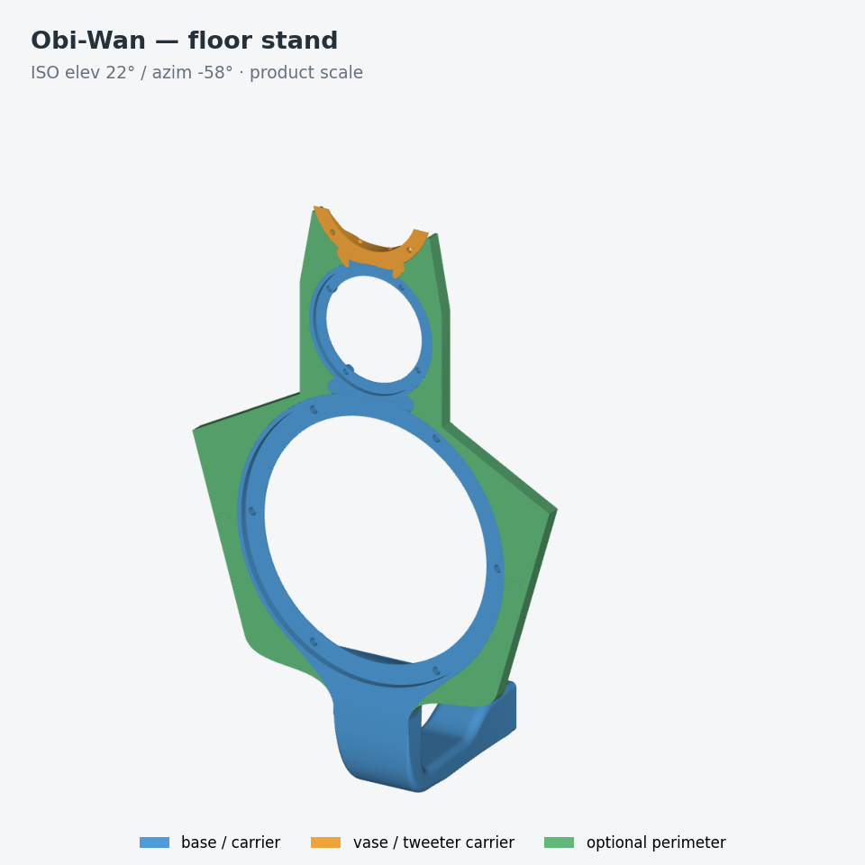
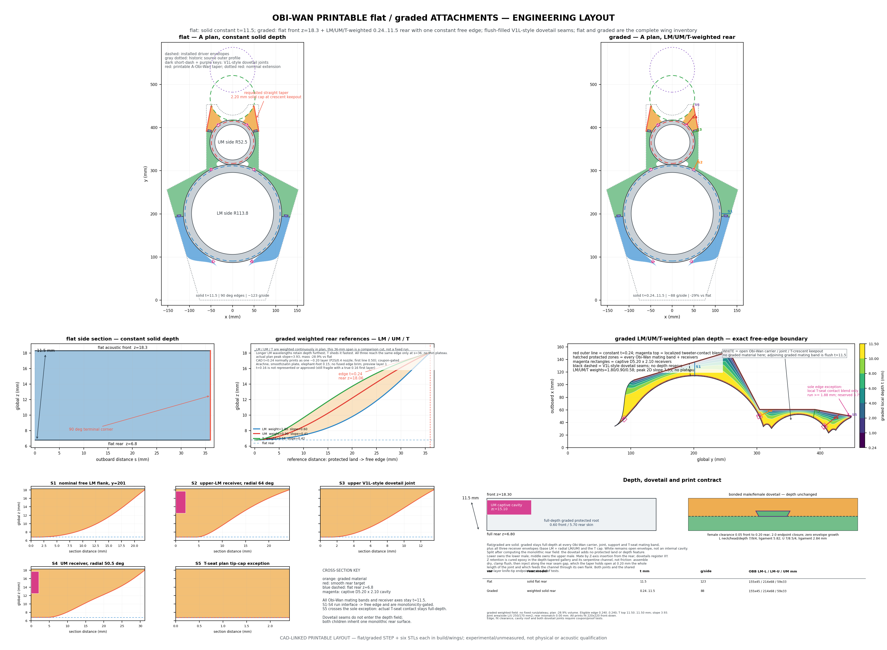
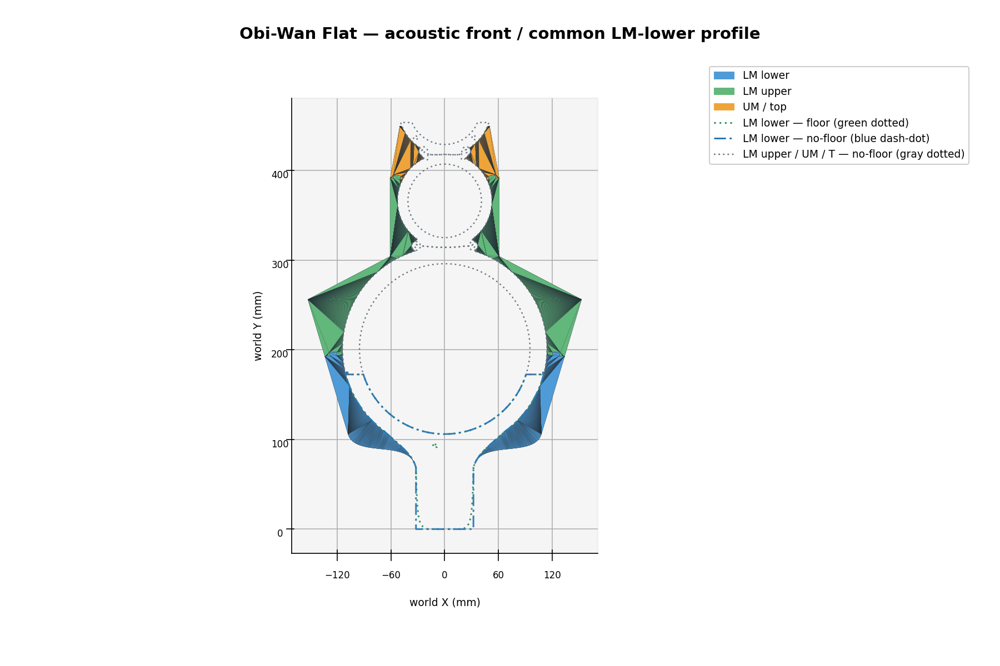
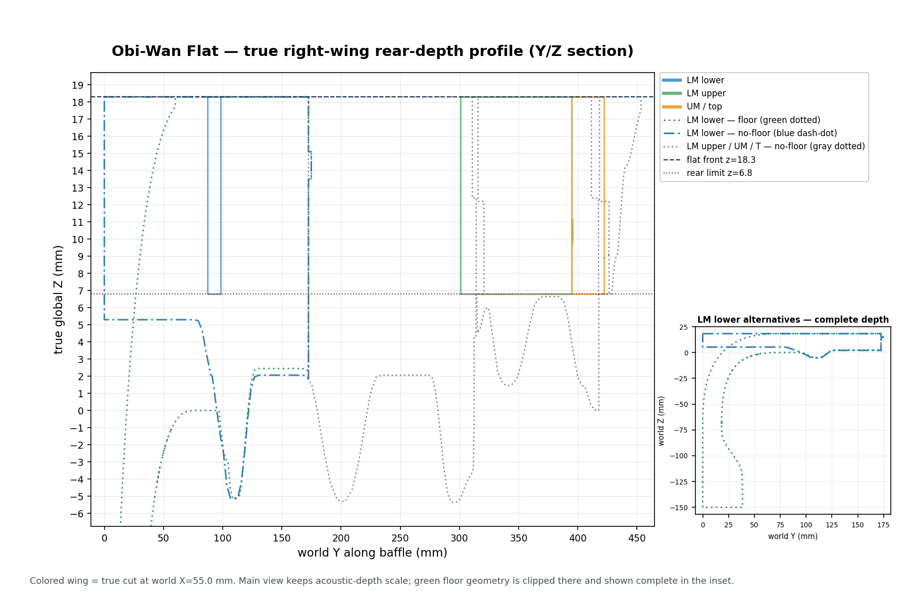
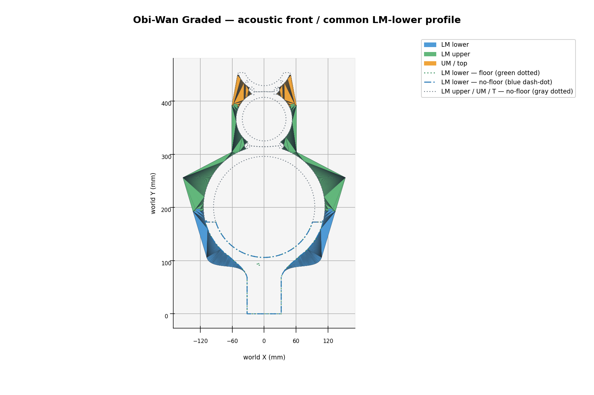
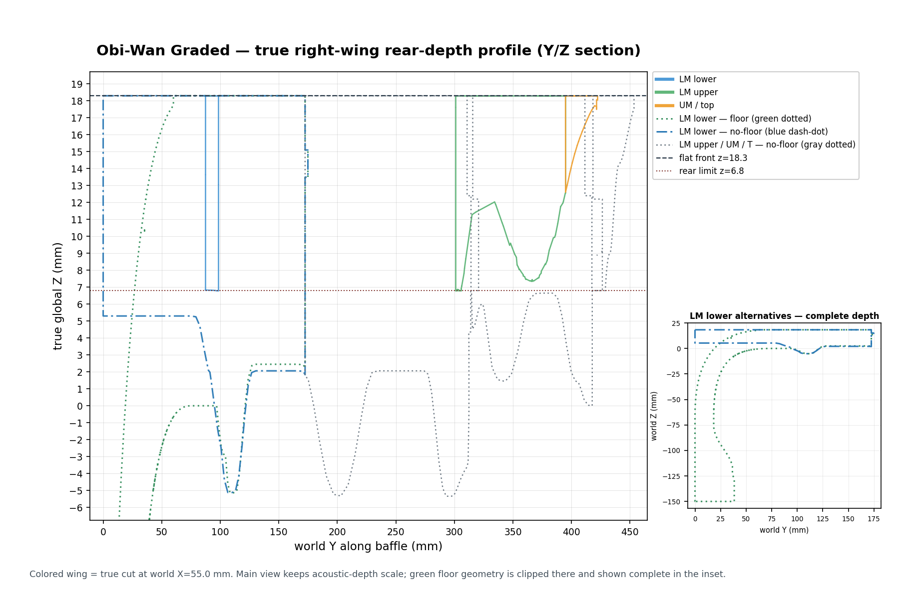
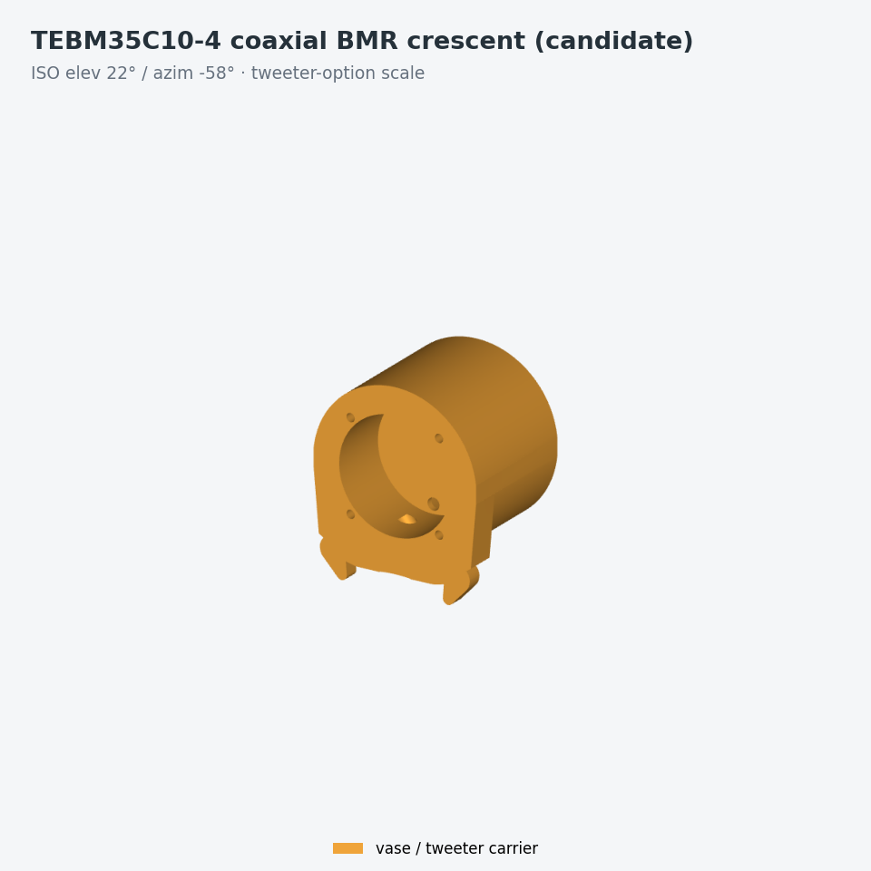
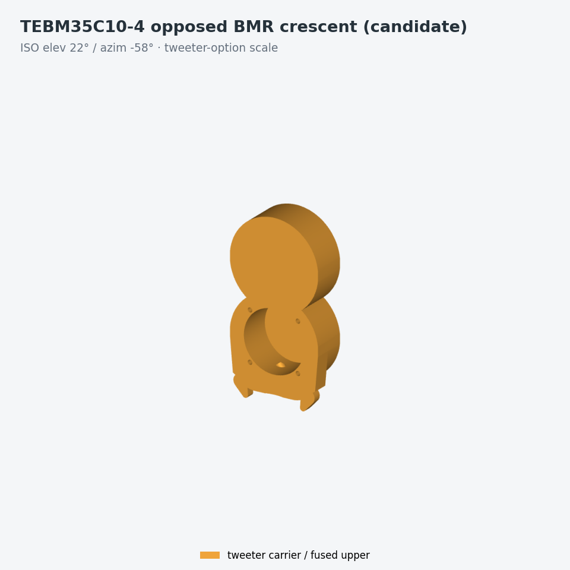

# Obi-Wan — extreme two-collar barebone

Obi-Wan removes the full baffle outline and keeps only what carries a driver:
one LM collar and one UM collar, plus optional tweeter crescent and optional
flat/graded acoustic wings. It shares no seam, duct, or attachment interface
with the proud family. Catalog entry:
[`artifacts/obiwan/`](../artifacts/obiwan/).

This product is a **candidate**: its state manifests record
`release_authorized: false`, and the physical qualification record in
[`obiwan_physical_qualification.md`](obiwan_physical_qualification.md) is
pending.




Both renders add the optional tweeter crescent and flat wings, because the
mandatory geometry alone is two bare rings. They share one camera and one
declared frame with every other product cell, so they are directly comparable;
`make iso_matrix` regenerates them.

## Source modules

| File | What |
|---|---|
| `src/lx521_baffle/obiwan/carriers.py` / `src/lx521_baffle/obiwan/split.py` | Extreme Obi-Wan core: structural LM/UM flush-driver collars at R113.0/R51.7 with smooth exposed R113.8/R52.5 side fairings clipped only inside the existing LM--UM and T--UM cusp/service regions, with the 0.40 mm LM--UM inter-carrier gap preserved; rounded LM-to-UM M3 half-laps whose closure-web/base teardrops remain nominal Ø9 while each complete Z-owned cylindrical functional boss is locally Ø9.8, with standalone rear Ø3.4 LM clearance bores and standalone rear-opening blind Ø4.6 x 4.0 UM heat-set receivers; six pause-and-bury captive magnet stations (two upper LM ring-radial, two lower LM shoulder-normal, and two UM ring-radial), all with cavity datums hidden 0.15 mm beneath a continuous carrier surface and no local pad/boss/flat/cue; buried UM/T route spans; and free rear cable continuations. Floor and no-floor share the exact upper LM shoulder used by the wings. Floor has no shallow material below its y=60 shoulder tangent; no-floor alone retains the shallow four-insert bridge. |
| `src/lx521_baffle/obiwan/lm_split.py` | Optional, mutually exclusive two-print form of the finalized Obi-Wan LM carrier: exact zero-gap world-Y butt seam plus two symmetric Ø1.60 cylindrical pins normal to the seam (world +Y). The pins engage 2.40 mm; the right blind socket is round Ø1.84 and the left is X-relieved to 1.96 × 1.84 mm so the 218.374 mm pitch cannot bind like two tight round fits. Two tiny exterior lands outside the LM recess retain 0.12 mm radial and 0.25 mm end clearance, at least 0.50 mm local radial/end wall, at least 0.05 mm recess plan clearance and 0.13 mm conservative W22-flange clearance. Their worst-case reach is R114.4036: 1.4036 mm beyond the structural R113.0 ring and 0.6036 mm beyond the finalized R113.8 visible fairing. They add no extra fastener or standalone retention/load credit; the monolithic LM remains canonical. |
| `src/lx521_baffle/obiwan/route.py` | Exact printed-owner segments and physical cable continuations: 0.8 mm minimum walls and 0.85 mm seat roof on the surviving buried UM/T spans; no-floor LM/T/UM entries packed inside the one D20 support opening; LM-owned UM/T envelopes buried 0.05 mm beneath their outside owner limits, leaving a continuous 0.85 mm skin to visible R113.8 with no groove; full-width burial webs and solid roof-to-bore saddles; free UM behind the UM carrier; free T behind the crescent; and the 82.95° crown crossing |
| `src/lx521_baffle/obiwan/bridge.py` | Universal lower-LM front profile (filled exterior union of the historical floor stem and no-floor bridge), immutable no-floor four-hole datum, fused 62 mm insert core with soft cubic shoulders and three rear cable entries packed in the D20 support opening at the deepest existing LM-pad depth (no separate keel or rear ribs), hardware proxies, and an opening-aware biaxial 4 kg sustained-1g/3g/5g structural screen |
| `src/lx521_baffle/obiwan/floor.py` / `src/lx521_baffle/obiwan/floor_strength.py` | Floor-only integral W64 stem/foot with the constant-thickness convex Option-B transition (75 mm span, 65 mm rise, centreline Rmin 41 mm), rear NL8 panel/service cavity and three buried cable continuations; closed-form five-material net-section screen. This is part of the LM carrier, not an add-on, and the analysis is not FEA or physical qualification. |
| `src/lx521_baffle/obiwan/attachments.py` | Optional tweeter crescent with complete standalone blind-M3 receiver ears; any cable retention is external/non-modeled, and magnets receive zero structural load credit |
| `src/lx521_baffle/obiwan/assembled.py` | Review assembly containing the Obi-Wan core, selected add-ons, and the explicitly non-manufacturing terminal/Faston proxy |
| `src/lx521_baffle/obiwan/wings.py` | STEP-first flat/graded Obi-Wan acoustic attachments: one canonical monolith per side, three exact surface-normal captive D5 × 2 magnet receivers per side (LM lower shoulder, LM upper, and UM), one saddle compatible with the shared floor/no-floor upper LM shoulder, the approved constant-depth flat or monotonic LM/UM/T-weighted graded rear, and two print options. Both wings start at the Option-B vertical tangent y=74.15 and grow outward through a G1 cubic that joins the outer flank at the LM-aperture lower tangent y=105.981, so no wing panel hangs below the bend. Option A preserves the original three exact-mask pieces; option B keeps the identical lower piece and fuses LM-upper plus UM into one upper piece by restoring only their former clearance seam. Each physical side retains the lower→upper V1L-style through-local-thickness XY dovetail; option A also retains its middle→UM dovetail. Female clearance is 0.05 mm, exposed split clearance closes over the final 2 mm at both endpoints, and the keys add no envelope growth. They register/interlock in XY but provide no independent Z retention. Graded’s complete internal protected-land perimeter is accepted only when paired actual-BREP probes show a C0 jump ≤0.03 mm |
| `scripts/export_obiwan_wings.py` | Transactional flat/graded exporter: canonical/A/B assembled STEP, ten strict front-face-down STLs with ten exact adjacent `.print.json` authorities, facts, hash manifest, and CAD-derived QA renders under `build/wings/flat/` or `build/wings/graded/`; every review PNG uses hash-validated staged BREPs for a neutral no-floor LM-upper/UM/tweeter reference plus the two coincident LM-lower outlines—blue dash-dot for no-floor and green dotted for floor stand; the side view keeps its useful acoustic-depth scale and includes a complete-depth floor inset |
| `tests/test_obiwan_wings.py` | Remote-only flat/graded BREP, print-inventory, STEP, STL, mirror, depth, receiver, dovetail/clearance, endpoint-closure, bed-fit, provenance, render, and exact dual-state lower-LM front-profile gates |

## Geometry and interfaces

Obi-Wan is no longer a flush-recessed copy of the full outline. Its
mandatory geometry is only:

- an LM flush carrier with Ø190 opening, Ø221.2 seat, **R113.0 structural
  radius**, and a smooth **R113.8 exposed side radius**;
- an UM flush carrier with Ø82 opening, Ø98.6 seat, **R51.7 structural
  radius**, and a smooth **R52.5 exposed side radius**;
- two compact half-lap pairs at x=±32.0, y=315.770 that establish the
  165.100 mm driver-center spacing without entering either flange seat. Their
  closure-web/base teardrops remain nominal **Ø9**, while each complete
  Z-owned cylindrical functional boss is locally **Ø9.8** to preserve the
  joint screen with the Ø4.6 receiver. Each LM rear Z-half owns a complete
  standalone Ø3.4
  rear-driven screw-clearance passage; each UM front Z-half owns a complete
  standalone rear-opening blind Ø4.6 x 4.0 receiver for an M3 x 3 heat-set.
  The receiver retains a **1.9 mm solid acoustic-front floor**, and the LM and
  UM ear halves retain a **0.20 mm axial gap**. Install the inserts in the
  individual UM print before assembly, then drive the screws from the LM rear;
  this interface has no washer, nut, or front bolt head;
- exactly six surface-normal D5×2 alignment/anti-rattle interfaces using
  captive Ø5.20 × 2.10 cavities: four LM and two UM. Each magnet is enclosed
  between 0.45 mm axial skins and a self-supporting 45° closing roof, with no
  glue or external access opening. The upper LM pair retains the world polar
  64°/116° axes (±26° from top), has no proud ear, and retains at least 2.2 mm cavity-edge to the nearest
  insert-pad edge and 0.86 mm to its route covers. The lower LM pair is
  captive at parameter 0.5 of the shared curved shoulder. The right visible
  datum is **`(x,y,z)=(45.285011,89.190370,15.10)`** with outward normal
  `(0.706451,-0.707762)`; the left is its exact mirror. The cavity datums are
  0.15 mm inward from those continuous surfaces. These shoulder stations are
  identical in floor/no-floor carriers, lie wholly above the Option-B bend
  tangent, and clear the inserts, buried routes, and load path. The upper LM
  pair and the UM pair use
  that same source Z=15.10; the UM pair retains its 50.5°/129.5° axes. The LM
  and UM structural ring radii stay
  R113.0/R51.7, while their exposed sides are continuous cylindrical
  R113.8/R52.5 fairings. The fairings stop only inside the existing LM--UM and
  T--UM cusp/service regions; the LM--UM stop keeps the 0.40 mm inter-carrier
  gap open. At each ring-radial or lower-shoulder station the
  cavity construction datum is structural radius **+0.65 mm**, or **0.15 mm
  beneath the exposed surface**. The D5×2 cavity and 0.45 mm skin remain
  unchanged, and there is no magnet-local backing, boss, relief, rear cap,
  flat, or visible pocket cue. The exterior is the immutable magnet-free
  carrier surface. All
  six have
  **zero structural load credit**;
- Flat and graded provide three coaxial captive receivers on each physical
  side—one at LM lower, one at LM upper, and one at UM—so all six carrier
  magnet axes have matching wing cavities. The mating surfaces are flush with
  zero physical air gap; the receiver retains 0.05 mm as a solid internal
  spacing standoff. Nominal paired magnet-face separation is **1.10 mm** at
  LM-lower, LM-upper, and UM (`0.45 + 0.15 + 0.05 + 0.45`);
- six Obi-Wan-only LM axes at 0/60/120/180/240/300° on radius 104.75 mm,
  leaving the crown clear; both states own six ordinary blind carrier
  inserts;
- two compact direct UM-to-tweeter half-lap ears at **x=±24,
  y=421.5**. UM owns complete rear ears with Ø3.4 passages; the crescent owns
  complete front ears with rear-opening blind Ø4.6 x 4.0 receivers, 360°
  walls, and 1.9 mm acoustic-front floors, so each part is independently
  printable and no fastener breaks the acoustic front; and
- complementary, tangent-blended **full-depth** closure webs at both
  LM–UM and T–UM junctions. LM owns the lower LM–UM web, UM owns the upper
  LM–UM and lower T–UM webs, and the tweeter crescent owns the upper T–UM
  webs. Every owner spans z=6.8..18.3 and overlaps its own ring/crescent by
  0.40 mm; the local anti-void lens fills retain a separate 0.45 mm
  Arachne-compatible fusion land. Sub-resolution Boolean shards are discarded,
  while the independently printed owners retain the normal 0.05 mm plan
  seam. The functional bosses at both LM-to-UM and UM-to-tweeter are a
  Z-owned exception: each base closure teardrop remains nominal Ø9, but every
  complete cylindrical boss is locally Ø9.8. Each ear remains wholly in its
  assigned axial half, and the opposing print is fully notched over that half
  so the plan seam cannot split a bore, receiver wall, or front floor. The
  separate 0.20 mm axial gaps remain open. These are
  solid members behind the common z=18.3 front plane,
  not front skins over cavities; the only non-functional opening between the
  upper rings is the central ±6 mm T free-cable mouth; and
- an Ø8.2 UM passage buried only in the LM carrier and an Ø6.0 T passage
  buried in the LM and UM carriers, each with 0.8 mm minimum walls and a
  0.85 mm seat roof on its printed span. The UM cable exits the LM passage
  and remains free behind the UM carrier; there is no printed UM-carrier rear
  duct or D82 mouth. T exits the UM passage and remains free behind the
  tweeter crescent; the crescent has no printed cable arc. Their physical
  centerlines cross at 82.95° with T above UM and retain a 2.00 mm physical
  envelope gap. In no-floor state the D7.8 LM lead uses the buried Ø9 branch
  from the D20 entry cluster; floor state uses its integral Ø9 lane. The
  LM-owned UM/T lumens finish at R112.95 and their covers at R113.75 beneath
  the uninterrupted R113.8 carrier exterior, leaving a 0.85 mm solid outside
  skin and no groove.

The load-bearing outer lips extend 2.4 mm past the flange-seat radii. Smooth
0.8 mm side fairings cover those structural lips at exposed radii R113.8 and
R52.5; they are clipped only inside the existing LM--UM and T--UM cusp/service
regions, and the LM--UM stop keeps the nominal 0.4 mm gap between the
structural collar envelopes open. The LM's six
insert-pad buttons, both pilot patterns, and flush seats remain; the old
5.5/7.5 mm annular floors and perimeter skin have been removed. Each seat
keeps only a 0.85 mm two-extrusion membrane. Narrow outer lips, local
blind-insert floors/bosses, calculated spokes, surviving buried-route covers, and
the explicit mechanical interfaces are the retained material.
The guarded closure acceptance clips the actual independently printable
LM/UM/crescent BREPs through fixed physical windows, not a window generated
from the closure target. It checks the actual front-face-down Bambu schedule
(0.20 mm first layer, then 0.16 mm layers) plus both sides of
each half-lap transition against frozen conservative front silhouettes,
proves the standalone LM clearance passages and UM blind receivers retain
their complete local Ø9.8 functional bosses, 360° walls, and the 1.9 mm UM
front floor; rejects exact 3-D owner overlap and proud material above z=18.3;
and rejects
any bounded residual void component beyond the declared fit seams, fastener
interfaces, route lumen, and T cable mouth. Thus a self-shrunk target, an open
cusp connected to a driver aperture, or a thin front skin over a rear cavity
cannot satisfy the release gate.

The canonical LM carrier remains one monolithic large-format release part.
Its mandatory front-face-down footprint is approximately 236.41 x 313.75 mm
in both states, so it is **not P2S-printable**. On a P2S it must instead be
printed as the mutually exclusive pair
`obiwan_optional_lm_keyed_1_of_2_bottom.stl` and
`obiwan_optional_lm_keyed_2_of_2_top.stl`; do not install either half
with the monolithic LM. The pair is cut from the finalized state-specific LM
at world **Y=172.481 mm** with an exact **zero-gap planar butt**, so both buried
route lumens cross the seam without being redrawn. The bottom owns two
symmetric Ø1.60 cylindrical pins at `x=±109.187`, `z=14.30`; each points world
+Y normal to the seam, has 0.50 mm root overlap, and engages the top by
2.40 mm (2.90 mm total male length). The top owns two 2.65 mm-deep blind
sockets with 0.12 mm radial and 0.25 mm end clearance: right is round Ø1.84,
while left is X-relieved to 1.96 × 1.84 mm. This round-plus-relieved constraint
tolerates ±0.30 mm relative pitch error across the 218.374 mm spacing instead
of binding like two tight round sockets. Two small exterior support lands
grow outward from the R113 lip, outside the LM recess. They retain at least
0.50 mm local radial and blind-end wall, 0.05 mm recess plan clearance, and
0.13 mm conservative W22-flange plan clearance. Their worst-case reach is
R114.4036: 1.4036 mm beyond the structural R113.0 ring and 0.6036 mm beyond
the finalized R113.8 visible fairing. Flat and graded include a hidden 0.25 mm
clearance pocket around each land at the carrier interface, wholly between the
front and rear faces. CAD compatibility is gated; physical printed fit remains
coupon-qualified. With the monolithic LM these pockets are only small hidden
local reliefs; the three magnetic datums and primary wing retention are unchanged.
The pins create no extra screw or standalone retention/load credit.
Print both halves front-face-down. Assemble them front-face-down on one flat
datum, bring the top toward the bottom along world -Y so both pins enter
together without flexing, and confirm full seating, coplanarity, and
route-seam continuity. Then install the LM driver:
its flange and all normal LM fasteners are the installed structural splice
across the seam. Both keyed halves now print front-face-down with only
in-plane bed rotation. The former Z26°/Z45° and floor-bottom X=−90° footprint
figures are obsolete because those out-of-plane orientations cannot support
the captive-magnet pause. Revalidate the generated front-down footprint on the
selected printer. Each horizontal Ø1.60 pin is four nominal 0.4 mm nozzle
widths: release requires a process-matched coupon and sliced preview proving
both complete pin paths, both blind mouths, the exterior lands, and continuous
minimum-wall paths.
This option is still **PENDING** until two-pin/socket fit, full-seat and
coplanarity evidence, route-seam inspection, cable pull-through, and
driver-installed 1g/3g/5g proof are recorded; monolithic-LM evidence does not
qualify the split form.

The captive-magnet release audit does not create monolith G-code or a fake
monolith pause. Instead, every monolith station is source-contract matched to
the corresponding same-state keyed half, and coverage is accepted only after
that actual half passes the normal P2S cavity/toolpath gates. The pause
manifest distinguishes `not_p2s_printable__cavity_covered_by_exact_split`
coverage from actual keyed-half pause groups. Scaling, clipping, tilting, and
virtual-bed overrides are prohibited because all pieces must retain the same
front-face-down texture and insertion geometry.

The floor stand is not an add-on. In `build/floor_stand/`, both the canonical LM
carrier and the optional keyed bottom own the complete floor structure: a
full-depth W64 stem softly blended into the lower LM cap, a W64 × 18.3 mm
foot extending from `z=-150..18.3`, and one constant-thickness convex
Option-B wall transition over a 75 mm rear span and 65 mm rise. Its tangent
cubic has a 41 mm minimum centreline radius and no curvature reversal,
and the rear NL8 panel/service cavity. The floor plane is world `Y=0`, so the
LM-axis-to-floor distance is exactly **200.981 mm**. The rear panel is
`z=-150..-146`, 44 mm high, with an Ø31 NL8 cutout centered at
`(x=0,y=22)` and four Ø3.2 holes on a 29.2 mm square. The outer stem/foot
is solid except for the necessary connector service cavity and three buried
continuation lumens (LM Ø9, UM Ø8.2, shared T Ø6) through R14 turns.
There is no yoke, open rail, support fastener, or
`lx521_top_obiwan_addon_mount_floor_support` file. All six LM driver insert
bores are ordinary blind carrier bores in both states.

The floor and no-floor lower profiles intentionally diverge below the shared
upper shoulder. No-floor owns the complete shallow bridge down to world Y=0;
floor mode owns only the shoulder material above Y=60 plus its full-depth
Option-B wall. There is no shallow perimeter box and no lower magnet rail
under the bend. Flat and graded share the exact local shoulder saddle, contain no
material below the Option-B vertical tangent at Y=74.15, and grow outward
through a G1 cubic to the LM-aperture lower tangent at Y=105.981. The floor's
deep load path and the no-floor bridge's four blind inserts remain
state-specific.

The optional V1 face-to-face tweeter crescent remains a separate add-on with
complete local-Ø9.8 blind-M3 receiver half-laps, 360° walls, 1.9 mm front
floors, and no printed T-cable arc.
Obi-Wan has no printed grommet; selected external cable retention remains a
physical-fit item, and cable load must never reach the MU tabs. No-floor
support is not an add-on: a 62 mm insert-bearing plate with soft cubic
shoulders is fused into the LM carrier around the unchanged holes at
(±20,20)/(±20,70). Three rear-facing mouths are packed inside the D20 support
opening centered at `(0,60)`: LM above, T lower-left, and UM lower-right. They
enter at z=5.3 and rise internally; the acoustic front stays solid. The plate occupies z=5.3..18.3, flush
with the acoustic front and no deeper than the six existing LM insert-pad rear
faces. It has no X-frame, acoustic-front window, rear rib, or other depth structure. Its four
6.8 mm-total bores open from the rear with a Ø6.5 × 2.0 entry followed by
Ø6.4; they retain the existing 6.2 mm solid front floor.
No bridge geometry extends behind the existing LM pad envelope. No-floor
geometry is otherwise unchanged. Select the tweeter module and an
independently qualified external retention method required by the
installation.

The conservative room-temperature PLA Tough+ screen assumes a 4.0 kg
installed mass, y=230 mm center of mass, and 70 mm rear offset. The 62 mm
insert core is reduced by the complete Ø9/Ø8.2/Ø6.0 entry lumens, with no
thin-skin credit, to a conservative **38.8 mm** design section. Exact 0.01 mm
sampled cuts through the soft outline retain at least 45.73 mm. At 13.0 mm
depth the credited section's in-plane/rear moduli are **3261.8/1092.9 mm³**.
Conservatively summing in-plane and rear bending gives approximately
**4.40/13.19/21.99 MPa** and safety factors **1.82/1.36/0.82** at sustained
1g/8 MPa, transient 3g/18 MPa, and transient 5g/18 MPa. Its 68° lower-ring fusion cradle physically follows the plate
to z=5.3, but the existing ring lip begins at z=6.8, so the load screen
credits only the actual 11.5 mm-deep monolithic interface. That interface
retains 118.5 mm effective width after deducting one Ø8.2 UM tunnel plus the
complete Ø6.0 tweeter tunnel. Its in-plane/rear section moduli are
**26908.4/2611.6 mm³**, with biaxial factors about **6.37/4.78/2.87**. The
combined normal/rear 5g insert reaction is 434.2 N, giving 1.38 pull-out
safety factor under the same assumed 600 N per insert; magnets contribute
exactly 0 N. These are design calculations, not certification. The two-ear
upper joints use the actual 0.43 kg MU + 0.20 kg tweeters plus carrier,
crescent, wire, and hardware allowance: 0.85 kg total over conservative
120 mm plan and 70 mm rear levers. Both receiver interfaces co-govern with
contact factors about 2.85/2.14/1.28 and M3 screw-tension factor about 1.28 at
5g. Those screens do not independently qualify either heat-set process,
receiver wall, or 1.9 mm front floor; the 5g pullout demand is approximately
393.9 N per insert. Magnets receive no credit in any case. The
finished print, inserts, screws, stock bridge, and installation substrate
remain
inside the physical proof-test boundary. The factors apply only near
room temperature; direct sun, a closed vehicle, or any service
approaching Bambu's published 61 °C heat-deflection temperature
invalidates them.

The integral floor stem has its own conservative closed-form
rectangle-minus-lumens screen. It is explicitly **not FEA, certification, or
physical release evidence**. The 4.0 kg load model uses `y=230 mm`, a 70 mm
rear eccentricity, and 1g/3g/5g load cases. The net W64 × 18.3 root deducts
the complete Ø9/Ø8.2/Ø6 lane sections; magnets and both optional concealed
split pins/sockets receive 0 N credit. Current project-allowable results are:

| Material | Vertical 1g/3g/5g SF | Anchored lateral 1g/3g/5g SF | 1g diagnostic deflection | Result |
|---|---:|---:|---:|---|
| Bambu PLA Tough+ | 3.05 / 1.97 / 1.18 | 4.22 / 2.73 / 1.64 | 1.18 mm | analytical pass |
| Bambu PLA Basic | 4.39 / 2.78 / 1.67 | 6.09 / 3.85 / 2.31 | 1.05 mm | analytical pass |
| Bambu PLA Lite | 2.69 / 1.73 / **1.04** | 3.73 / 2.40 / 1.44 | 1.40 mm | **FAIL at vertical 5g; provisional data** |
| Bambu PLA Matte | 2.78 / 1.79 / 1.08 | 3.85 / 2.49 / 1.49 | 1.49 mm | analytical pass |
| Bambu PLA Silk+ | 3.23 / 2.09 / 1.25 | 4.47 / 2.90 / 1.74 | 1.17 mm | analytical pass |

PLA Lite is provisional because no product-specific official TDS was
available; its comparison-sheet input is fail-closed. Every reported stress
includes an explicit **1.25 root geometry/model factor**. PLA Lite fails the
1.05 minimum at vertical 5g and is not an accepted material under this screen;
the other four pass only the analytical thresholds (2.0/1.5/1.05 and ≤2.0
mm), not the physical gate. The result is valid only with a **100% local-solid
modifier through the complete stem/root**; sparse infill receives no structural
credit. The W64 footprint also tips before material failure under lateral
acceleration: the calculated free-standing thresholds are only 0.139g
lateral, 0.348g rearward, and 0.384g forward. Therefore the installed speaker
**must use a positively attached anti-tip tether or anchor**; the rectangular
foot alone is not a safety restraint. Qualification remains pending a
2×-service-load 24 h proof at 35 °C with no cracking/whitening and residual
set ≤0.5 mm or ≤10% of loaded deflection, followed by at least 168 h at
1.5× service load for creep. Service above 35 °C, direct sun, radiator hot
soak, changed material/process, or the optional keyed LM form requires its own
recorded qualification.

The terminal service reference lies on the **283-degree axis**, exactly
midway between mounting screws 238 and 328 degrees; coupon 9 is the
physical clocking witness—there is no cosmetic collar engraving. Printed
UM conduit stops at the LM owner boundary; the Ø7.0 cable is free behind the
UM carrier, follows the modeled R15 approach to the 283° reference, and
continues through the R20 service turn to
a Y breakout comprising a 4 mm-long OD8 collar and two OD4 branch sleeves.
Two provisional Ø3.2/R8 slack leads enter separate provisional low-profile
flag Fastons. Service states pull one connector at a time through
0/3/6/9/12 mm while the other remains installed. The STEP fit model adds
closed Ø98/Ø80/Ø60 MU and conservative stepped W22 rear-body keep-outs.
The W22 source and transform are hash-pinned and recorded above.

`PHYSICAL_MEASURE_REQUIRED = True`, so terminal qualification remains
pending. The raw MU reference is an open acoustic surface and omits the
terminals; the datasheet also does not dimension them. The 12 mm maximum
pull exactly equals the provisional exposed-tab length and has zero
positive release overtravel margin. Measure and record carrier radius,
tab pitch/projection, 8.5/9.5 mm proxy body widths, flag orientation,
polarity, real withdrawal, cable/Y fit, and the selected external cable
retention before committing a full print. The proxy is a keep-clear aid,
not manufacturer
geometry or release proof.

See [`VARIANTS.md`](VARIANTS.md) for the variant/add-on catalog and the
compatibility matrix, [`obiwan_acoustic_wings_spec.md`](obiwan_acoustic_wings_spec.md)
for the flat/graded wing design authority, and [`PRINTING.md`](PRINTING.md) for
filament choice, print settings, fastener torques, and insert installation.

## Printable pieces

| STL in `build/<state>/stl/` | Footprint (mm) | Used by |
|---|---|---|
| `obiwan_core_1_of_2_lm_carrier.stl` | Structural Ø226 (R113.0) collar with a smooth exposed R113.8 side fairing, clipped only inside the LM--UM cusp to retain the 0.40 mm gap; six ordinary blind LM insert bores at 0/60/120/180/240/300°; two complete rear LM-to-UM ears with locally Ø9.8 cylindrical functional bosses and standalone Ø3.4 rear-driven screw-clearance passages at x=±32/y=315.770; two captive upper ring-magnet stations plus two captive lower shoulder stations, all hidden 0.15 mm beneath continuous surfaces. The right lower visible datum is `(x,y)=(45.285011,89.190370)` on shoulder parameter 0.5 with outward normal `(0.706451,-0.707762)`; the left is its exact mirror. All four LM magnets share source Z=15.10 with the UM pair. The LM also owns the buried UM/T route segments and continuous Ø9/R14 LM handoff. Floor state owns the full-height bent W64 stand and only the upper shallow shoulder; it has no lower box or magnet rails. No-floor owns the shallow four-insert bridge. | canonical large-format release form of the mandatory LM carrier; use it on a verified larger bed **or** both optional keyed halves, never both forms. |
| `obiwan_optional_lm_keyed_1_of_2_bottom.stl` | front-face-down; in-plane bed rotation only; verified within 220 mm in both states | optional replacement print form for the canonical LM; in floor state it inherits the **entire** stem/foot/NL8 panel but remains the bed-checked alternative to the oversized monolith; requires the matching top half |
| `obiwan_optional_lm_keyed_2_of_2_top.stl` | front-face-down; in-plane bed rotation only; inherits both complete LM-to-UM ears, their local Ø9.8 cylindrical functional bosses, and their standalone Ø3.4 rear clearance passages | optional replacement print form for the canonical LM; requires the matching bottom half |
| `obiwan_core_2_of_2_um_carrier.stl` | Structural Ø103.4 (R51.7) collar with a smooth exposed R52.5 side fairing, clipped only inside the LM--UM and T--UM cusp/service regions while retaining the 0.40 mm LM--UM gap; two complete front LM-to-UM ears with standalone rear-opening blind Ø4.6 x 4.0 M3 heat-set receivers and 1.9 mm acoustic-front floors; two complete rear UM-to-tweeter ears with standalone Ø3.4 screw-clearance passages; locally Ø9.8 cylindrical functional bosses at both interfaces; two captive ring-magnet stations hidden 0.15 mm beneath the fairing; and the buried T continuation with fully solid-webbed 328°/58° insert bypasses. The UM cable is free behind this carrier and has no printed rear duct. | mandatory UM core; install both LM-to-UM inserts in this individual print before assembly |
| `obiwan_addon_tweeter_crescent.stl` | cropped V1 crescent plus two complete front UM-to-tweeter ears with locally Ø9.8 functional bosses, standalone rear-opening blind Ø4.6 x 4.0 M3 heat-set receivers, complete 360° walls, and 1.9 mm acoustic-front floors; no printed T-cable arc or conduit | optional face-to-face tweeter carrier; install both inserts in this individual print before assembly, then attach at x=±24, y=421.5 with the T cable free behind it |

Stable routing/fit review files in each state folder are
`obiwan_split.step` (mandatory two-carrier core),
`obiwan_lm_split.step` (the optional two-print LM form;
mutually exclusive with the monolithic LM carrier),
`obiwan_attachments.step` (optional tweeter add-on only),
`obiwan_assembled.step` (review assembly), and
`um_fit.step` (non-manufacturing Faston proxy,
standard/V1L/Obi-Wan UM Ø7 cable references, and the proud/V1L profile-fitted
split inserts). Obi-Wan has no printed grommet. The V1L grommet halves are also exported as the stable
STLs listed above.
The assembled Obi-Wan STEP also shows the independent LM Ø7.8 reference.

## Acoustic wings (flat and graded)

Two mutually exclusive wing families attach to the same three captive magnet
axes per side. **Flat** is constant depth; **graded** weights its rear depth
by LM/UM/T wavelength. Both are optional, and
[`obiwan_acoustic_wings_spec.md`](obiwan_acoustic_wings_spec.md) is their
design authority.



The engineering layout plots both families' plan, rear-depth field, section
cuts and dovetail contract on one sheet.







The front views carry both coincident LM-lower outlines — blue dash-dot for
no-floor, green dotted for floor stand. The two Y/Z sections are true cuts at
world X=55 mm and are the clearest statement of what separates the families:
flat holds its rear at the z=6.8 limit the whole way, while graded's rear
rises and falls between the LM, UM and T bands. Both keep the acoustic-depth
scale in the main view and show the complete floor geometry in the inset.
`rear`, `magnet_roots`, `split_exploded` and `two_piece_split_exploded` sheets
sit beside them in `build/wings/{flat,graded}/review/`.

Note that these sheets and the design map above still print the pre-rename
`Ac`/`Ae` family titles inside the image. `Ac` is flat and `Ae` is graded; the
titles regenerate with the next `make obiwan_wings`.

## Combined plates

A **combo** is one pre-arranged Bambu plate that holds several parts at locked
positions and prints them in a single job. It is not a different part: each
combo contains exactly the same meshes as the individual files it replaces, in
the released front-face-down orientation, and promotion requires exact
project/STL equivalence against them.

There are four, all under `to_print/obiwan/`:

| Combo | Contains |
|---|---|
| `obiwan_01_02_03_04_LM_UM_combo_no_floor_stand` | `01` keyed LM bottom (no-floor) + `02` keyed LM top + `03` UM carrier + `04` tweeter crescent |
| `obiwan_01_02_03_04_LM_UM_combo_floor_stand` | `01` keyed LM bottom (floor stand) + `02` keyed LM top + `03` UM carrier + `04` tweeter crescent |
| `obiwan_flat_wings_split2_combo` | all four flat split2 wing pieces: `05`/`08` LM-lower left and right, `06`/`09` fused LM/UM-upper left and right |
| `obiwan_graded_wings_split2_combo` | all four graded split2 wing pieces: `11`/`14` LM-lower left and right, `12`/`15` fused LM/UM-upper left and right |

**The rule is exclusive-or.** Print a combo *or* its individual pieces, never
both — a combo plate together with the same parts as separate jobs prints
every piece twice. And never mix stand states: the `01` bottom is
state-specific, so a floor-stand plate and any no-floor part do not belong in
the same speaker.

Print settings, magnet pauses and the refresh procedure are in
[`to_print/README.md`](../to_print/README.md).

## Tweeter options

Obi-Wan has no vase, so where Stock and Slim choose between two vases, Obi-Wan
chooses between three **crescents** on one unchanged mount: the pair of
half-lap ears at `x=±24, y=421.5` on the UM collar, with blind M3 receivers,
360° walls, 1.9 mm acoustic-front floors and a 0.20 mm axial gap. All three
present that interface identically, so swapping them touches nothing else —
not the UM print, not the wings.

- **Released ND25FW-4 face-to-face crescent** (default) —
  `obiwan_addon_tweeter_crescent.stl`, the same arrangement Stock and Slim get
  from their vase: two Dayton ND25FW-4 domes whose faceplates clamp the
  crescent between them. This is the only release-authorized carrier.
- **Candidate coaxial TEBM35C10-4 BMR crescent** — two Tectonic BMRs stacked
  back to back on one acoustic axis, carried by a D66 pod dropped onto the
  collar and joined to it by a solid flush skirt rather than by a crescent
  outline. Documented below; **not** release-authorized.
- **Candidate opposed TEBM35C10-4 BMR crescent** — the same two BMRs in the
  qualified proud vase's own side-by-side arrangement, on the same dropped
  land plus a second one a vase pitch above it, inside one 25.1 mm envelope.
  Documented below; **not** release-authorized.

Fitting no crescent at all is also a supported configuration.

The opposed TEBM35C10-4 BMR **vase** used by Stock and Slim is still **not**
available for Obi-Wan: it is a seam-B vase piece with the regular proud-family
female dovetails, and Obi-Wan has no seam B. What the opposed crescent takes
from it is the *layout*, not the part.

### Candidate coaxial TEBM35C10-4 BMR crescent



A pod and a flush junction, not a crescent outline: the two drivers, the two
half-lap ears, and solid material everywhere between them and the collar. It
keeps the released UM mate exactly — the same half-laps at `x=±24, y=421.5`,
the same blind-M3 ear receivers, the same 0.20 mm axial gap — and keeps
nothing else of the released crescent's plan.

- **The pod is dropped as close to the UM as the mate allows.** Both BMRs sit
  on one axis at `(0, 452.494193)`, 15.699 mm below the released ND25FW-4
  acoustic axis at `(0, 468.193)`, so the MU10-to-BMR axis spacing falls from
  102.112 mm to **86.413 mm**. Two things stop the drop and both come from the
  released mate: the UM's native R51.7 core ring, which the released crescent
  clears by 0.20 mm and which alone would allow `y=450.981`; and the UM
  half-lap's own receiver notch — the complete Ø9.8 ear grown by the released
  0.10 mm joint clearance — which the D66 land must not be nicked by, because
  the notch is cut over `z=6.7…12.4` while the land runs the full depth, so a
  nick would either lose land or make the plan grow rearward at z=6.7. The
  notch governs. Holding the proud vase's qualified 1.20 mm wall between the
  notch and the pod fixes the axis, and leaves the pod wall 1.713 mm off the
  UM core ring at the cable mouth — material the skirt fills. **The acoustic
  consequence of the new spacing is unmeasured and is an open item.**

- **50.2 mm stack.** The front driver mounts on the shared z=18.3 acoustic
  plane facing +z; the rear driver mounts on the pod rear land at z=−31.9
  facing −z. Two 25.1 mm driver envelopes back to back is exactly
  2 × 25.1 = 50.2 mm, of which 38.7 mm protrudes behind the core rear plane.
- **2.40 mm partition.** Not one shared wall but two independent 1.20 mm blind
  walls back to back, so each driver keeps the wall thickness already
  qualified on the proud BMR vase and the two rear volumes stay separate
  chambers apart from the one declared lead pass below.
- **The pod wall is the D66 driver land, and that is the printable minimum.**
  Both mounting faces have to carry the qualified D66 land, and the part
  prints front-face-down, so its plan may never grow rearward. Below R33 a
  land is lost; above R33 at the front the wall would have to come back down
  to R33 at the rear, which is the one direction this orientation cannot
  take. A straight D66 cylinder is therefore the only radius that satisfies
  both — and it is also how the qualified proud vase treats its own drivers,
  where the D66 land *is* the exterior surface. It still leaves 11.537 mm of
  wall outside each pocket and 7.270 mm outside each M2 insert bore. The land
  carries the vase's **two magnet flats** with it, at `x=±32.834585`: a magnet
  needs a plane to seat behind and a cylinder offers only a tangent line, so
  0.165 mm comes off the land at its two widest points. That still leaves
  5.835 mm of land outside the Ø54 flange there, so nothing a driver touches
  moves.
- **A solid flush skirt, not struts.** The plate band `z=6.8…18.3` is filled
  between the pod and the collar: the plan is the convex hull of the pod disc
  and the two complete Ø9.8 half-lap bosses, less the released R51.90 UM
  clearance disc, plus the released crescent's own half of the T–UM closure
  web, less the released wing plan. Nothing about that lower edge is new — it
  is the released crescent's seam, 0.201 mm off the UM core ring across the
  cable mouth (the released recut) and the released 0.05 mm fit seam across
  the closure web, where it runs 0.070 mm off the ring exactly as the released
  crescent does. Because the hull is convex the fill has no concave corner of
  its own, so there is no root fillet to choose. The narrowest printed section
  on either ear-to-pod load path, the D4.6 heat-set receiver taken out of the
  same chord, is 49.26 mm² — **1.61 ×** the half-lap's own 30.68 mm² net
  ligament, against the 1.44 × the two superseded struts reached — so the
  already-qualified joint stays the governing section.
- **The wings do not move.** A convex hull of the pod and the bosses would
  fill the slot the released crescent leaves just outboard of each ear, and
  both wing families run a tongue into exactly that slot. The wing plan is
  therefore subtracted from the skirt: the released envelope wins, and the
  skirt's boundary there ends up where the released crescent's own clearance
  envelope already was. It is the one place the plan is deliberately
  discontinuous, and the gate that walks the plan for windows allows a break
  only where a released wing sits in it.
- **No overhang anywhere outside the pockets.** The skirt stops at the core
  rear plane, so only the driver stack reaches behind it, and the one feature
  that does go further back (the cable entry collar) is cut from the skirt's
  own plan. Printed front-face-down the exterior plan never grows rearward,
  checked section by section over the skirt, the ear step, the collar and the
  pod.
- **The cable is invisible, and there are no external outlets at all.** The
  free T cable leaves the UM's own declared central mouth at `z=3.8` and goes
  straight into **one Ø6.00 duct** — `TS_DUCT_D`, the UM's own T lumen, for
  the same Ø5.2 cable — whose mouth sits on this part's R51.90 mate face at
  `(4.131, 417.816)`, on the cable's own centreline. The duct runs along the
  cable's own tangent, 6.58° off it at the mouth, which leaves 5.960 mm of
  projected aperture for a 5.2 mm cable; a bore normal to the mate face or
  aimed at the pod axis would be more than 28° off and the cable would land on
  the rim. 16.475 mm later it opens into the front chamber. Because the skirt
  stops at `z=6.8` and the cable runs 3.0 mm behind it, an **entry collar**
  carries the duct back to `z=−0.4`: the bore's own plan sweep offset by one
  1.20 mm wall — the vase's qualified blind wall, already the thinnest wall
  this part prints — so it is a R4.20 stadium hugging the bore, with no flat
  face and no corner on it anywhere. Clipping it to the skirt's plan does two
  jobs at once: its mate face becomes the same R51.90 arc the skirt has, and
  it can never reach outside the skirt, which is what keeps the
  front-face-down silhouette from growing rearward at the core rear plane.
- **One Ø4.60 partition pass** feeds the rear driver from the front chamber,
  at `(0, 434.531)` — the proud vase's own single-driver lead branch, pushed
  17.963 mm outboard in the partition, as far as its own 1.20 mm wall to the
  Ø42.9 pocket bore allows, which is where the driver motor is not. The two
  rear volumes are otherwise still separate chambers.
- **Nothing opens on the assembled exterior.** Every declared opening either
  faces the UM mate across the released gap (the cable entry, the two Ø3.4
  half-lap passages, the two blind Ø4.6 receivers), sits under a fitted driver
  (the two pocket mouths, the eight M2 bores), or never reaches the skin at
  all (the partition pass).
- **Eight blind Ø3.2 × 4.0 M2 insert bores**, four per D66 land on the
  drawing's Ø48.26 pattern, clocked +45°/−45°.
- The released **M4 clamp holes** are **gone**. This variant clamps no
  tweeter, so those four passages carried no fastener; they existed only to
  keep a released silhouette this part no longer has.
- **Two captive D5 × 2 magnets**, the qualified proud vase's own lower/front
  land pair, at the vase's own land-local station: on the land's flat at
  `x=±32.834585`, on the project-wide source `Z=15.10`, applied through the
  same `lx521_baffle.magnets` helper the vase uses rather than re-specified
  here. Each is a sealed void behind the qualified 0.45 mm face skin, with the
  loading cradle, its chimney and the 45° gable buried by the layers that
  follow the pause — nothing about a station reaches the exterior, which is
  why the part now reads as one outer shell plus exactly two nested voids.
  **The pause is real**: both stations close on the same print plane, so the
  delivery below slices them as one park/pause/restore event at Z = 5.96 mm.
  What they are still not is *released* — no entry in the 58-artifact
  catalog, no change to its 94-station total — and that entry is what the
  qualification below still asks for.
- 65.67 × 73.97 × 50.20 mm and 106.07 cm³, front-face-down, support-free and
  P2S bed-fitting — 15.70 mm shallower in Y than the strutted candidate,
  because the pod came down toward the collar. The X extent is the
  flat-clipped land, not the full D66: the two magnet flats are now the widest
  thing on the part.

### Candidate opposed TEBM35C10-4 BMR crescent



The same two drivers, the same mount, the same skirt and the same hidden cable
entry — arranged the way the *qualified* proud vase arranges them. Instead of
stacking 50.2 mm rearward, the two BMRs stand side by side inside one 25.1 mm
envelope: the lower one faces front off the shared `z=18.3` acoustic plane and
the upper one faces rear off `z=−6.8`. It is the vase's layout on the
crescent's mount, and nothing about it is a new idea — the vase cannot itself
fit Obi-Wan, because it is a seam-B vase piece and Obi-Wan has no seam B.

- **Two D66 lands, one vase pitch apart.** The lower land is the mount land
  and sits on exactly the same drop limit as the coaxial pod, at
  `(0, 452.494193)`. The upper one is at `(0, 501.794193)`, 49.3 mm above it —
  the vase's own `PAIR_AXIS_PITCH_MM`, which is half a Ø54 flange plus half a
  Ø43.6 basket plus 0.50 mm, because each driver's basket crosses the other's
  mounting face. The two D66 circles overlap by 16.7 mm, so the body is one
  continuous plan whose narrowest section between the axes is a 43.88 mm
  waist. Both lands carry the same two magnet flats.
- **One 25.1 mm envelope, two 1.20 mm blind walls, no shared wall.** The lower
  pocket is bored from the front to `z=−5.6` and closed by its own 1.20 mm
  wall on the rear plane; the upper pocket is bored from the rear to `z=17.1`
  and closed by its own wall under the acoustic front. Neither wall is shared,
  so there is no partition to qualify — only the 6.374 mm ligament the two
  pocket bores leave on the axis line. Just 13.6 mm protrudes behind the core
  rear plane, against the coaxial pod's 38.7 mm.
- **The same hidden cable entry, then one Ø4.60 branch.** The free T cable
  goes into the identical Ø6.00 mate-face duct — same mouth at
  `(4.131, 417.816)`, same bearing, same stadium collar — and opens into the
  lower/front chamber. From there one Ø4.60 branch, the vase's own
  single-driver lead branch, crosses to the upper/rear chamber: straight, at
  `x=0` on the line joining the two driver axes, and at the entry duct's own
  `z=3.8`, so the lead arrives and leaves at one level and never has to climb
  inside the part. It runs `y=473.957…480.331` under 12.2 mm of front cover,
  8.3 mm of rear cover and 19.6 mm of cover to either side. There are no
  exterior openings at all.
- **Four captive D5 × 2 magnets**, all of the vase's own stations: two per D66
  land, on each land's flat at `x=±32.834585` and source `Z=15.10`, through
  the same `lx521_baffle.magnets` helper. Like the coaxial pod's pair they are
  sealed voids behind the 0.45 mm skin — the part reads as one outer shell
  plus four nested voids. The two lands differ only in Y, so all four cavities
  close on the same print plane and the delivery slices **one** pause at
  Z = 5.96 mm covering all four, exactly as the four-magnet vase does. Like
  that pair they are still **not released**.
- **Eight blind Ø3.2 × 4.0 M2 insert bores**, four per land on the Ø48.26
  pattern, clocked +45° on the lower/front face and −45° on the upper/rear
  one, exactly as the vase clocks them.
- 65.67 × 123.27 × 25.10 mm and 93.27 cm³ — 12.8 cm³ *less* plastic than the
  coaxial pod for the same two drivers, and 25.1 mm rather than 50.2 mm deep,
  at the cost of standing 49.3 mm taller. It prints front-face-down,
  support-free and P2S bed-fitting; the body is prismatic over its whole
  depth, so the only place the exterior plan changes at all is where the skirt
  and the entry collar end.

### Building and gating both candidates

Build them together with the local-only target:

    make obiwan_bmr_crescent_cad

Both land in `build/bmr_crescent_TEBM35C10-4/` as
`obiwan_bmr_crescent_TEBM35C10-4.*` and
`obiwan_bmr_crescent_opposed_TEBM35C10-4.*`, each with its own
`{brep,step,stl,print.json,facts.json,catalog.json,slicing_profile.json}` and
`cad_manifest_{coaxial,opposed}.json`.
The target never dispatches to osado. **Forty-eight local gates** run with it:
two shared, then twenty-three applied to each variant in turn.

### Printable delivery

Each candidate is a first-class printable delivery on the same parallel path
the optional TEBM vase family uses. On this Mac:

    make obiwan_bmr_crescent_coaxial_3mf
    make obiwan_bmr_crescent_opposed_3mf
    make obiwan_bmr_crescent_3mf           # both
    make obiwan_bmr_crescent_3mf_validate  # revalidate without slicing

Each consumes the promoted CAD and fails closed with a
`run 'make obiwan_bmr_crescent_cad' first` message if any of it is missing.
Like every Bambu goal these are workstation-only and never dispatch to osado.
The audited ready projects are promoted beside their CAD as

```text
build/bmr_crescent_TEBM35C10-4/obiwan_bmr_crescent_TEBM35C10-4.gcode.3mf
build/bmr_crescent_TEBM35C10-4/obiwan_bmr_crescent_opposed_TEBM35C10-4.gcode.3mf
```

and the delivery record for each lands in
`review/bmr_crescent_TEBM35C10-4/{coaxial,opposed}_delivery.json`.

Each variant slices its own isolated one-artifact captive-magnet catalog under
its own profile, both written by the CAD target. The profile is the base
`captive_magnet_slicing_profile.json` — Bambu PLA Tough+, six walls, 30%
gyroid, support off — with only the four fields the vase also changes:
`catalog_mode: auxiliary`, the base it came from, an `artifact_scope` naming
exactly one artifact, and an empty `artifact_overrides`. The structural
PETG-GF profile stays where it belongs: scoped to the two LM keyed halves and
the UM carrier. A pod *hangs off* the UM carrier's qualified M3 half-lap
rather than being that joint, and the released ND25FW-4 crescent it replaces
is not in that scope either.

Both pods put every station on source `Z=15.10`, which front-face-down off the
`z=18.3` bed datum is a cavity roof starting at print `Z=5.80`. With the
profile's 0.20 mm first layer and 0.16 mm layers after it, 5.80 is a layer top
and the first layer that closes the cavities is **5.96 mm** — so each variant
gets exactly one pause, the coaxial pod's burying two magnets and the opposed
pod's burying all four. The pause is published from the sliced G-code, never
from CAD; what CAD contributes is the prediction the slice has to meet.

The delivery validator (`scripts/validate_bmr_crescent_delivery.py`) is
`validate_vase_tebm35c10_4_delivery.py` plus the two things a candidate owes.
It re-derives the slicing profile from the base and rejects anything not
byte-identical, so a hand-edited profile cannot reach a printer this way; and
it hash-binds the promoted project to the STL the catalog carries, so a
re-export invalidates the delivery instead of leaving a stale 3MF that still
agrees with its own audit. On top of that it repeats every vase gate:
one-artifact catalog identity, artifact bindings, all four support fields zero
globally and on the object, no support toolpaths, exact STL/3MF mesh
equivalence with no blockers or modifiers, the pause count and each pause's Z,
park Z, `M400 U1` and exact-Z restore in that order, unit marked-pole axes with
a polarity instruction on every station, straight-down insertion in print
space, and the four required 3MF members.

The two shared gates hold the family together. One evaluates the real proud
vase in a proud-profile subprocess and compares all 26 mirrored constants —
the driver envelope *and* the captive-magnet flat — value for value, because
the vase cannot be imported beside an obiwan-profile part. The other asserts
that 21 family names (the mount, the drop limit, the skirt, the entry, the
magnet machinery) are the *same objects* in both variants, so the shared
module cannot quietly be forked into two copies that agree today and drift
tomorrow.

Neither part is a superset of the released crescent, so the old
symmetric-difference identity gate is replaced by two that prove the mount
directly: the two ear footprints are compared against the released crescent
ear for ear over the add-on's own Z span and must match to under 10⁻⁶ mm³, and
each part is then assembled against the staged UM collar BREP in both stand
states — zero interference, both 0.20 mm axial gaps empty from both sides with
real bearing faces either side of them, and both rear-driven M3 paths
continuous from the UM bore through the gap into the blind receiver under its
1.9 mm front floor. Beyond those:

- the mount axis is recomputed from the two released constraints and has to be
  the tighter of them, so neither part can quietly drift back up — and the
  opposed variant's second axis has to be the vase's pitch above it, not a
  local choice;
- each assembly is projected head on against the staged collar and every sight
  line across the junction has to be the mate seam, not a window — and the
  plan itself is walked column by column, where a break is allowed only where
  a released wing sits in it;
- every declared opening has to name the side it faces, and the list of
  exterior ones has to be empty;
- the free T cable is untouched on the UM's side of the mate, and where it
  crosses the mate its own section has to be inside the declared duct rather
  than on its rim;
- every captive station has to sit at the vase's own **land-local** coordinate,
  read back from the real vase in the same subprocess — that is the only form
  in which the two can be compared, since these parts put their lands
  somewhere else entirely — and each cavity is then walked in the exported
  solid: void inside, the 0.45 mm face skin solid in front of it, nothing
  outside the flat, and solid land behind it so no station has broken into a
  driver pocket;
- the exported solid must be one body with exactly one outer shell plus one
  nested void per declared station: one more would be an undeclared cavity and
  one fewer a station that broke out;
- neither candidate may appear in the released captive-magnet catalog
  generator or the two released slicing profiles, and the 58-artifact /
  94-station totals and the shelf's 51 pairs are all restated in the test so
  that wiring a candidate in has to come past it — with every delivered file
  additionally required to sit inside the candidate's own build child;
- the derived slicing profile has to be the base profile field for field,
  material and walls included, and the PETG-GF profile has to keep refusing to
  name either pod;
- the stations have to share one closing plane, and the pause the delivery
  plans has to be the first layer of the profile's own ladder above it;
- and the promoted 3MF, when one exists, has to pass the delivery validator
  in full.

The remaining gates cover zero interference with the UM carrier and with the
flat and graded wings, the skirt's section at the ears, a never-growing
exterior silhouette over 27 sections per variant, chamber separation apart
from the one declared pass, bed fit, and source-hash freshness.

The same claim as a picture — both pods installed on the collar, orthographic
front elevation under one shared frame, one row per variant and one column per
stand state — plus a close-up of the cable entry looking up at the mate face
from where the UM sits, are rendered from the same BREPs into the untracked
review shelf by

    python scripts/render_bmr_crescent_assembly.py
    # -> review/bmr_crescent_assembled_front.png
    # -> review/bmr_crescent_entry_closeup.png

**Candidate status.** `release_authorized` is false and
`PHYSICAL_MEASURE_REQUIRED` is true on both. Having a printable delivery does
not change that: they are still deliberately absent from the release
inventory, the stage manifests, `to_print/`, the released captive-magnet
catalog and the two released slicing profiles, and their own test asserts all
five. What each does have is its *own* isolated catalog and profile, which is
what a candidate delivery is allowed to have. The two
BMRs weigh 102.6 g, so the two-screw UM joint would hang roughly **234 g** on
the coaxial pod (106.07 cm³ of plastic) and **218 g** on the opposed one
(93.27 cm³) — both well above the released ND25FW-4 crescent.

Four items are open on **both**, and the artifact `facts.json` files carry them
in a shared `open_items` block:

1. the TEBM35C10-4 flange, basket and depth measured on the actual driver
   rather than taken from the published envelope;
2. M2 × 4 heat-set installation in every D66 land without breakthrough into a
   pocket or a magnet cavity;
3. a pull test on the printed land: the stations now slice with real
   park/pause/restore events out of the part's own isolated catalog, so what
   is left of that item is the released-catalog entry and the physical pull,
   not the pause wiring;
4. the T cable threaded for real, out of the UM's declared mouth, into the
   Ø6.00 mate-face entry and on to both drivers, with both drivers fitted and
   the pod screwed down.

Five more are open on the **coaxial** pod: the back-to-back 2.40 mm partition
printed and pressure/rattle-checked, which front-face-down is also a Ø42.9
unsupported span over the front pocket carrying one Ø4.60 pass; the two-screw
joint re-proven at its ~234 g; the junction skirt loaded at that mass, its ear
section having been chosen by rule and never printed; an acoustic opinion on
the dropped axis, now 86.413 mm from the MU10 axis instead of 102.112 mm; and
its two front-land stations, on a land the vase never had to hold a
cantilevered 50.2 mm stack from.

Five more are open on the **opposed** one: the two 1.20 mm blind walls printed
and pressure/rattle-checked, each a Ø42.9 unsupported span and the lower one
printed as the last layers over an open pocket; the two-screw joint re-proven
on a far longer arm than either the coaxial pod or the released crescent,
since the upper driver axis stands **80.294 mm** above the half-lap line; the
skirt *and* the 43.88 mm waist loaded at that hanging moment; an acoustic
opinion on both axes, at 86.413 mm and 135.713 mm from the MU10 axis; and all
four stations, the upper pair especially, since they sit on the land furthest
from the only mount the part has.

Three items are **closed** on both, recorded in a `closed_items` array beside
the open ones: the inherited M4 clamp holes, closed by deletion; the open
window between the pod and the collar, closed by the flush skirt and checked
head on against the staged collar in both stand states; and the pair of
external Ø4.6 lead outlets, closed by deletion now that the cable enters once
on the mate face.

## Cable routing (buried Obi-Wan routes)

- `baffle_cable_routing_obiwan.png` documents the Obi-Wan routes: the
  surviving buried UM/T owner segments, the free rear UM and tweeter spans, the short
  un-ducted LM free span, solid-backed insert-bypass bumps, the physical
  T-over-UM crown crossing, state-specific support, and optional tweeter
  carrier. In addition to
  plan routing, it contains the true longitudinal side profiles and local
  nominal diametric u-z sections with authoritative vertical limits through
  representative UM and T bump/pilot axes.

Obi-Wan rotates only its six LM inserts to **0/60/120/180/240/300°** on the
unchanged Ø209.5 PCD, leaving the 90° crown clear. The physical UM and T
cable envelopes are Ø7.0/Ø5.2. The UM cable uses an Ø8.2 buried passage only
inside the LM carrier, then runs free behind the UM carrier. The T cable uses
an Ø6.0 buried passage through the LM and UM carriers, then runs free behind
the tweeter crescent; the crescent owns no printed cable arc. In no-floor
state all three mouths are packed inside the one D20 support opening centered
at `(0,60)`: LM Ø9 at `(0,64.76)`, T Ø6 at `(-4.75,55.91)`, and UM Ø8.2 at
`(3.17,55.91)`. Their radial D20 rim is at least 0.725 mm and every lumen pair
retains at least 0.800 mm of web. The LM branch follows a buried Ø9 path to
the common analytic R14 rear handoff; floor state reaches that same handoff
through its buried integral-stem lane. The UM route rises in the right LM arc
and exits the LM-owned
passage before continuing as free cable behind the UM carrier. The tweeter
route rises in the left LM arc, stays buried through the UM carrier, passes
the 328° and 58° pilots on shallow covered Z bumps, and exits before the
tweeter crescent. Both LM-owned ring lumens finish at R112.95; their 0.8 mm
covers finish at R113.75 beneath the continuous R113.8 carrier exterior. This
leaves a solid 0.85 mm outside skin and no radial groove. At the crown the
physical routes cross at **82.95°**: T
is the higher +Z cable and UM the lower cable, with **2.00 mm** between their
physical envelopes. This is not a two-printed-duct crossover and has no
separator-web claim.

The free UM cable follows the modeled R15 terminal approach to the immutable
283° service axis with a clockwise circumferential **193° tangent** at z=2.7,
then continues with exact G1 continuity through R20, clearing
the known Ø60 motor and terminal-carrier proxy before reaching the named
Y breakout. That breakout has a 4 mm-long OD8 collar with two OD4 branch
sleeves. Two provisional Ø3.2 conductors use R8-minimum slack paths into
separate provisional low-profile flag Fastons (8.5 mm receptacle / 9.5 mm
boot at 11 mm pitch). The review states move one connector at a time
through **0/3/6/9/12 mm** while the other remains installed.

Every surviving printed UM/T owner segment is continuously covered and has no
cable window. The
non-load-bearing wall is two complete 0.4 mm extrusion widths (**0.8 mm
minimum**); the seat roof is 0.85 mm to avoid a tangent BREP union. Insert
bypasses move only in Z and retain at least 0.4 mm to the complete
pad/bore envelope. Each of the eight named bypasses has a local full-width
solid saddle from the conduit roof to the applicable blind-bore floor; there
is no hollow trapped between the duct and bore, and the saddle never extends
behind the existing conduit bump. The LM-owned UM/T low runs and the
UM-owned T low run also have continuous full-width longitudinal webs from
the rear half of the conduit to the seat membrane. Those webs close both
shoulder cavities on either side of the 328°/58° UM bypasses while retaining
only the functional D6 lumen, blind insert bores, captive-magnet cavity voids and
half-lap mating clearances. In floor mode the 300/240/180° saddles retain the
same ordinary blind carrier insert floors as the other three LM axes; all
surrounding saddle volume is solid. The routing
PNG's nominal diametric u-z sections show the authoritative
vertical saddle limits without pretending to be exact octagonal BREP slices.
Obi-Wan deliberately exports no printed grommet or tunnel clip. Keep any
external cable retention outside the modeled buried-route, free-cable,
driver and Faston
service envelopes, and qualify it with the measured cable.

`PHYSICAL_MEASURE_REQUIRED = True`; qualification remains pending. The
MU reference omits both terminals and the datasheet leaves their carrier
and withdrawal geometry un-dimensioned. The maximum modeled pull is
12 mm, exactly the provisional exposed-tab length, so it has **zero
positive release overtravel margin**. The real MU, both Fastons and boots,
one-at-a-time withdrawal, cable, Y breakout, and selected external retention
must pass and record a physical dry fit before release. The completed record
must also bind each state to its exact candidate artifacts and document the
required 1g/3g/5g structural proof. Record all evidence and per-state signoff
in `obiwan_physical_qualification.md`; its current pending record and checksum
are bound into every Obi-Wan candidate manifest.

## Assembly

First prove the real MU terminal/Faston fit with coupon 9 and
the review STEP. If the optional LM print split is selected, use both halves
and omit the monolithic LM. With both front faces down on one flat datum, seat
the bottom half's two symmetric Ø1.60 +Y pins simultaneously in the top
half's right round and left X-relieved blind sockets by bringing the top along
world -Y without flexing or twisting. Verify full seating, coplanarity, the
closed route seam, and unobstructed UM/T cable pull-through. Hold that
registration while lifting the LM for driver fit-up. The pins/sockets have no
standalone retention or load credit; only the installed LM flange and its
normal fasteners splice the seam.
Install both LM-to-UM M3 inserts through the individual UM carrier's rear
receiver openings before assembly. On a flat front-face datum, engage the
rounded x=±32.0, y=315.770 half-lap ears while preserving their 0.20 mm axial
gap, then drive two M3 screws from the LM rear through its Ø3.4 clearance
passages into the UM's blind Ø4.6 x 4.0 receivers. Use no washer/nut and do not
drill through the 1.9 mm UM front floor. Verify the
165.100 mm axis spacing. Place the LM cable in its short free span, dry-fish
the UM and shared tweeter cables through their buried owner segments, and
rehearse the free UM span behind the UM carrier and free T span behind the
tweeter crescent. Confirm the physical T-over-UM crown crossing and covered
328°/58° T-route bumps are unobstructed. All six LM screws use the same
ordinary blind carrier inserts in floor and no-floor states. In floor mode,
verify that the integral W64 stem/foot, convex R41-minimum Option-B transition,
three buried continuations,
connector service cavity, and NL8 panel are unobstructed, then install a
positive anti-tip tether or anchor before loading the assembly. In no-floor
mode, bolt the stock bridge directly to the four rear-entry inserts in the
fused front-flush LM web. Fit only the selected add-ons;
fasten the crescent at x=±24, y=421.5 with rear-driven M3 screws into
its blind inserts. Obi-Wan has no TPU tunnel clip; keep the selected external
cable retention clear of the buried-route mouths, free cable, and service
envelope. Clock the physical terminals between screws 238/328 on the 283°
coupon-9 service axis. Confirm each measured flag Faston fits separately,
its lead follows the polarity-specific slack path, and each one-at-a-time
0/3/6/9/12 mm review state clears the installed opposite connector and
both drivers before final driver installation. This is still not release
proof: the 12 mm state has zero positive overtravel beyond the provisional
12 mm exposed tab. The numbered procedure and hardware
cautions are in PRINTING.md.

**Flat/graded wing segments:** slide each through-local-thickness dovetail along
local Z while holding the acoustic front faces on a common datum. The two keys
provide XY registration and in-plane interlock only; they do not independently
retain the segments against Z separation and carry no structural-retention
claim. If handling or the experiment requires Z retention, use the same
documented rear tape or light-bond method on every compared wing. This flat/graded
contract supersedes their former wavy butt-glue/epoxy seams only; it does not
change the adhesive instructions for legacy proud-family attachments or
other splits.
