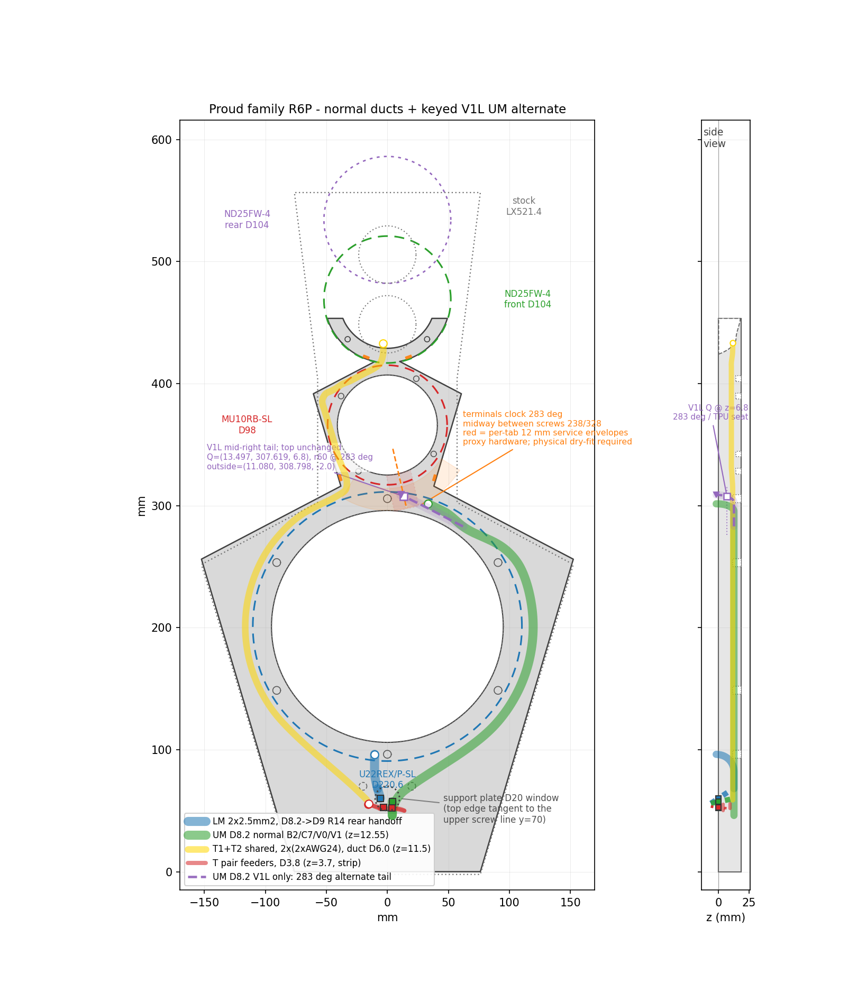

# Slim — 11.5 mm front-flush product

Slim is the Stock outline with the acoustic field thinned to 11.5 mm: the V1L
bottom and mids paired with the V1 vase, sharing one front plane at z=18.3 and
one rear plane at z=6.8, with the bottom structural strip left at full depth.
Catalog entry: [`artifacts/slim/`](../artifacts/slim/).

Both renders share one camera and one declared frame with every other product
cell, so they are directly comparable; `make iso_matrix` regenerates them.

Slim inherits Stock's seams, dovetail profiles, key dimensions, W22/MU pilot
patterns, and captive-magnet contract unchanged — see [`stock.md`](stock.md)
for all of those. This file covers only what Slim changes: the thinned vase,
the thinned LM section, and the keyed UM outlet that goes with it.

## Source modules

| File | What |
|---|---|
| `src/lx521_baffle/proud/v1l.py` / `src/lx521_baffle/proud/v1l_split.py` | Thin proud-family bottom+mids; its alternate UM tail and rear-face exit remain wholly in `piece_mid_right`, so the shared top/vase is unchanged |

## Variant V1 — 11.5 mm UM vase (minimum-thickness field)

The vase field is thinned to t=11.5 while retaining the standard
B2/V1 proud route. The UM main hands off below seam B, so it does
not enter the vase; the
binding buried passage here is the shared tweeter duct, flattened to
W6.6 × H4.4 under the MU seat. The rear plane and all ducts are
unchanged, with a sharp step exactly at seam B (keys auto-trim to 11.5
on both sides). The whole top is flush at 11.5: the crescent taper is
re-derived on the 6.8..18.3 slab (same 4.0 clamp seat / 0.4 tips), and
the tweeter pair clamps an 11.5 septum (shorter standoffs; pair spacing
−6.8). The front-datum geometry keeps V1 front-flush with the LM
section. Pair with V1L for the complete thin proud-family baffle. 10F
mounting: 4 × Ø4.6 × 4.0 bores from
the new front for M3 x 3 x O5 brass heat-sets (floor z=7.5 stays 1.9
above the T-lane roofs at the ring crossings). Two D5 x 2 magnets per side
are fully buried in the common Ø5.20 x 2.10 captive flank-wall cavities
(one source Z=15.10 for both stations). The magnet-free slim host keeps a
broad, symmetric, smooth rear-taper shelf through the upper station so the
complete land remains internal without a station-local cap, boss, relief, or
backfill. B2 wall
pockets are skipped (B2 attachments do not fit V1). Guarded by
test_v1_field (`make check`).
The duplicate standalone V1 vase STL is retired: this same vase ships as
`slim_4_of_4_vase_b2` from the `--variant v1l` export, and
`--variant v1` now emits only the slim shoulder/wing receivers. Thinner is possible only by externalizing cables to
rear-face grooves (~7) or through-bolting the 10F (~5-6) -- see the
constraint ladder in the
[V0/V1 discussion](VARIANTS.md#retired-variant-design-history).

## Variant V1L — 11.5 mm LM section (front-flush)

The bottom + both mids thinned to t=11.5 (material z 6.8..18.3 above
the foot strip): the ENTIRE baffle then shares one front plane (use
with the V1 vase -- same rear plane, NO step at seam B). Binding
constraint: the Ø8.2 LM/UM z-window. The bottom strip keeps full 18.3 for the
fused foot / bridge hardware / cable feeders, and the rear-thickness ramp back
up to it depends on the stand state:

* **no floor stand** — smoothstep ramp y=78 -> 96: full past the top
  pass-through seats +5, thin 10 short of the D190 edge.
* **floor stand** — one quintic smootherstep ramp y=74.15 -> 118, i.e. the
  whole span the stand leaves free. It reaches full depth exactly at the
  Option-B vertical tangent, so it rejoins the stand arc's rear face
  tangentially instead of swelling over 18 mm just above it, and it stays
  slim through the seam-A dovetails and the 2 mm below their root so the
  shared mid pieces mate identically in both states.

W22 heat-sets unchanged (floor keeps a 4.5 wall; the floor state's ramp puts
4.98 mm behind the two inserts at y=110.265, up from 4.7). It preserves
the common proud entries, LM route, and tweeter route, but its UM outlet is
a keyed V1L-only alternate:

* LM Ø8.2 at z=12.55 follows the established plan, flares to Ø9 over
  its final 10 mm, and reaches the retained rear mouth below the LM opening
  through the shared continuous R14 bend and external tangent lead.
* UM Ø8.2 at z=12.55 follows the r=119.5 outer U22 arc and broad-neck
  return, then substitutes the V1L alternate tail for the normal R14
  outlet. Its physical exit is centered at Q=(13.497063, 307.618796,
  6.8), radius 60.0 mm on the 283-degree terminal axis. The nominal
  outside continuation ends at (11.080158, 308.797599, −2.0). The
  entire alternate stays in `piece_mid_right`, below seam B; neither
  seam B nor the top/vase changes.
* T1+T2 SHARE one O6.0 duct ("ts") at z=11.5 up the LEFT flank -- the
  largest bore the notch corridor (D82 rim vs vase chamfer) admits --
  with a SINGLE scallop exit at (-3.3, 430); both pairs dress to their
  tweeters through the open scallop void. Pair feeders (O3.8, t1f
  z=3.7 / t2f z=9.5) cross the full-depth strip under the LM/UM
  columns and merge into a O6.8 z-step west of the LM column. 10F pilot pattern rotated to
  (58/148/238/328) so its left pair clears the lane and dive.
* The four seam-A through-thickness dovetails at ±66/±103 stay in qualified
  material and clear the crossings. The two seam-B males belong to the V1L
  mids and follow their z=6.8 rear plane; the vase contains the matching
  through-thickness female pockets. The alternate tail never reaches seam B,
  and the right vase flank still carries no duct.

STLs: slim_{1_of_4_bottom,2_of_4_mid_left,3_of_4_mid_right}
(--variant v1l) + slim_4_of_4_vase_b2. Structural note: ~30% of
stock bending stiffness -- measure assembly modes before trusting the
W22 on it. The ordinary proud R14 coupon/grommet does not validate this
exit: dry-fish the printed V1L `mid_right` with the real cable and prove
the physical terminals, boots, measured withdrawal, and the dedicated V1L
split TPU grommet before final assembly.

## Printable pieces

| STL in `build/<state>/stl/` | Footprint (mm) | Used by |
|---|---|---|
| `slim_1..3_of_4_*` + re-exported 4-of-4 vase | as stock base 1..4 of 4 | keyed V1L bottom/mids; its 283-degree alternate is confined to `slim_3_of_4_mid_right`, while `slim_4_of_4_vase_b2` is the unchanged V1 vase |
| `slim_um_grommet_half_{a,b}.stl` | keyed split TPU D8 curved shank, D7.1 bore, D13 × 2 flange | V1L-only strain relief; seats at Q on the z=6.8 rear face and follows the alternate R14 |

## Cable routing — the keyed V1L UM exception

The shared proud routing, its analytic R14 LM bend, and the standard B2/V1 UM
handoff are documented in
[`stock.md`](stock.md#cable-routing-proud-channels). V1L substitutes one
alternate UM tail:

That sheet carries both tails: the normal B2/V1 UM path and the labeled
V1L-only 283-degree alternate. The floor-stand twin is
`build/floor_stand/baffle_cable_routing_proud.png`.

V1L is the keyed proud exception. Its complete UM cutter substitutes an
alternate tail wholly inside `piece_mid_right`; it does not branch from
or retain the normal R14 outlet. The physical aperture is centered at
**Q = (13.497063, 307.618796, 6.8)**, where the V1L rear face intersects
the exact 283-degree terminal axis at radius 60.0 mm. The nominal cutter
continuation ends outside the part at **(11.080158, 308.797599, −2.0)**,
2.689 mm farther in XY along the tail; that nominal endpoint is not the
aperture center. The route stays below seam B and never enters the
top/vase, so B2 and V1 geometry and every top-piece route remain
unchanged. The reference MU mesh still omits its terminal tabs, so the
real driver, Fastons, boots, pull-off stroke, and the supplied
`slim_um_grommet_half_{a,b}.stl` strain relief require a
physical dry fit before release.

The V1L grommet has a Ø8 curved body around a Ø7.1 nominal cable bore,
inserts 2.5 mm into the keyed R14, and seats a Ø13 × 2 mm flange against
the z=6.8 rear face. Its printed solid clears the conservative Faston
motion box; the installed cable intentionally enters that box because it
is the functional terminal handoff. Do not treat cable/envelope overlap
as a collision or grommet/envelope clearance as proof of real hardware
fit.

## Tweeter options

Exactly as on Stock, the tweeter choice on Slim is a **choice of vase**: two
interchangeable `04` pieces on the same seam-B interface, with nothing else in
the set changing.

- **Standard V1 vase** (default) — carries the face-to-face ND25FW-4 pair
  clamped through the V1 crescent, plus the MU10 seat, on the 11.5 mm field.
  This is `slim_4_of_4_vase_b2`.
- **Opposed TEBM35C10-4 BMR vase** — replaces that vase and its crescent with
  two Tectonic TEBM35C10-4 BMRs, the lower facing front and the upper facing
  rear, released in a Slim envelope profile. Build it with
  `make vase_tebm35c10_4_cad` and take it from `build/vase_TEBM35C10-4/slim/`.

Pick one; they are never combined. See
[`VARIANTS.md`](VARIANTS.md#opposed-tebm35c10-4-bmr-vase-alternative) for the
BMR vase's geometry and the two envelope profiles.
