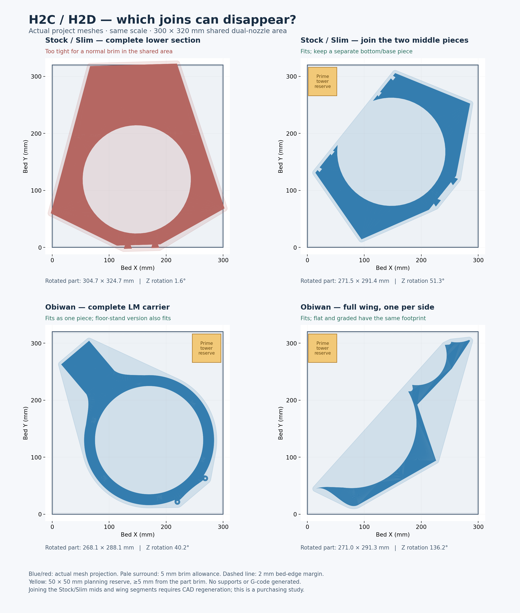

# H2C / H2D: useful changes to the baffle splits

Measured 14 September 2026 against 47 current project STLs, covering 53 individual and assembled cases. This is a purchasing assessment, not a new print release.

**Either printer gives a substantial assembly benefit for Obiwan, and a more modest benefit for Stock and Slim under the conservative settings below. The proposed splits fit both.**

The [follow-up on smaller adjustments](ADJUSTMENTS.md) also screens a one-piece Stock/Slim LM with contained registration and a narrower brim, and permanent-wing configurations with fewer main pieces. It explains why H2D offers more freedom in nozzle assignment, rather than a uniquely larger model size for this project.

## What can change

| Version / component | Current printed split | Recommended H2C or H2D arrangement | Benefit |
|---|---|---|---|
| Stock LM | Bottom/base + mid-left + mid-right: 3 pieces | Join the two middle panels, retain a separate bottom/base: 2 pieces | Removes the vertical joint and its registration/finishing work |
| Slim LM | Same 3-piece arrangement | Same 2-piece arrangement | Same reduction; thinner material does not change the footprint limit |
| Obiwan LM, no floor stand | Top + bottom: 2 pieces | One complete LM carrier | Removes the joint crossing the LM ring and the split registration pins |
| Obiwan LM, floor stand | Top + bottom: 2 pieces | One LM carrier including its integral stand | Same gain; the complete stand reaches only 168.3 mm in build Z |
| Obiwan flat or graded wings | 2 segments per side | One full wing per side | Removes one glued joint on each side |
| V4-matched flat or graded wings | Regular lower segment + V4 upper segment per side | One matching wing per side | Same gain while retaining the V4 magnet/interface geometry |
| UM and tweeter modules | Small separate regular modules, or already-fused V4 body | Keep the current interchangeable upper arrangement | No size-driven need to fuse these to LM |
| Stock/Slim optional wings and shoulders | Small wings; segmented shoulders | No purchase-dependent change needed | Even merged shoulder pairs already fit the existing 256 mm plate |

With regular Obiwan, crescent and wings, the main printed assembly drops from **8 to 5 pieces per speaker**: one LM, one UM, one crescent and two wings. With the fused V4 upper, it drops from **7 to 4**: one LM, one upper body and two wings. Counts exclude caps, retainers, drivers and hardware.

The unsplit Obiwan LM already exists as a canonical CAD/mesh output. Its monolithic wing CAD also exists. Making production files still requires exporting the intended solids and rebuilding the printer-specific slicer projects; concatenating split STLs would leave joint clearances inside the supposed single piece.

## Measured space on the plate

All dimensions below are XY footprints after rotating the part within the plate plane. Printing remains front face down. A planning allowance of **5 mm brim plus 2 mm edge clearance on each side** is included in the fit decision.

| Candidate | Rotated part footprint | Footprint with 5 mm brim | Fits shared 300 × 320 area? |
|---|---:|---:|---|
| Stock/Slim entire current lower section | 304.7 × 324.7 mm | 314.7 × 334.7 mm | No |
| Stock/Slim middle panels combined | 271.5 × 291.4 mm | 281.5 × 301.4 mm | Yes, both stand states |
| Obiwan full LM, no floor stand | 268.1 × 288.1 mm | 278.1 × 298.1 mm | Yes |
| Obiwan full LM, floor stand | 262.8 × 282.9 mm | 272.8 × 292.9 mm | Yes |
| Obiwan full regular wing | 271.0 × 291.3 mm | 281.0 × 301.3 mm | Yes, flat/graded and left/right |
| V4 full matched wing, flat | 261.4 × 281.8 mm | 271.4 × 291.8 mm | Yes, both sides |
| V4 full matched wing, graded | 261.1 × 280.9 mm | 271.1 × 290.9 mm | Yes, both sides |

The successful proposals also leave space for a **50 × 50 mm prime-tower reserve**, including its own footprint, at least 5 mm from the model's planned brim. This is geometric space reservation, not the footprint of a sliced tower. The successful current-joint proposals retain roughly 7–12 mm additional clearance per limiting plate edge after the brim and 2 mm edge allowance.

The different floor/no-floor rotated Obiwan footprints are expected: the stand changes the projected shape and the best diagonal angle even though both assembled XY bounding boxes are about 227.9 × 320.7 mm.

### Can Stock/Slim also have an uninterrupted LM ring?

**Yes, as a promising two-piece redesign: a complete driver-carrying panel plus a separate bottom/base.** The simple merge above retains the present horizontal seam at Y120, which still crosses the driver aperture. For a cleaner final split, move that seam below the driver seat.

An indicative cut near assembled Y80 gives an upper-panel envelope that rotates to **267.9 × 292.2 mm**, or **277.9 × 302.2 mm with the 5 mm brim**. That envelope and a separate tower reserve fit both printers. Y80 is a feasibility example, not a final joint location: the stand transition, connection loads, cable routes and new registration features still need design work.

I would use that arrangement as the design target if reworking Stock/Slim, and use the simple mid-left/mid-right merge as the smallest implementation change.

### Why not promise a single Stock/Slim LM including the base?

Its current assembled lower section is approximately **304.8 × 321.95 mm**, including the upward connection keys. Rotated 90 degrees, its bare envelope fits a **325 × 320 mm single-nozzle area**, but the limiting clearance is only **1.53 mm per side before any brim**. That is too marginal to count as the normal PETG/PLA workflow.

A redesigned upper joint and narrower brim may make a monolithic version possible in the left-nozzle area. PLA support would then have to stay inside the other nozzle's reach. This is an option to investigate after selecting the printer, not a dependable reason to buy it. Both printers have that same left-nozzle reach.

The entire Stock/Slim baffle is about 453.5 mm tall in assembly. The regular Obiwan LM+UM combination also fails the flat-print envelope check. Neither printer makes the entire baffle a practical front-face-down monolith. Standing or tilting it upright would change the surface, support and captive-magnet workflow, and is outside this recommendation.

## H2C versus H2D: use the appropriate print area

| XY reach | H2C | H2D |
|---|---:|---:|
| Area reachable by **both** nozzles | **300 × 320 mm** | **300 × 320 mm** |
| Fixed left nozzle | 325 × 320 mm | 325 × 320 mm |
| Right nozzle | 305 × 320 mm, Vortek | 325 × 320 mm |
| Combined reach of both nozzles | 330 × 320 mm | 350 × 320 mm |

These are taken from Bambu's current official [H2C machine profile](https://raw.githubusercontent.com/bambulab/BambuStudio/master/resources/profiles/BBL/machine/Bambu%20Lab%20H2C%200.4%20nozzle.json) and [H2D machine profile](https://raw.githubusercontent.com/bambulab/BambuStudio/master/resources/profiles/BBL/machine/Bambu%20Lab%20H2D%200.4%20nozzle.json). The shared area is their per-nozzle intersection, physical X25–325 and Y0–320. Drawing coordinates use that shared area's local origin; add 25 mm to plotted X for physical bed coordinates.

The H2C's advertised 305 mm single-nozzle width describes its right-side reach; it does not describe the fixed left nozzle's full area. The combined 330/350 mm widths are not a region where either nozzle can print everywhere. Keeping the complete PETG part and PLA support in the shared area is a conservative, interchangeable layout policy. Using the outer strips requires per-nozzle slicing checks.

Both advertise nominal Z325. The inherited [official common profile](https://raw.githubusercontent.com/bambulab/BambuStudio/master/resources/profiles/BBL/machine/fdm_bbl_3dp_002_common.json) limits left-nozzle Z to 320 and right-nozzle Z to 325; this study uses the conservative left/shared limit. The highest measured build is 168.3 mm, so height does not decide these splits. Official headline volumes are also recorded in the [H2C announcement](https://blog.bambulab.com/bambu-lab-h2c-where-multi-material-vortek-system-meets-engineering-precision/) and [H2D specification](https://cdn1.bambulab.com/documentation/h2d/en/H2D_Laser_Full_Combo_20250305.pdf).

## Purchase recommendation for this project

The main size benefit is a continuous Obiwan LM ring and continuous wings. Fewer joints should reduce alignment, adhesive and visible-seam work; structural and acoustic improvements have not been measured. For Stock/Slim the gain is worthwhile, but smaller: a two-piece lower assembly rather than the current three.

For PETG-GF or PETG Translucent with PLA interfaces, assign the model material and PLA to separate nozzles. H2D explicitly supports a [dedicated support nozzle](https://eu.store.bambulab.com/products/h2d?from=home_page_3dprinter). This removes repeated PETG-to-PLA exchanges within one hotend, addressing the source of the current large material-change purges. Priming and nozzle-start routines still remain; this does not establish zero waste or guarantee against every cause of blockage.

**H2D already provides the useful new splits and the separate support nozzle.** H2C's [six interchangeable Vortek hotends](https://blog.bambulab.com/bambu-lab-h2c-where-multi-material-vortek-system-meets-engineering-precision/) are valuable if future jobs need three or more materials/colors with dedicated hotends, or if keeping separate hotends for the alternating PETG-GF, translucent PETG and PLA jobs matters. Neither printer unlocks an additional recommended split over the other here. I would choose H2D if its price saving outweighs that added capability; this study does not compare current offers or ownership cost.

Larger continuous prints also put more material and time into a single job. I would preserve the current detachable LM/UM interface, driver datums and magnet positions, consolidate the plate-size-driven joints, and retain small replaceable caps and retainers.

## Evidence and limits

- [Measurement results](measurements.json): 53 cases, 47 source meshes, mesh and sidecar hashes, restored dimensions, rotation search and all bed checks.
- [Layout witnesses](layout_witnesses.json): translations, rotations, tower reserves and explicit brim/edge/tower geometry checks, including both stand states and V4 wings.
- [Official source copies and hashes](sources/sources.json), retrieved on 14 September 2026.
- [Measurement script](measure_fit.py) and [PNG/layout generator](layout_review.py).
- [Inspection status](cad_inspection_obiwan.json): the legacy CAD catalog inspector could not index a required-argument `gen_step()` in `obiwan/wings.py`. The dimensional study instead uses exact STL vertices restored with the inverse of each hash-matched `.print.json` transform; it does not use preview screenshots as measurement evidence.

The rotation sweep is 0.1 degrees, with no scaling or out-of-plane tilt. Convex outlines conservatively bound the projected geometry. Conceptual seam changes are clipped outline studies, not regenerated solids. Source meshes and their production sidecars are unchanged.

Before manufacturing, regenerate any merged CAD, create H2-specific 0.6 mm HF material/support projects, inspect sliced support/tower reach and restore magnet pauses. The existing P2S machine G-code is not an H2 print job. Preserve the existing infill, insert and magnet policies unless separately revised. Neither these footprint checks nor a printer change qualify the custom translucent PETG/PLA material pairing.
